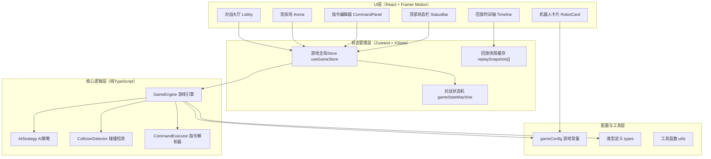

## 1. 架构设计



## 2. 技术说明

- **前端框架**：React 18 + TypeScript 5
- **构建工具**：Vite 5（ES模块，HMR热更新）
- **路由管理**：React Router v6（/lobby 大厅，/battle 对战）
- **样式方案**：@emotion/react + @emotion/styled（CSS-in-JS，支持动态主题变量）
- **动画库**：framer-motion（拖拽、过渡、粒子、动画编排）
- **状态机**：xstate（管理 idle/playing/paused/replay/ended 状态流转）
- **全局状态**：zustand（轻量级，管理机器人、指令、回合等共享状态）
- **后端**：无（纯前端应用，所有逻辑在浏览器端运行）

## 3. 路由定义

| 路由路径 | 页面组件 | 用途 |
|-----------|-----------|---------|
| `/` | Lobby | 对战大厅：选择机器人类型，创建房间 |
| `/battle` | Battle | 对战主界面：竞技场+指令编辑器+状态栏+回放控制 |

## 4. 核心数据模型定义

### 4.1 机器人类型与指令
```typescript
type RobotType = 'scout' | 'attacker' | 'tank'
type CommandType = 'forward' | 'backward' | 'turnLeft' | 'turnRight' | 'attack' | 'defend' | 'scan'
type Direction = 0 | 1 | 2 | 3 // 0=上,1=右,2=下,3=左

interface RobotStats {
  maxHp: number
  speed: number   // 决定行动顺序
  attack: number  // 攻击伤害
  range: number   // 攻击距离（格）
  viewRange: number // 扫描范围（格）
}

interface Robot {
  id: string
  name: string
  type: RobotType
  x: number
  y: number
  direction: Direction
  hp: number
  stats: RobotStats
  isPlayer: boolean
  commands: CommandType[]  // 6个指令序列
  isDefending: boolean
  isHit: boolean
  scannedEnemies: string[]
  color: string  // 霓虹色标识
}
```

### 4.2 障碍物与单元格
```typescript
type ObstacleType = 'metalCrate' | 'energySupply'

interface Obstacle {
  id: string
  type: ObstacleType
  x: number
  y: number
  hp?: number  // 金属箱可被攻击摧毁
  value?: number // 补给点恢复量
}

interface GridCell {
  x: number
  y: number
  robotId?: string
  obstacle?: Obstacle
}
```

### 4.3 回合与回放快照
```typescript
interface TurnSnapshot {
  turn: number
  robots: Robot[]
  obstacles: Obstacle[]
  events: BattleEvent[]
  executingIndex: number  // 当前执行到第几条指令
}

type BattleEvent =
  | { type: 'move'; robotId: string; from: [number, number]; to: [number, number] }
  | { type: 'turn'; robotId: string; from: Direction; to: Direction }
  | { type: 'attack'; attackerId: string; targetId: string; damage: number; bulletPath: [number, number][] }
  | { type: 'defend'; robotId: string }
  | { type: 'scan'; robotId: string; foundIds: string[] }
  | { type: 'pickup'; robotId: string; supplyId: string; value: number }
  | { type: 'destroy'; robotId: string }
  | { type: 'hit'; robotId: string; damage: number; isDefending: boolean }
```

### 4.4 游戏全局状态
```typescript
interface GameState {
  phase: 'lobby' | 'playing' | 'paused' | 'replay' | 'ended'
  turn: number
  maxTurns: number
  robots: Robot[]
  obstacles: Obstacle[]
  currentCommandIndex: number
  selectedRobotType: RobotType | null
  playerCommands: CommandType[]
  snapshots: TurnSnapshot[]
  winner: Robot | null
  settings: {
    gridSize: number
    maxRobots: number
    commandSlots: number
  }
}
```

## 5. 目录结构

```
src/
├── config/
│   └── gameConfig.ts          # 机器人属性、指令配置、网格尺寸、颜色常量
├── core/
│   ├── GameEngine.ts          # 回合管理、指令解析、碰撞检测
│   ├── AIStrategy.ts          # 3种AI决策逻辑
│   └── types.ts               # 核心类型定义
├── store/
│   └── useGameStore.ts        # Zustand全局状态
├── components/
│   ├── arena/
│   │   ├── Arena.tsx          # 主竞技场容器（8x8网格）
│   │   ├── GridCell.tsx       # 单元格渲染
│   │   ├── RobotSprite.tsx    # 机器人精灵（含血条、方向）
│   │   ├── ObstacleSprite.tsx # 障碍物（金属箱/补给）
│   │   ├── Bullet.tsx         # 能量弹（尾迹+爆炸）
│   │   └── TrailLine.tsx      # 移动轨迹线
│   ├── command/
│   │   ├── CommandPanel.tsx   # 指令编辑器主容器
│   │   ├── CommandLibrary.tsx # 左侧指令库
│   │   ├── CommandBlock.tsx   # 可拖拽指令块
│   │   └── CommandSlot.tsx    # 序列槽位（吸附动画）
│   ├── lobby/
│   │   ├── RobotCard.tsx      # 机器人选择卡片（扫光+粒子）
│   │   └── StatsBar.tsx       # 属性条渐变填充
│   ├── ui/
│   │   ├── StatusBar.tsx      # 顶部状态栏
│   │   ├── PauseOverlay.tsx   # 暂停遮罩
│   │   ├── Timeline.tsx       # 回放时间轴
│   │   ├── BattleReport.tsx   # 战斗报告
│   │   ├── CyberButton.tsx    # 通用赛博朋克按钮
│   │   └── ParticleBurst.tsx  # 粒子特效组件
│   └── pages/
│       ├── Lobby.tsx          # 大厅页面
│       └── Battle.tsx         # 对战页面
├── hooks/
│   ├── useDragDrop.ts         # 拖拽逻辑hook
│   └── useAnimationFrame.ts   # 帧循环hook
├── styles/
│   ├── GlobalStyles.tsx       # Emotion全局样式
│   └── theme.ts               # 赛博朋克主题变量
├── utils/
│   ├── gridMath.ts            # 网格坐标计算
│   └── soundEffects.ts        # Web Audio API模拟电音音效
├── App.tsx
├── main.tsx
└── Router.tsx
```

## 6. 核心技术决策与性能策略

### 6.1 回合执行引擎
- **回合驱动**：`GameEngine.executeTurn()` 按6个指令槽位逐槽执行，每槽内按 `robot.stats.speed` 降序排序依次行动
- **快照机制**：每条指令执行后生成 `TurnSnapshot` 存入数组，回放时直接读取快照无需重算
- **碰撞检测**：AABB网格对齐检测（`checkCollision(x,y)` 返回是否越界/撞物/撞机器人）
- **攻击判定**：按机器人方向发射 `range` 格数的射线，命中第一个目标即停止；防御状态伤害减半

### 6.2 动画策略
- **移动动画**：framer-motion `animate={{x,y}}`，`transition={{type: 'spring', stiffness: 200}}`，机器人同步旋转头部
- **拖拽指令**：`useDragDrop` hook 基于 framer-motion drag，`dragGhost` 半透明残影，slot 吸附使用 `onDragEnd` 坐标映射
- **阶梯血条**：将maxHp等分为10段，动画时从 `scaleY(1)` 跳到 `scaleY(segment/10)`，使用 `stepEnd` timing function
- **粒子系统**：`ParticleBurst` 使用绝对定位DOM节点+CSS keyframes，池化复用避免频繁GC

### 6.3 性能优化
- **时间轴回放**：`snapshots` 数组预先生成所有回合数据，拖动时通过索引访问，时间复杂度 O(1)
- **重绘控制**：竞技场使用 React.memo，机器人位置通过 transform 而非 top/left 变更触发GPU合成层
- **节流防抖**：时间轴拖动使用 rAF 节流，指令编辑去抖后写入状态

### 6.4 构建配置说明
- Vite 开启 `build.target: 'es2020'`，使用 Rollup 代码分割，核心引擎与UI组件分离chunk
- Emotion 开启 sourcemap（开发模式），生产模式压缩类名
- Framer Motion 通过 lazy 导入动画组件（非首页使用的Timeline/Report）
