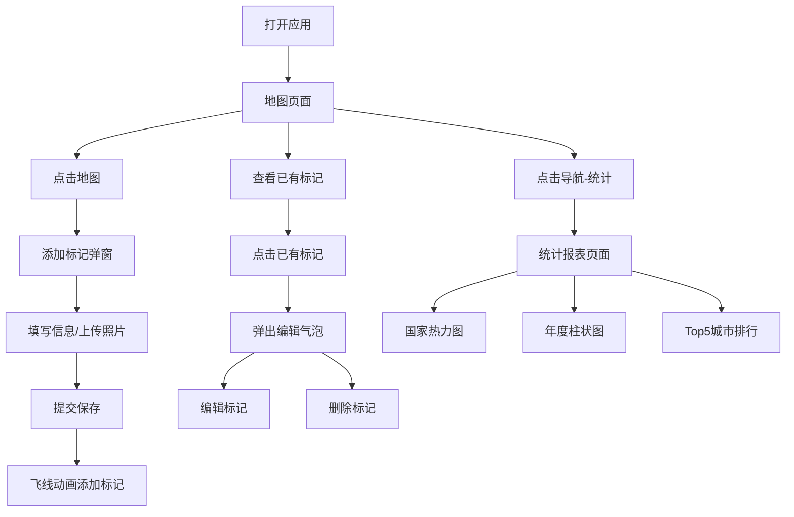

## 1. 产品概述
旅行足迹地图应用是一款帮助用户记录和可视化个人旅行经历的在线工具。用户可以在交互式世界地图上标记去过的城市和国家，记录每次旅行的日期、照片和心情，并生成丰富的统计报表。

- 核心目标：让用户以直观、美观的方式回顾和分享自己的旅行足迹
- 目标用户：热爱旅行、喜欢记录生活的个人用户
- 产品价值：将零散的旅行记忆转化为可视化的人生地图数据

## 2. 核心功能

### 2.1 用户角色
| 角色 | 注册方式 | 核心权限 |
|------|----------|----------|
| 普通用户 | 无需注册，本地存储 | 标记旅行地点、编辑记录、查看统计报表 |

### 2.2 功能模块
1. **地图页面**：交互式世界地图、旅行标记点展示、添加/编辑/删除标记
2. **统计报表页面**：国家覆盖热力图、年度旅行柱状图、Top5城市排行榜
3. **标记管理**：城市名称自动获取、日期选择、心情选择、照片上传

### 2.3 页面详情
| 页面名称 | 模块名称 | 功能描述 |
|----------|----------|----------|
| 地图页面 | 地图视图 | 世界地图展示，缩放级别2，浅色地图样式 |
| 地图页面 | 标记点层 | 按大洲分类的彩色标记，脉动光晕动画，100+标记时聚类显示 |
| 地图页面 | 添加标记弹窗 | 城市名（反向地理编码）、日期、心情emoji、照片上传 |
| 地图页面 | 编辑气泡 | 显示城市/日期/心情/缩略图，提供编辑和删除按钮 |
| 统计页面 | 国家热力图 | 简化世界地图，按国家填充颜色表示去过次数 |
| 统计页面 | 年度柱状图 | 年度旅行次数统计，点击下钻到月度分布 |
| 统计页面 | Top5城市排行 | 横向条形图展示最常去的城市 |
| 全局 | 顶部导航 | 半透明磨砂玻璃效果，页面切换淡入淡出 |

## 3. 核心流程
用户打开应用默认进入地图页面，可查看已有的旅行标记点。点击地图任意位置弹出添加标记弹窗，填写信息后标记以飞线动画添加到地图。点击已有标记可查看详情、编辑或删除。通过顶部导航切换到统计页面，查看各类旅行数据可视化报表。

## 4. 用户界面设计

### 4.1 设计风格
- **主色调**：卡其色（#C4A882）和浅蓝灰色（#B8C4D0）搭配
- **文字颜色**：深棕色（#3E2723）用于标题和关键文字
- **按钮样式**：土黄到橙红的渐变色，圆角设计
- **卡片效果**：细微纸纹理（线性渐变模拟），柔和阴影
- **导航栏**：半透明磨砂玻璃效果（backdrop-filter: blur）
- **弹窗气泡**：圆角毛玻璃效果
- **标记点颜色**：亚洲红色、欧洲蓝色、非洲橙色、美洲绿色、大洋洲紫色

### 4.2 页面设计概览
| 页面名称 | 模块名称 | UI元素 |
|----------|----------|--------|
| 地图页面 | 地图容器 | 全屏地图，浅色风格，缩放控件 |
| 地图页面 | 标记点 | 彩色圆形图钉，脉动光晕，悬停放大效果 |
| 地图页面 | 添加弹窗 | 圆角卡片，毛玻璃背景，表单输入 |
| 地图页面 | 编辑气泡 | 深色半透明卡片，城市/日期/心情/照片缩略图 |
| 统计页面 | 热力图卡片 | 简化世界地图，绿色渐变填充 |
| 统计页面 | 柱状图卡片 | 圆角柱状条，蓝紫色调，悬停交互 |
| 统计页面 | 排行榜卡片 | 横向进度条，柔和蓝紫色调 |
| 全局 | 顶部导航 | 磨砂玻璃效果，平滑淡入淡出切换 |

### 4.3 响应式设计
- 桌面端优先设计，适配平板和手机
- 整体布局不变，字体和控件适当缩放
- 最小宽度支持375px
- 图表在窗口resize时自适应大小

### 4.4 动效设计
- 标记点脉动光晕动画
- 新标记飞线降落动画
- 页面切换淡入淡出过渡
- 删除标记缩小消失动画
- 柱状图/条形图加载动画
