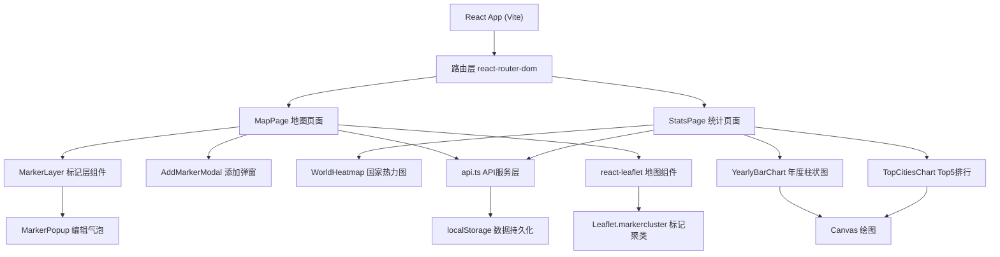
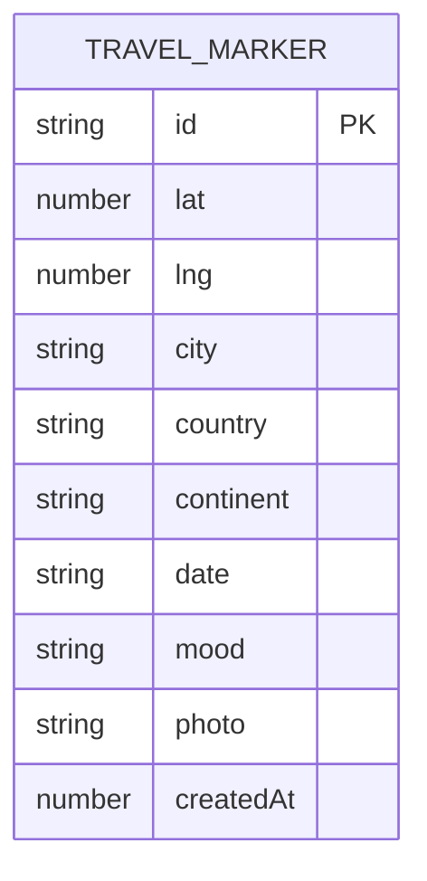

## 1. 架构设计


## 2. 技术说明
- **前端框架**：React 18 + TypeScript
- **构建工具**：Vite 5
- **路由管理**：react-router-dom
- **地图库**：leaflet + react-leaflet
- **标记聚类**：leaflet.markercluster
- **HTTP客户端**：axios（用于Nominatim反向地理编码）
- **数据存储**：localStorage（模拟后端CRUD）
- **图表绘制**：原生Canvas API
- **样式方案**：CSS Modules + 全局CSS变量

## 3. 路由定义
| 路由 | 页面 | 说明 |
|------|------|------|
| / | MapPage | 主地图页面，默认入口 |
| /stats | StatsPage | 统计报表页面 |

## 4. API定义
由于使用localStorage模拟后端，API服务层提供以下方法：

### 4.1 类型定义
```typescript
interface TravelMarker {
  id: string;
  lat: number;
  lng: number;
  city: string;
  country: string;
  continent: string;
  date: string;
  mood: 'happy' | 'calm' | 'excited' | 'tired';
  photo?: string;
  createdAt: number;
}

interface TravelStats {
  totalCountries: number;
  totalCities: number;
  totalMarkers: number;
  yearlyData: { year: number; count: number }[];
  topCities: { city: string; count: number }[];
  countryCounts: { country: string; count: number }[];
}
```

### 4.2 方法列表
| 方法名 | 参数 | 返回值 | 说明 |
|--------|------|--------|------|
| getMarkers | 无 | TravelMarker[] | 获取所有标记 |
| addMarker | marker: Omit<TravelMarker, 'id' \| 'createdAt'> | TravelMarker | 添加新标记 |
| updateMarker | id: string, data: Partial<TravelMarker> | TravelMarker | 更新标记 |
| deleteMarker | id: string | boolean | 删除标记 |
| getStats | 无 | TravelStats | 获取统计数据 |
| reverseGeocode | lat: number, lng: number | Promise<{city: string, country: string, continent: string}> | 反向地理编码 |

## 5. 文件结构
```
├── package.json
├── vite.config.ts
├── tsconfig.json
├── index.html
└── src/
    ├── main.tsx           # 应用入口
    ├── App.tsx            # 根组件（路由+导航）
    ├── styles/
    │   └── global.css     # 全局样式
    ├── pages/
    │   ├── MapPage.tsx    # 地图页面
    │   └── StatsPage.tsx  # 统计页面
    ├── components/
    │   ├── MarkerLayer.tsx       # 地图标记层
    │   ├── AddMarkerModal.tsx    # 添加/编辑标记弹窗
    │   ├── MarkerPopup.tsx       # 标记气泡
    │   ├── Navbar.tsx            # 顶部导航
    │   ├── WorldHeatmap.tsx      # 国家热力图
    │   ├── YearlyBarChart.tsx    # 年度柱状图
    │   └── TopCitiesChart.tsx    # Top5城市排行
    ├── services/
    │   └── api.ts         # API服务层
    ├── types/
    │   └── index.ts       # 类型定义
    └── utils/
        ├── storage.ts     # localStorage工具
        ├── geo.ts         # 地理相关工具
        └── image.ts       # 图片处理工具
```

## 6. 数据模型

### 6.1 数据模型定义


### 6.2 存储结构
localStorage 存储键：`travel_markers`
存储值：JSON 数组，包含所有 TravelMarker 对象

## 7. 性能优化
- 标记点超过100个时自动启用Leaflet.markercluster聚类
- 照片上传限制2MB，压缩至800px宽
- 地图交互帧率保持30fps以上
- 添加/删除操作响应时间不超过200ms
- Canvas图表使用requestAnimationFrame优化重绘
