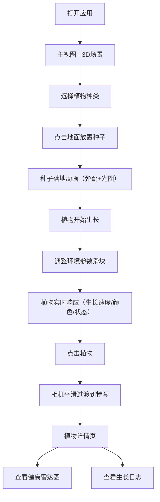

## 1. 产品概述

虚拟植物园是一款面向植物学教育与园艺爱好者的交互式3D植物生长模拟与监控仪表盘应用。用户可在3D场景中种植不同种类的虚拟植物，通过调整环境参数实时观察植物的生长状态与健康指标变化，实现沉浸式的植物生长学习与体验。

- **核心价值**：直观展示不同植物在光照、水分、温度等环境因素下的生长反应，帮助用户理解植物生态
- **目标用户**：植物学学习者、园艺爱好者、教育工作者
- **差异化体验**：实时3D生长动画 + 健康雷达图 + 生长日志，构建完整的植物生长监控体系

## 2. 核心功能

### 2.1 用户角色
| 角色 | 注册方式 | 核心权限 |
|------|----------|----------|
| 普通用户 | 无需注册，直接使用 | 种植植物、调整环境参数、查看健康数据 |

### 2.2 功能模块
1. **主视图页面**：3D场景渲染、植物种植交互、环境参数控制面板
2. **植物详情页面**：3D植物特写、健康雷达图、生长日志记录
3. **3D植物生长系统**：种子→发芽→生长期→成熟→开花/结果五阶段生长动画
4. **环境参数模拟系统**：光照、水分、温度、养分四参数实时调控
5. **健康监控系统**：五维度健康雷达图实时评估植物状态

### 2.3 页面详情
| 页面名称 | 模块名称 | 功能描述 |
|----------|----------|----------|
| 主视图 | 3D场景容器 | Three.js渲染场景，支持OrbitControls交互，地面半透明渐变 |
| 主视图 | 植物种植面板 | 选择植物种类（果树/花卉/多肉），点击地面放置种子，带弹跳动画和光圈效果 |
| 主视图 | 环境参数控制面板 | 四滑块控制光照/水分/温度/养分，数值颜色随状态变化，毛玻璃效果 |
| 植物详情 | 3D特写视图 | 相机平滑过渡到植物特写，展示植物细节 |
| 植物详情 | 健康雷达图 | 五维度（光照/水分/温度/养分/病虫害）雷达图，带补间动画 |
| 植物详情 | 生长日志 | 时间线样式记录生长事件，新条目滑入动画 |

## 3. 核心流程

用户打开应用进入主视图，在右侧面板选择植物种类后，点击3D场景地面放置种子。种子落地后开始生长，用户通过滑块调整环境参数，植物根据参数实时改变生长速度和健康状态。点击某棵植物进入详情页，查看健康雷达图和生长日志。

## 4. 用户界面设计

### 4.1 设计风格
- **整体主题**：深色科技风，深灰#1a1a2e到墨蓝#16213e的径向渐变背景
- **核心概念**：自然生长 × 科技监控，有机形态与数据可视化结合
- **毛玻璃效果**：所有面板采用背景虚化+半透明，营造悬浮感
- **圆角风格**：统一使用大圆角（12-16px），柔和现代
- **色彩系统**：
  - 主色调：深绿/翠绿（代表植物生命力）
  - 状态色：红色（过低）、绿色（适中）、橙色（过高）
  - 雷达五色：黄色（光照）、蓝色（水分）、红色（温度）、绿色（养分）、紫色（病虫害）

### 4.2 页面设计概览
| 页面名称 | 模块名称 | UI元素 |
|----------|----------|--------|
| 主视图 | 顶部导航栏 | 应用名称"虚拟植物园"、"植物总览"/"详情"切换按钮、毛玻璃背景 |
| 主视图 | 3D场景容器 | 占满屏幕主体、地面半透明渐变网格、粒子背景 |
| 主视图 | 右侧控制面板 | 宽度300px、毛玻璃效果、滚动条、植物种类选择卡片、四个渐变滑块 |
| 主视图 | 植物种类选择 | 缩略图+说明卡片、选中态高亮、确认按钮 |
| 植物详情 | 3D特写区 | 大尺寸3D渲染、植物悬停高亮发光、名称标签 |
| 植物详情 | 健康雷达图 | 深色半透明背景、五边形渐变填充、弹性缩放入场动画 |
| 植物详情 | 生长日志 | 小圆点时间线、右侧滑入动画、时间戳+事件描述 |

### 4.3 响应式设计
- **桌面端（>1024px）**：右侧固定300px控制面板，3D场景自适应剩余空间
- **平板端（768-1024px）**：控制面板宽度缩减至260px
- **移动端（<768px）**：控制面板折叠为底部浮动卡片，支持拖拽展开

### 4.4 3D场景指引
- **环境氛围**：暗色系科幻植物园，深蓝渐变背景，粒子模拟花粉/孢子飘动
- **光照设置**：环境光+方向光，支持实时光照强度调整
- **相机设置**：PerspectiveCamera，初始俯视45度角，OrbitControls交互
- **地面设计**：半透明渐变网格平面，带微弱发光边缘
- **植物模型**：程序化生成，果实球体、花蕾锥体、叶片平面，支持阶段过渡动画
- **粒子系统**：2000个以内半透明白色粒子，模拟花粉飘动，随光照强度变化
- **性能要求**：稳定30fps以上，最多20棵植物实例
