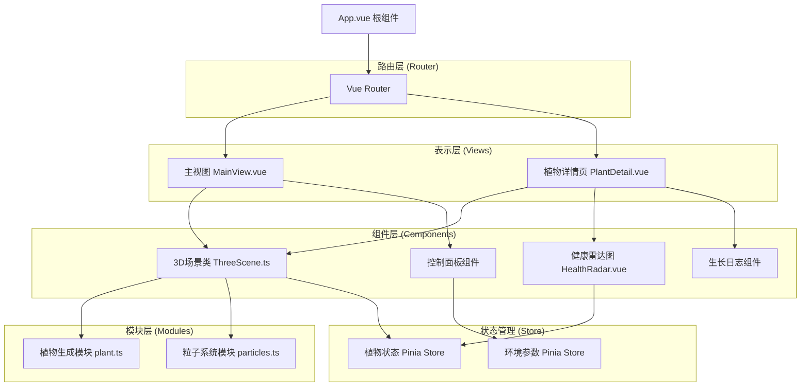

## 1. 架构设计



## 2. 技术描述

- **前端框架**：Vue 3 + TypeScript + Composition API
- **构建工具**：Vite
- **状态管理**：Pinia
- **路由管理**：Vue Router
- **3D渲染**：Three.js
- **动画库**：@tweenjs/tween.js
- **数据可视化**：d3-scale（雷达图坐标计算）
- **样式方案**：原生CSS + CSS变量 + 毛玻璃效果

## 3. 项目文件结构

```
src/
├── main.ts                  # 应用入口
├── App.vue                  # 根组件
├── router/
│   └── index.ts             # 路由配置
├── stores/
│   ├── plant.ts             # 植物状态store
│   └── environment.ts       # 环境参数store
├── views/
│   ├── MainView.vue         # 主视图
│   └── PlantDetail.vue      # 植物详情页
├── components/
│   ├── ThreeScene.ts        # Three.js 3D场景核心类
│   ├── HealthRadar.vue      # 健康雷达图组件
│   ├── ControlPanel.vue     # 环境参数控制面板
│   ├── PlantSelector.vue    # 植物种类选择器
│   └── GrowthLog.vue        # 生长日志组件
├── modules/
│   ├── plant.ts             # 植物生成与生长逻辑
│   └── particles.ts         # 粒子系统模块
├── types/
│   └── index.ts             # TypeScript类型定义
└── utils/
    └── helpers.ts           # 工具函数
```

## 4. 数据流向

### 4.1 环境参数控制流向
```
控制面板滑块 → Pinia Store (environment) → ThreeScene → 植物生长逻辑 → 渲染更新
```

### 4.2 植物健康数据流向
```
ThreeScene (植物状态计算) → Pinia Store (plant) → 健康雷达图组件 → 渲染更新
```

### 4.3 种植交互流向
```
用户点击地面 → ThreeScene (光线投射检测) → 创建植物实例 → 播放落地动画 → 开始生长
```

## 5. 核心模块说明

### 5.1 ThreeScene 类
- **职责**：管理Three.js场景、相机、渲染器、光照、地面
- **核心方法**：
  - `init(container)`：初始化场景
  - `addPlant(type, position)`：添加植物
  - `updateEnvironment(params)`：更新环境参数
  - `selectPlant(id)`：选中植物，相机过渡
  - `dispose()`：资源清理
- **动画循环**：requestAnimationFrame驱动，更新植物生长、粒子系统、Tween动画

### 5.2 plant.ts 植物模块
- **职责**：程序化生成植物模型，管理生长阶段
- **植物种类**：果树（fruit）、花卉（flower）、多肉（succulent）
- **生长阶段**：种子 → 发芽 → 生长期 → 成熟 → 开花/结果
- **核心函数**：
  - `createPlant(type)`：创建植物实例
  - `grow(plant, deltaParams)`：根据累积参数更新生长
  - `getHealthMetrics(plant, env)`：计算健康指标
  - `updateAppearance(plant)`：更新模型外观

### 5.3 particles.ts 粒子模块
- **职责**：管理全局粒子系统
- **粒子类型**：背景花粉粒子、落叶粒子
- **核心方法**：
  - `createParticles(count)`：创建粒子系统
  - `update(delta, lightIntensity)`：每帧更新
  - `spawnLeaves(position, count)`：生成落叶粒子

### 5.4 HealthRadar 雷达图组件
- **职责**：五边形健康雷达图可视化
- **技术实现**：SVG + d3-scale线性插值 + CSS动画
- **动画**：弹性缩放入场、数据补间过渡（0.3秒）

## 6. 性能优化策略

1. **滑块节流**：100ms节流防止过度渲染
2. **实例化渲染**：同类植物使用InstancedMesh（如需要）
3. **粒子优化**：BufferGeometry + PointsMaterial，最多2000粒子
4. **植物数量限制**：最多20棵植物
5. **帧率目标**：稳定30fps以上
6. **资源清理**：组件卸载时正确清理Three.js资源和事件监听

## 7. 路由定义

| 路由路径 | 页面组件 | 说明 |
|----------|----------|------|
| / | MainView | 主视图，3D场景 + 控制面板 |
| /plant/:id | PlantDetail | 植物详情页，特写 + 雷达图 + 日志 |
