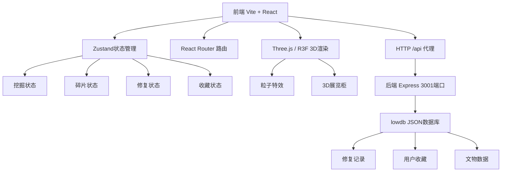
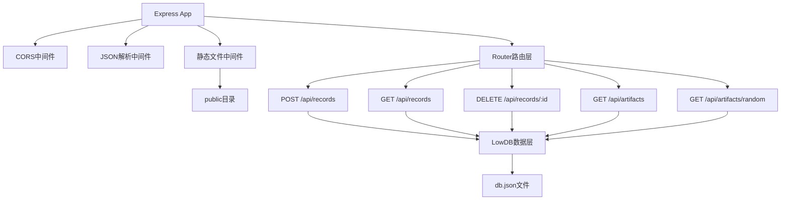
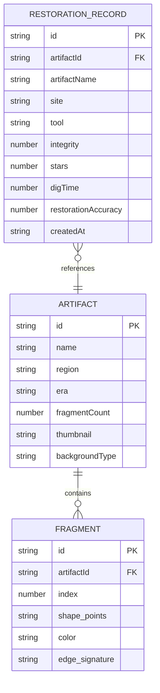

## 1. 架构设计



## 2. 技术说明

- **前端框架**：React@18 + TypeScript + Vite@5
- **状态管理**：Zustand@4
- **路由管理**：react-router-dom@6
- **3D渲染**：three + @react-three/fiber + @react-three/drei
- **HTTP请求**：axios
- **后端框架**：Express@4
- **数据库**：lowdb@7（JSON本地存储）
- **跨域**：CORS中间件 + Vite代理
- **唯一ID**：uuid

## 3. 路由定义

| 路由 | 用途 |
|-------|---------|
| / | 首页，场地选择和工具选择 |
| /dig-site/:site | 挖掘场地页面，处理网格挖掘 |
| /workbench | 修复工作台页面 |
| /exhibition | 3D展览柜收藏展示页面 |

## 4. API定义

```typescript
// 文物数据结构
interface ArtifactData {
  id: string;
  name: string;
  region: string; // 地域：egypt/greek/china等
  era: string; // 年代
  fragmentCount: number; // 5-8块
  fragments: FragmentData[];
  thumbnail: string; // 缩略图数据
  backgroundType: string; // 背景类型
}

// 碎片数据
interface FragmentData {
  id: string;
  artifactId: string;
  index: number;
  shape: number[][]; // 多边形顶点
  color: string;
  edgeSignature: EdgeSignature;
  initialRotation: number;
  initialFlipped: boolean;
}

// 边缘特征
interface EdgeSignature {
  north?: { matchId: string; angle: number };
  south?: { matchId: string; angle: number };
  east?: { matchId: string; angle: number };
  west?: { matchId: string; angle: number };
}

// 修复记录
interface RestorationRecord {
  id: string;
  artifactId: string;
  artifactName: string;
  site: string; // desert/jungle/ocean
  tool: string; // brush/shovel/vacuum
  integrity: number; // 完整度百分比
  stars: number; // 1-3星
  digTime: number; // 挖掘用时（秒）
  restorationAccuracy: number; // 修复准确率
  createdAt: string;
}

// 响应格式
interface ApiResponse<T> {
  success: boolean;
  data?: T;
  message?: string;
}
```

| API | 方法 | 请求 | 响应 |
|-----|------|------|------|
| /api/records | POST | RestorationRecord | ApiResponse<RestorationRecord> 保存修复记录 |
| /api/records | GET | - | ApiResponse<RestorationRecord[]> 获取收藏列表 |
| /api/records/:id | DELETE | id param | ApiResponse 删除记录 |
| /api/artifacts | GET | - | ApiResponse<ArtifactData[]> 获取文物数据 |
| /api/artifacts/random | GET | site param | ApiResponse<ArtifactData[]> 根据场地随机文物 |

## 5. 服务端架构图



## 6. 数据模型

### 6.1 数据模型定义



### 6.2 初始数据（lowdb seed）

lowdb数据库初始化时内置6件文物（每种场地2件），每件文物5-8块碎片，碎片形状为不规则多边形（用SVG path表示），包含边缘匹配关系。
