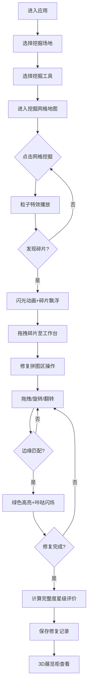

## 1. 产品概述

考古挖掘与文物修复Web应用，让玩家在浏览器中体验真实的考古发掘过程，解决传统考古游戏流程固定、缺乏实时物理模拟和个性化修复路径的痛点。目标用户为对考古学、历史学感兴趣的游戏玩家，产品核心价值是沉浸式考古体验、个性化修复路径、3D收藏展示。

## 2. 核心功能

### 2.1 功能模块

1. **挖掘场地模块**：沙漠/丛林/海底三大场景选择，网格地图挖掘系统，粒子特效，碎片发现闪光动画
2. **修复工作台模块**：碎片库存、拼图区、预览区，拖拽吸附、旋转翻转、边缘匹配算法
3. **评价与收藏模块**：星级评价系统、修复记录保存、3D展览柜展示

### 2.2 页面详情

| 页面名称 | 模块名称 | 功能描述 |
|-----------|-------------|---------------------|
| 场地选择页 | 场景卡片 | 沙漠/丛林/海底场景卡片展示，悬停放大动画，点击进入对应挖掘场地 |
| 场地选择页 | 工具选择 | 刷子/小铲/吸尘器三种工具选择，显示对碎片完整度影响说明 |
| 挖掘场地页 | 网格地图 | 俯视网格地图，不同土壤/沙层颜色渐变，点击挖掘 |
| 挖掘场地页 | 粒子特效 | 碎土飞溅粒子效果（10-15个），闪光动画 |
| 挖掘场地页 | 碎片显示 | 不规则多边形碎片飘浮动画 |
| 修复工作台页 | 碎片库存区 | 小图标带编号和颜色标签，支持拖拽 |
| 修复工作台页 | 修复拼图区 | 任意拖拽旋转，吸附效果，边缘匹配绿色高亮，咔哒视觉闪烁 |
| 修复工作台页 | 文物预览区 | 拼接进度百分比，完整文物缩略图 |
| 修复工作台页 | 碎片操作 | 鼠标滚轮旋转15度带惯性阻尼，R键水平翻转带弹性过渡 |
| 评价弹窗 | 星级评价 | 一星到三星旋转星星动画，光晕扫过，挖掘用时，修复准确率 |
| 展览柜页 | 3D画廊 | 立体文物模型展示，鼠标拖拽旋转查看 |
| 展览柜页 | 文物背景 | 根据年代/地域变换动态背景 |

## 3. 核心流程

玩家进入应用后首先选择挖掘场地（沙漠/丛林/海底）和挖掘工具，进入网格地图进行挖掘操作，点击网格触发挖掘粒子效果，发现文物碎片后碎片飘浮显示，玩家将碎片拖拽至修复工作台，在拼图区进行拖拽、旋转、翻转操作完成文物修复，系统根据工具与场地匹配度计算完整度并给出星级评价，玩家可保存修复记录并在3D展览柜中查看收藏。

## 4. 用户界面设计

### 4.1 设计风格

- **主色调**：大地色系（泥土棕#8B5A2B、陶土橙#D2691E、沙黄#F4A460）与海洋色系（深蓝#1E3A5F、浅蓝#87CEEB）
- **按钮风格**：圆角设计带微渐变，挖掘按钮泥土棕色渐变，修复按钮陶土橙色渐变
- **字体**：标题使用Cinzel（古典衬线字体），正文使用Lora（优雅衬线字体）
- **布局风格**：卡片式布局，挖掘场景深色背景突出网格和碎片，修复工作台浅色木纹背景
- **交互效果**：所有可交互元素悬停scale 1.05放大，过渡0.2秒，阴影加深

### 4.2 页面设计概览

| 页面名称 | 模块名称 | UI元素 |
|-----------|-------------|-------------|
| 场地选择页 | 场景卡片 | 三列卡片布局，大渐变遮罩标题，悬停上浮阴影，渐变边框发光 |
| 场地选择页 | 工具选择 | 图标按钮组，选中态发光边框 |
| 挖掘场地页 | 网格地图 | 深色背景，渐变色网格块，悬浮高亮，铲子光标 |
| 挖掘场地页 | 工具栏 | 顶部固定工具栏，返回/工作台入口，工具状态显示 |
| 修复工作台页 | 三栏布局 | 左库存-中拼图-右预览，木纹纹理背景，分区细线边框 |
| 修复工作台页 | 碎片 | 不规则多边形，编号标签，颜色指示 |
| 评价弹窗 | 星级动画 | 中心弹窗，旋转星星，光晕扫过，数据统计卡片 |
| 展览柜页 | 3D画廊 | 沉浸式深色展厅，文物聚光灯，动态背景 |

### 4.3 响应式设计

- 桌面端：挖掘网格和修复工作台左右排列
- 移动端：挖掘网格和修复工作台上下排列
- 触控优化：移动端拖拽使用touch事件，旋转使用双指手势

### 4.4 3D场景指引

- **环境**：展览柜采用展厅环境，深色空间感，聚光灯照明
- **光照**：AmbientLight环境光+DirectionalLight主光源+PointLight聚光灯效果
- **相机**：PerspectiveCamera，初始距离文物前45度俯视角
- **交互**：OrbitControls拖拽旋转，缩放
- **后期**：轻微辉光效果，文物阴影
