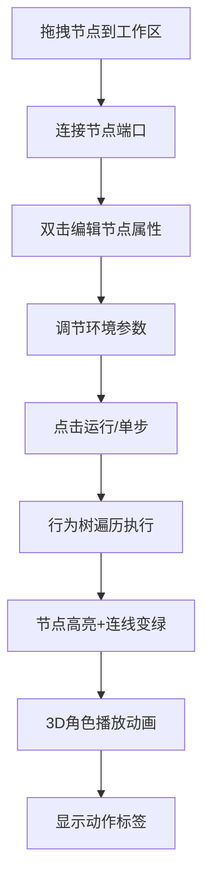

## 1. 产品概述

可视化AI行为树沙盒是一款面向游戏开发教学的交互式工具，帮助学生直观理解AI决策树（行为树）的工作原理。用户通过拖拽方式搭建行为树，设置虚拟角色环境状态，实时观察角色在3D场景中根据决策逻辑执行的动作动画。

- 主要解决：学生学习AI行为树时缺乏可视化、可交互的实践工具
- 目标用户：游戏开发专业学生、AI行为树初学者
- 产品价值：将抽象的决策逻辑转化为直观的可视化操作和实时动画反馈

## 2. 核心功能

### 2.1 用户角色
| 角色 | 注册方式 | 核心权限 |
|------|----------|----------|
| 普通用户 | 无需注册 | 完整使用所有功能 |

### 2.2 功能模块
1. **节点面板**：可折叠的节点类型选择器，展示选择节点、顺序节点、条件节点、行动节点
2. **树编辑器**：中央工作区，支持节点拖拽放置、连线、属性编辑
3. **3D场景查看器**：实时渲染角色行为动画的Three.js场景
4. **运行控制条**：运行/暂停/单步/重置控制，环境参数调节

### 2.3 页面详情
| 页面名称 | 模块名称 | 功能描述 |
|----------|----------|----------|
| 主页面 | 节点面板 | 展示四种节点类型卡片，支持拖拽到工作区 |
| 主页面 | 树编辑器 | 节点放置、连线、属性编辑，贝塞尔曲线连接 |
| 主页面 | 3D场景查看器 | 渲染绿色地面、蓝色角色胶囊、红色玩家球体，播放动作动画 |
| 主页面 | 运行控制条 | 运行控制按钮、环境参数滑块（玩家距离、生命值、掩体开关） |

## 3. 核心流程

用户从左侧节点面板拖拽节点类型到中央工作区生成节点，从节点输出端口拖拽连线到其他节点输入端口建立连接，双击节点编辑属性参数。在底部控制条调节环境参数后，点击运行按钮，行为树开始每50ms遍历执行，3D场景中的角色根据决策结果执行移动、攻击或躲藏动画，当前执行的节点高亮显示，执行路径的连线变为亮绿色。

## 4. 用户界面设计

### 4.1 设计风格
- **主色调**：深色主题，背景#1a1a2e，面板#16213e，文字#e0e0e0
- **节点配色**：选择节点#e94560（珊瑚红），顺序节点#0f3460（深蓝），条件节点#533483（紫），行动节点#1a936f（翠绿）
- **按钮样式**：悬停亮度提升10%，点击缩放0.95持续0.1s
- **字体**：采用现代无衬线字体，标题加粗，正文常规
- **布局风格**：左右两栏+底部横条，卡片式节点，网格背景辅助线

### 4.2 页面设计概述
| 页面名称 | 模块名称 | UI元素 |
|----------|----------|--------|
| 主页面 | 节点面板 | 240px可折叠侧边栏，四种彩色节点卡片，拖拽手柄，"<"/">"折叠按钮旋转动画 |
| 主页面 | 树编辑器 | 浅灰色网格背景，节点弹性放置动画，贝塞尔曲线连线，端口脉动光晕，双击弹出属性编辑弹窗 |
| 主页面 | 3D场景查看器 | 绿色地面网格，蓝色胶囊角色，红色球体玩家，灰色立方体掩体，动作标签滑入动画 |
| 主页面 | 运行控制条 | 60px高度固定，四个控制按钮（播放/暂停/单步/重置），渐变色滑块（红到绿），掩体切换开关 |

### 4.3 响应式
- **桌面端（>1280px）**：左右布局，左侧240px节点面板，右侧工作区+3D场景，底部60px控制条
- **平板端（768-1280px）**：底部控制条增高至80px，增加间距
- **移动端（<768px）**：节点面板变为顶部可展开抽屉，工作区垂直布局

### 4.4 3D场景设计
- **环境**：深色背景，绿色网格地面，简洁科技感
- **光照**：环境光+方向光，确保角色和物体清晰可见
- **相机**：透视相机，45度俯视角，可轻微拖拽调整视角
- **动画**：角色移动缓动动画，攻击手部摆动，躲藏蹲下动画，红色闪屏效果
- **特效**：节点高亮金色边框扩散，连线颜色平滑过渡（0.3s），动作文字标签滑入
