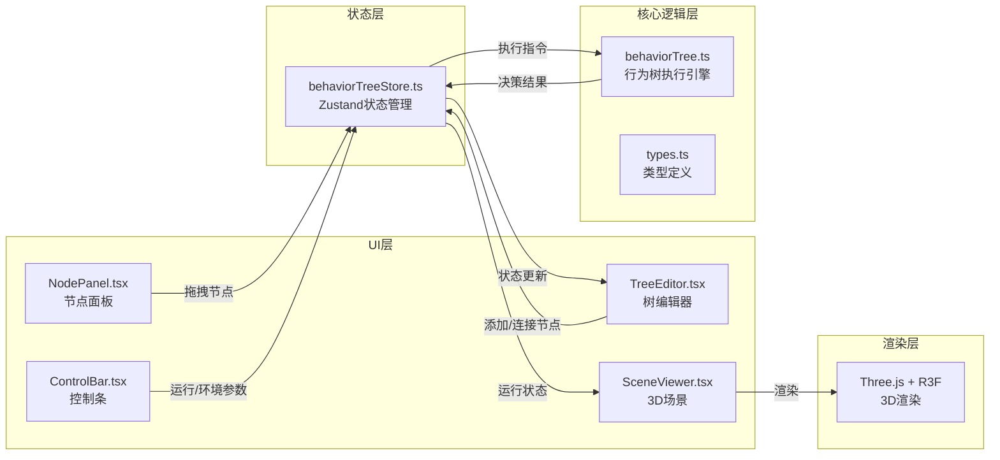

## 1. 架构设计



## 2. 技术描述
- **前端框架**：React 18 + TypeScript
- **构建工具**：Vite
- **3D渲染**：Three.js + @react-three/fiber + @react-three/drei
- **状态管理**：Zustand
- **拖拽交互**：react-dnd + react-dnd-html5-backend
- **样式方案**：CSS Modules + CSS变量

## 3. 目录结构
```
src/
├── App.tsx                 # 根组件，整体布局
├── main.tsx               # 入口文件
├── index.css              # 全局样式与CSS变量
├── types/
│   └── behaviorTree.ts    # 类型定义
├── stores/
│   └── behaviorTreeStore.ts  # Zustand状态管理
├── engine/
│   └── behaviorTree.ts    # 行为树执行引擎
├── components/
│   ├── NodePanel.tsx      # 左侧节点面板
│   ├── TreeEditor.tsx     # 中央树编辑器
│   ├── SceneViewer.tsx    # 3D场景查看器
│   ├── ControlBar.tsx     # 底部控制条
│   ├── TreeNode.tsx       # 节点卡片组件
│   ├── ConnectionLine.tsx # 贝塞尔连线组件
│   ├── PropertyModal.tsx  # 属性编辑弹窗
│   └── Slider.tsx         # 渐变滑块组件
└── utils/
    ├── geometry.ts        # 几何计算工具
    └── animation.ts       # 动画工具函数
```

## 4. 数据模型

### 4.1 节点类型
```typescript
type NodeType = 'selector' | 'sequence' | 'condition' | 'action';

interface TreeNodeData {
  id: string;
  type: NodeType;
  x: number;
  y: number;
  label: string;
  properties: Record<string, any>;
  isActive: boolean;
  isExecuting: boolean;
}

interface Connection {
  id: string;
  fromNodeId: string;
  fromPort: 'output';
  toNodeId: string;
  toPort: 'input';
  isActive: boolean;
}

interface EnvironmentState {
  playerDistance: number;  // 1-100
  health: number;          // 0-100
  hasCover: boolean;
}

interface CharacterState {
  position: { x: number; z: number };
  rotation: number;
  action: 'idle' | 'move' | 'attack' | 'hide';
  isCrouching: boolean;
}

interface RunState {
  isRunning: boolean;
  currentNodeId: string | null;
  executionPath: string[];
  speed: number;
}
```

### 4.2 Store 接口
```typescript
interface BehaviorTreeStore {
  // 状态
  nodes: TreeNodeData[];
  connections: Connection[];
  environment: EnvironmentState;
  character: CharacterState;
  runState: RunState;
  panelCollapsed: boolean;
  
  // 节点操作
  addNode: (type: NodeType, x: number, y: number) => void;
  removeNode: (id: string) => void;
  updateNodePosition: (id: string, x: number, y: number) => void;
  updateNodeProperties: (id: string, props: Record<string, any>) => void;
  
  // 连接操作
  addConnection: (fromId: string, toId: string) => void;
  removeConnection: (id: string) => void;
  
  // 环境操作
  updateEnvironment: (env: Partial<EnvironmentState>) => void;
  
  // 运行控制
  start: () => void;
  pause: () => void;
  step: () => void;
  reset: () => void;
  
  // UI操作
  togglePanel: () => void;
}
```

## 5. 核心调用关系

### 5.1 数据流
1. `NodePanel` → 拖拽 → `TreeEditor` 接收放置 → 调用 `store.addNode()`
2. `TreeNode` 端口拖拽 → `TreeEditor` 接收连接 → 调用 `store.addConnection()`
3. `ControlBar` 按钮点击 → 调用 `store.start()/pause()/step()/reset()`
4. `ControlBar` 滑块调节 → 调用 `store.updateEnvironment()`
5. `store.runState` 变化 → `behaviorTree` 引擎执行 → 更新 `character` 和 `isActive` 状态
6. `store` 状态变化 → `TreeEditor` 重新渲染节点和连线 → `SceneViewer` 更新3D动画

### 5.2 行为树执行逻辑
- **选择节点(Selector)**：依次执行子节点，直到一个成功返回成功，全部失败返回失败
- **顺序节点(Sequence)**：依次执行子节点，直到一个失败返回失败，全部成功返回成功
- **条件节点(Condition)**：判断环境参数是否满足条件，返回成功/失败
- **行动节点(Action)**：执行具体动作（移动/攻击/躲藏），返回成功

## 6. 性能优化
- 使用 Zustand 选择器避免不必要重渲染
- 节点使用 React.memo 包裹
- 3D场景使用 InstancedMesh 优化渲染
- 行为树执行使用 requestAnimationFrame 控制帧率
- 连线使用 SVG 路径缓存
