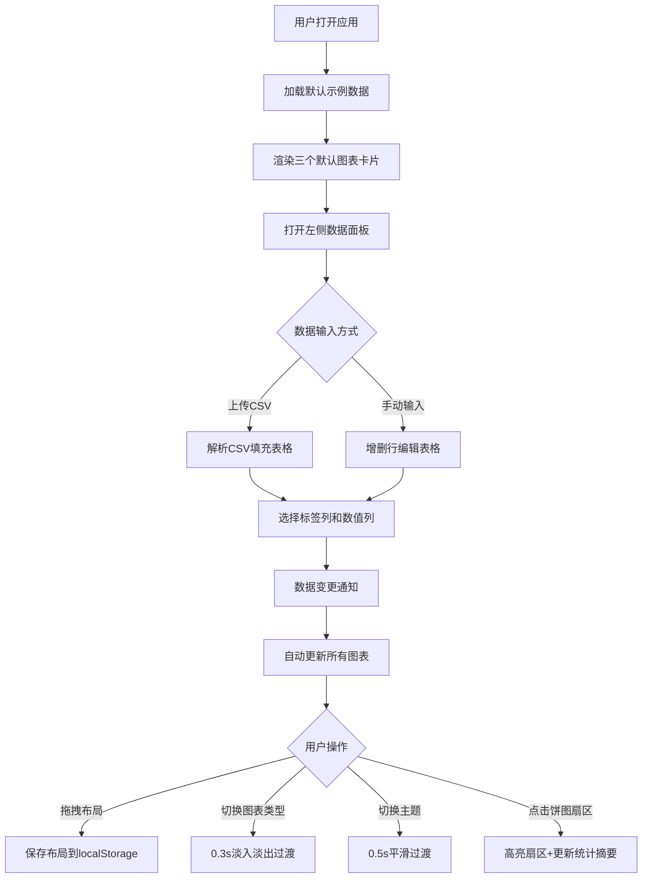

## 1. 产品概述
个人动态数据可视化仪表板，用户可通过上传CSV或手动输入数据，自动生成三种可交互图表（折线图、柱状图、饼图），支持图表布局拖拽调整和多主题配色切换。

- 核心用途：为个人用户提供轻量级的数据可视化工具，快速将原始数据转化为直观的图表仪表板
- 目标用户：需要快速展示和分析数据的个人用户、数据分析师、学生

## 2. 核心功能

### 2.1 用户角色
| 角色 | 注册方式 | 核心权限 |
|------|---------|----------|
| 普通用户 | 无需注册 | 上传/输入数据、生成图表、调整布局、切换主题 |

### 2.2 功能模块
1. **数据面板**：手动添加行、CSV上传解析、数据预览表格、标签列选择
2. **仪表板主体**：Grid布局展示图表卡片、拖拽排序、大小调整
3. **图表卡片**：ECharts渲染、图表类型切换、导出、全屏、统计摘要
4. **主题系统**：三种配色主题切换、全局样式联动

### 2.3 页面详情
| 页面名称 | 模块名称 | 功能描述 |
|---------|---------|----------|
| 主页面 | 顶部导航栏 | 深色毛玻璃效果、主题切换按钮、数据面板开关 |
| 主页面 | 左侧数据面板 | 抽屉样式、CSV上传、手动增删行、数据表格编辑、标签列选择 |
| 主页面 | 仪表板区域 | 3个默认图表卡片、Grid布局、拖拽排序/调整大小 |
| 主页面 | 图表卡片 | 标题编辑、图表类型下拉菜单、图表渲染、统计摘要、导出、全屏 |

## 3. 核心流程
用户打开应用 → 默认展示示例数据的三个图表 → 通过左侧面板上传CSV或手动输入数据 → 系统自动更新图表 → 用户拖拽调整卡片位置/大小 → 切换图表类型和配色主题 → 导出或全屏查看图表 → 布局状态持久化保存

## 4. 用户界面设计

### 4.1 设计风格
- **主背景色**：#1a1a2e（深色主题）
- **导航栏**：深蓝色半透明毛玻璃效果（backdrop-filter: blur）
- **配色主题**：
  - 默认：蓝紫渐变
  - 暖阳：橙黄渐变
  - 森林：绿褐渐变
- **按钮样式**：统一8px圆角，点击0.2s缩放反馈
- **卡片样式**：12px圆角，微弱发光边框，悬停阴影增强一倍
- **字体**：现代无衬线字体，标题加粗，正文常规

### 4.2 页面设计概览
| 页面名称 | 模块名称 | UI元素 |
|---------|---------|--------|
| 主页面 | 顶部导航 | 深蓝色半透明、毛玻璃模糊、左侧面板开关、主题切换下拉 |
| 主页面 | 左侧抽屉 | 320px宽、0.4s滑入动画、上传区域、数据表格、列选择器 |
| 主页面 | 图表卡片 | 12px圆角、发光边框、可编辑标题、下拉菜单、统计摘要 |
| 主页面 | 数据表格 | 交替行颜色、选中行高亮、自定义窄滚动条 |

### 4.3 响应式
- 桌面端优先设计，最小支持1280px宽度
- 左侧抽屉320px固定宽度，仪表板区域自适应剩余空间
- Grid列数根据屏幕宽度自动调整（默认12列栅格）

### 4.4 动画细节
- 抽屉滑入：0.4s cubic-bezier缓动
- 图表类型切换：0.3s淡入淡出
- 主题切换：ECharts动画0.5s平滑过渡
- 卡片拖拽：半透明跟随，松开平滑吸附
- 按钮交互：0.2s缩放反馈（scale 0.95→1）
- 卡片悬停：阴影增强一倍，过渡0.2s
