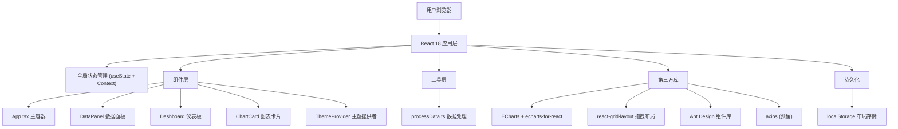

## 1. 架构设计



## 2. 技术说明
- **前端框架**：React 18 + TypeScript
- **构建工具**：Vite 5 (ES模块，严格模式)
- **图表库**：ECharts 5 + echarts-for-react
- **UI组件库**：Ant Design 5 + @ant-design/icons
- **布局库**：react-grid-layout 1.x
- **HTTP请求**：axios (预留扩展)
- **样式方案**：CSS Modules + CSS变量 + 内联样式
- **状态管理**：React useState/useReducer + Context API
- **初始化方式**：Vite react-ts 模板

## 3. 文件结构
```
auto111/
├── package.json
├── vite.config.ts
├── tsconfig.json
├── index.html
└── src/
    ├── main.tsx
    ├── App.tsx
    ├── components/
    │   ├── Dashboard.tsx
    │   ├── ChartCard.tsx
    │   └── DataPanel.tsx
    ├── utils/
    │   └── processData.ts
    └── styles/ (可选，全局样式)
```

## 4. 模块接口定义

### 4.1 类型定义
```typescript
interface DataRow {
  [key: string]: string | number;
}

type ChartType = 'line' | 'bar' | 'pie';

interface ThemeConfig {
  name: string;
  colors: string[];
  bgPrimary: string;
  bgSecondary: string;
  borderColor: string;
  glowColor: string;
}

interface ChartCardConfig {
  id: string;
  title: string;
  chartType: ChartType;
  labelColumn: string;
  valueColumn: string;
}

interface LayoutItem {
  i: string;
  x: number;
  y: number;
  w: number;
  h: number;
  minW?: number;
  minH?: number;
  maxW?: number;
  maxH?: number;
}

interface StatsSummary {
  sum: number;
  average: number;
  max: number;
  min: number;
  selectedLabel?: string;
}
```

### 4.2 数据流
1. App.tsx 持有全局状态：dataRows, columns, labelColumn, valueColumn, chartConfigs, layout, theme
2. DataPanel 修改 dataRows/columns/labelColumn/valueColumn，通过回调通知 App
3. App 将数据传入 Dashboard，Dashboard 接收布局回调更新 layout
4. Dashboard 遍历 chartConfigs 渲染 ChartCard，每张卡片接收独立的 chartType 配置
5. ChartCard 调用 processData 处理数据后传递给 ECharts

## 5. 核心处理逻辑

### 5.1 processData.ts 输出
- 折线图/柱状图：返回 { xAxis: { data: labels[] }, series: [{ type, data: values[], ... }] }
- 饼图：返回 { series: [{ type: 'pie', data: [{ name, value }[]], ... }] }
- 统计摘要：对数值列计算 sum/average/max/min

### 5.2 localStorage 持久化
- key: `dashboard_layout_v1`
- key: `dashboard_theme_v1`
- key: `dashboard_chart_configs_v1`

### 5.3 性能保障
- 数据变更使用 useMemo 缓存 processData 结果
- ECharts notMerge/lazyUpdate 配置优化重渲染
- react-grid-layout useCSSTransforms 启用 GPU 加速
- 拖拽节流，布局更新防抖保存 localStorage
