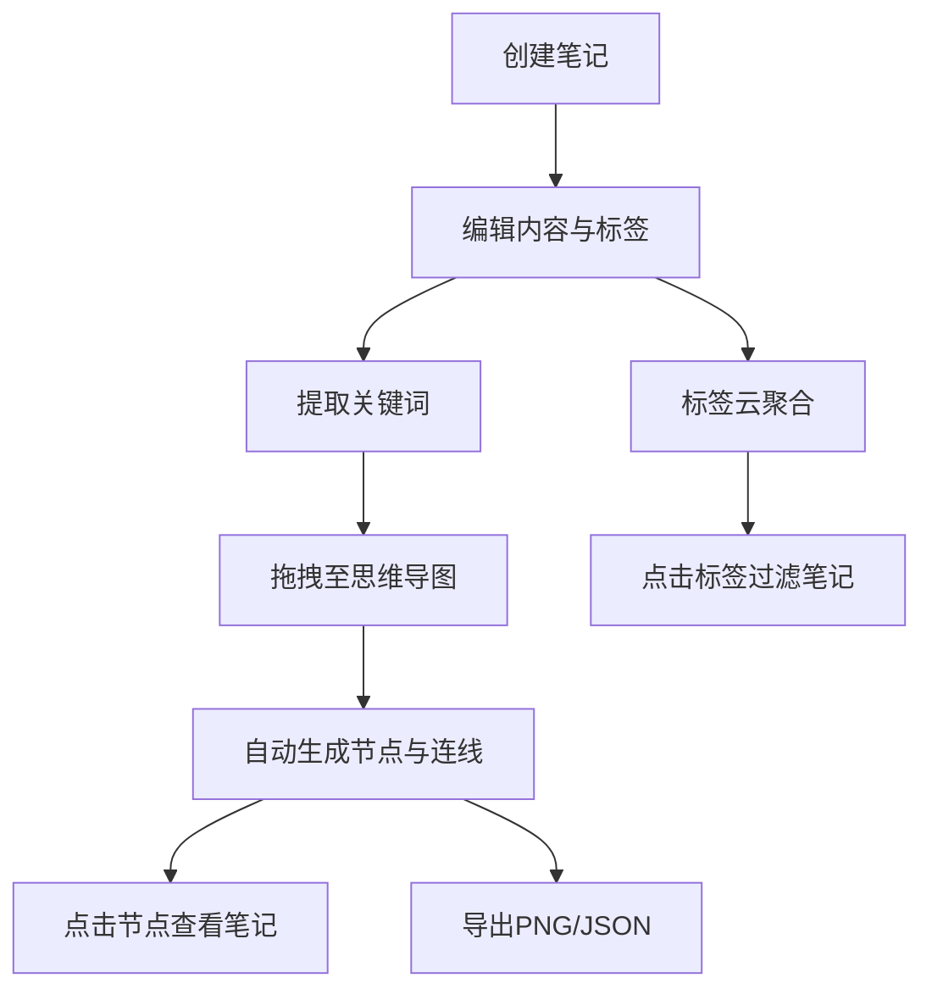

## 1. 产品概述

知识笔记与思维导图管理应用，面向个人或小团队，解决传统笔记工具无法将零散记录自动关联成结构化思维导图、以及难以在笔记之间建立可视化链接的痛点。核心价值：让笔记从"碎片化存储"升级为"结构化知识网络"。

- 目标用户：个人知识工作者、小团队协作成员
- 核心价值：笔记自动关联、思维导图可视化、标签云聚合

## 2. 核心功能

### 2.1 用户角色

| 角色 | 注册方式 | 核心权限 |
|------|----------|----------|
| 普通用户 | 无需注册（单用户/本地模式） | 全部功能 |

### 2.2 功能模块

1. **笔记编辑页**：富文本编辑器、Markdown格式化、标签管理、图片嵌入、大纲目录树、拖拽排序
2. **思维导图面板**：关键词节点提取、自动连线、画布平移缩放、节点浮动卡片
3. **标签云视图**：标签网格展示、颜色生成、笔记过滤、瀑布流列表
4. **导出功能**：PNG导出、JSON导出

### 2.3 页面详情

| 页面名称 | 模块名称 | 功能描述 |
|----------|----------|----------|
| 主工作区 | 笔记目录树 | 左侧折叠式目录树，浅蓝灰连接线，旋转箭头动画，拖拽笔记调整层级归属 |
| 主工作区 | 笔记编辑区 | 中间富文本编辑器，暖白背景深灰文字，标题22px微软雅黑加粗，正文16px宋体，支持#tag标签、Markdown格式化、图片粘贴上传缩略展示 |
| 主工作区 | 思维导图面板 | 右侧画布面板，从笔记提取关键词拖拽生成圆形节点（蓝绿渐变），自动绘制带箭头连线，画布平移缩放，节点点击弹出浮动卡片显示笔记列表 |
| 主工作区 | 标签云视图 | 网格排列胶囊标签，首字母HSL颜色生成，标签大小与笔记数量成正比，点击过滤笔记，瀑布流列表展示 |
| 主工作区 | 导出功能 | 右上角导出按钮，PNG（1920x1080纯白背景）和JSON（节点坐标、连线、笔记ID标题），按钮按下缩放反馈，成功提示条3秒淡出 |

## 3. 核心流程

用户创建笔记 → 编辑器中输入内容和标签 → 从笔记提取关键词 → 拖拽关键词到思维导图面板 → 自动生成节点和连线 → 点击节点查看关联笔记 → 通过标签云过滤笔记 → 导出思维导图为PNG/JSON

## 4. 用户界面设计

### 4.1 设计风格

- 主色调：极简白 + 海军蓝 + 浅灰色辅助线
- 编辑器：暖白色背景(#FFF8F0)，深灰文字(#333333)
- 标题：22px 微软雅黑加粗
- 正文：16px 宋体
- 节点：蓝绿色渐变填充，直径40px
- 连线：深灰半透明，线宽2px，带箭头
- 标签胶囊：首字母HSL颜色生成
- 笔记卡片：圆角10px，左边框标签主题色竖条
- 按钮：按下缩放反馈
- 提示条：绿色背景白色文字，3秒淡出
- 所有交互：0.2秒缓动动画

### 4.2 页面设计概览

| 页面名称 | 模块名称 | UI元素 |
|----------|----------|--------|
| 主工作区 | 笔记目录树 | 浅蓝灰连接线、旋转箭头动画、折叠面板、默认宽240px |
| 主工作区 | 笔记编辑区 | 暖白背景、Markdown编辑器、标签高亮、图片缩略图、自适应宽度 |
| 主工作区 | 思维导图面板 | 蓝绿渐变圆形节点、深灰半透明连线、画布平移缩放、浮动卡片、最小宽350px |
| 主工作区 | 标签云视图 | 胶囊标签网格、HSL颜色、瀑布流笔记列表、悬停上移5px+阴影 |
| 主工作区 | 导出功能 | 右上角按钮、按下缩放、绿色成功提示条 |

### 4.3 响应式设计

- 桌面优先设计，三栏布局
- 宽度≤768px时三栏变两栏，思维导图面板移至底部，高度可调
- 分隔线可拖动调整宽度

### 4.4 性能要求

- 思维导图画布渲染50节点+100连线时，拖拽缩放帧率≥30fps
- 笔记搜索响应时间≤500ms
- 所有交互0.2秒缓动动画
