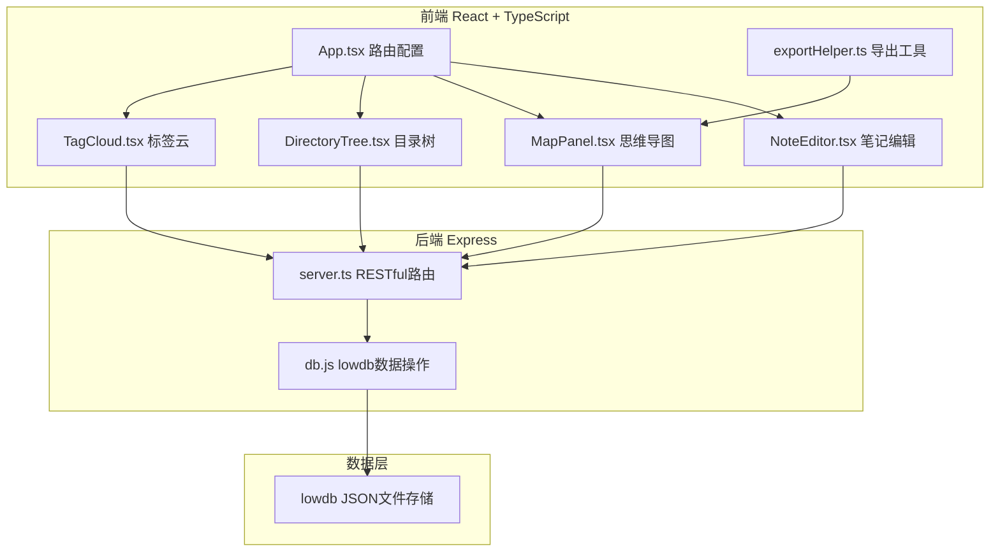
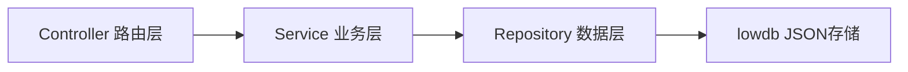
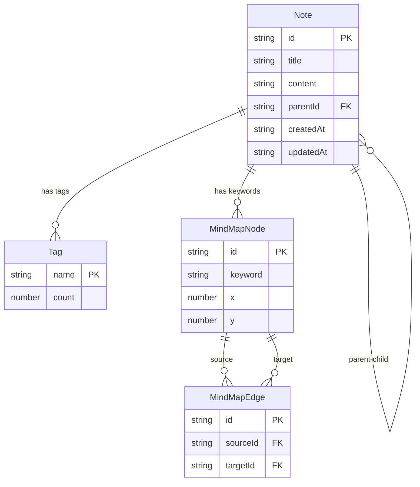

## 1. 架构设计



## 2. 技术说明

- 前端：React@18 + TypeScript + Vite + Tailwind CSS + Zustand
- 初始化工具：vite-init（react-express-ts 模板）
- 后端：Express@4 + TypeScript
- 数据库：lowdb（JSON文件存储）
- 认证：bcryptjs + jsonwebtoken（预留）
- 文件上传：multer + sharp（图片处理）
- 画布渲染：HTML5 Canvas（思维导图）

## 3. 路由定义

| 路由 | 用途 |
|------|------|
| / | 主工作区，包含笔记编辑、目录树、思维导图、标签云 |
| /note/:id | 笔记编辑详情页 |

## 4. API定义

### 4.1 笔记接口

```typescript
interface Note {
  id: string;
  title: string;
  content: string;
  tags: string[];
  parentId: string | null;
  createdAt: string;
  updatedAt: string;
  keywords: string[];
}

// GET /api/notes - 获取所有笔记
// GET /api/notes/:id - 获取单个笔记
// POST /api/notes - 创建笔记
// PUT /api/notes/:id - 更新笔记
// DELETE /api/notes/:id - 删除笔记
// PUT /api/notes/:id/move - 移动笔记层级
```

### 4.2 标签接口

```typescript
interface Tag {
  name: string;
  count: number;
  noteIds: string[];
}

// GET /api/tags - 获取所有标签
// GET /api/tags/:name/notes - 获取标签下笔记
```

### 4.3 思维导图接口

```typescript
interface MindMapNode {
  id: string;
  keyword: string;
  noteIds: string[];
  x: number;
  y: number;
}

interface MindMapEdge {
  id: string;
  sourceId: string;
  targetId: string;
}

// GET /api/mindmap - 获取思维导图数据
// POST /api/mindmap/nodes - 添加节点
// PUT /api/mindmap/nodes/:id - 更新节点位置
// DELETE /api/mindmap/nodes/:id - 删除节点
// POST /api/mindmap/edges - 添加连线
// DELETE /api/mindmap/edges/:id - 删除连线
```

### 4.4 图片上传接口

```typescript
// POST /api/upload - 上传图片（multipart/form-data）
// 返回 { url: string }
```

## 5. 服务端架构图



## 6. 数据模型

### 6.1 数据模型定义



### 6.2 数据定义

```json
{
  "notes": [
    {
      "id": "uuid",
      "title": "笔记标题",
      "content": "Markdown内容",
      "tags": ["标签1", "标签2"],
      "parentId": null,
      "keywords": ["关键词1"],
      "createdAt": "2026-01-01T00:00:00.000Z",
      "updatedAt": "2026-01-01T00:00:00.000Z"
    }
  ],
  "mindmapNodes": [
    {
      "id": "uuid",
      "keyword": "关键词",
      "noteIds": ["note-id-1"],
      "x": 100,
      "y": 200
    }
  ],
  "mindmapEdges": [
    {
      "id": "uuid",
      "sourceId": "node-id-1",
      "targetId": "node-id-2"
    }
  ]
}
```
