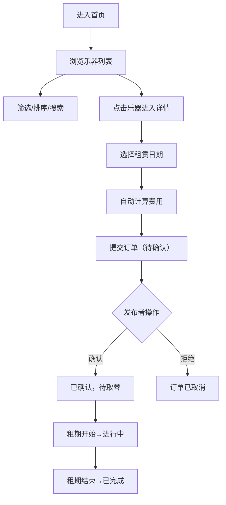

## 1. 产品概述

社区二手乐器租赁与交换平台，面向音乐爱好者，提供闲置乐器发布、浏览、租用、订单管理的一站式服务。平台连接闲置乐器持有者与有临时使用需求的乐手，降低乐器使用成本，促进乐器资源流通。

目标用户为拥有闲置乐器的个人、音乐学习者、演出组织者，核心价值在于便捷的乐器共享生态与可信的交易保障。

## 2. 核心功能

### 2.1 用户角色

| 角色 | 注册方式 | 核心权限 |
|------|----------|----------|
| 普通用户 | 用户名+密码注册 | 浏览乐器、发布闲置、发起租赁、管理订单 |

### 2.2 功能模块

1. **首页/乐器列表**：网格卡片展示、分类筛选、租金排序、搜索
2. **乐器详情页**：图片轮播、详细信息、租赁表单
3. **发布乐器**：多图上传与裁剪预览、信息填写表单
4. **个人中心**：发布的乐器、收到的订单、发出的订单
5. **用户认证**：注册、登录、会话管理

### 2.3 页面详情

| 页面名称 | 模块名称 | 功能描述 |
|----------|----------|----------|
| 首页/乐器列表 | 顶部导航栏 | Logo、搜索框、用户头像/登录入口、汉堡菜单 |
| 首页/乐器列表 | 筛选排序栏 | 分类下拉、租金升序/降序切换 |
| 首页/乐器列表 | 乐器卡片网格 | 响应式网格，PC 4列、平板 2列、手机 1列 |
| 首页/乐器列表 | 乐器卡片 | 缩略图、名称、分类标签、日租金、状态标签、悬停上浮 |
| 乐器详情页 | 图片轮播区 | 左侧轮播，淡入淡出切换、缩略图选择 |
| 乐器详情页 | 信息展示区 | 名称、品牌、分类、年份、描述、日租金、押金 |
| 乐器详情页 | 租赁表单 | 日期选择器、租期校验、费用计算、提交订单 |
| 发布乐器页 | 图片上传区 | 多图上传、Canvas等比缩放裁剪预览、大小限制 |
| 发布乐器页 | 信息表单 | 名称、分类、品牌、年份、日租金、押金、描述 |
| 个人中心 | 标签切换 | 发布的乐器/收到的订单/发出的订单 |
| 个人中心 | 乐器管理列表 | 发布者可查看、删除自有乐器 |
| 个人中心 | 订单卡片 | 显示乐器、双方昵称、日期、金额、状态、操作按钮 |
| 登录/注册页 | 认证表单 | 用户名、密码输入、注册/登录切换 |

## 3. 核心流程

**用户浏览并租赁乐器流程**：

用户进入首页 → 浏览乐器列表（可筛选/排序/搜索）→ 点击乐器卡片进入详情页 → 选择租赁起止日期 → 系统自动计算总租金与押金 → 确认提交订单 → 订单状态为"待发布者确认" → 发布者在个人中心确认订单 → 订单变为"已确认，待取琴" → 租期开始后状态为"进行中" → 租期结束后状态为"已完成"

## 4. 用户界面设计

### 4.1 设计风格

- **主色调**：木纹暖棕色系（#8B5A2B 暖棕、#D2B48C 浅木色、#5D3A1A 深棕），营造自然复古音乐氛围
- **点缀色**：森林绿色（#2E7D32、#4CAF50），代表生命力与艺术感
- **按钮样式**：圆角（8px），渐变背景（暖棕→深棕），按下有回弹动画
- **字体**：标题使用 Lora（衬线体，复古优雅），正文使用 Source Sans Pro（易读性好）
- **布局风格**：卡片式布局，顶部固定导航栏，充足留白
- **图标风格**：Lucide React 线性图标，统一线条粗细

### 4.2 页面设计概览

| 页面名称 | 模块名称 | UI 元素 |
|----------|----------|---------|
| 首页/乐器列表 | 顶部导航栏 | 固定定位、木纹背景、半透明毛玻璃效果、滚动时阴影加深 |
| 首页/乐器列表 | 乐器卡片 | 白色底、圆角12px、轻微阴影、悬停 translateY(-4px)、过渡动画 0.3s |
| 首页/乐器列表 | 状态标签 | 可租（绿色底）、已租出（灰色底）、pill 形 |
| 乐器详情页 | 图片轮播 | 圆角16px、阴影、淡入淡出切换动画（opacity 过渡） |
| 乐器详情页 | 租赁表单 | 输入框聚焦时边框发光（box-shadow 0 0 0 3px rgba(76,175,80,0.2)） |
| 乐器详情页 | 提交按钮 | 绿色渐变背景、hover 加深、active 缩放 0.98 |
| 个人中心 | 订单卡片 | 左侧色条标识状态（橙-待确认、蓝-已确认、绿-进行中、灰-已完成） |
| 发布乐器页 | 图片预览区 | Canvas 裁剪预览框、拖拽上传、删除图标 |

### 4.3 响应式设计

- **桌面端（≥1024px）**：乐器列表 4 列网格，导航栏完整展示所有元素
- **平板端（768px-1023px）**：乐器列表 2 列网格，搜索框宽度自适应
- **手机端（<768px）**：乐器列表 1 列，导航栏变为汉堡菜单，表单元素全宽
- 触控优化：按钮最小尺寸 44×44px，交互区域充足

### 4.4 动效设计

- 页面加载：卡片依次淡入（staggered animation-delay）
- 卡片悬停：translateY(-4px) + 阴影加深，0.3s ease
- 图片轮播：opacity 0.4s 淡入淡出
- 按钮按下：scale(0.98) 回弹
- 状态切换：色条颜色过渡动画
