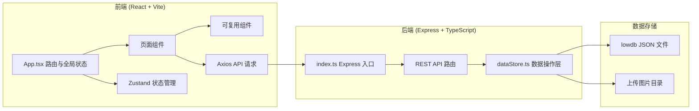
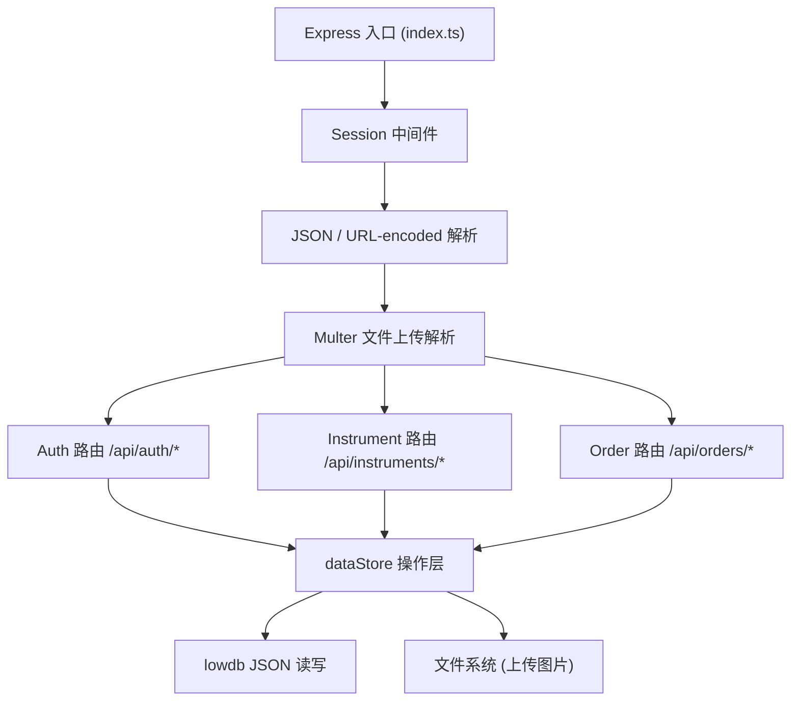
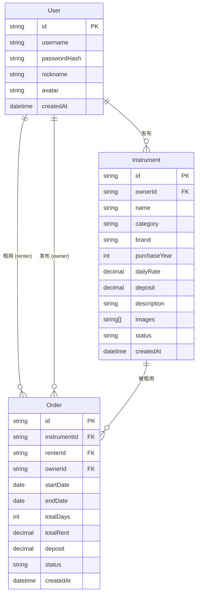

## 1. 架构设计



## 2. 技术说明

- **前端框架**：React@18 + TypeScript
- **构建工具**：Vite，配置 API 代理到后端 `http://localhost:3001`
- **路由**：react-router-dom v6
- **状态管理**：Zustand，管理用户会话、乐器列表、订单状态
- **HTTP 客户端**：Axios，withCredentials=true 支持 session cookie
- **样式方案**：TailwindCSS v3，配合自定义 CSS 变量定义主题色
- **图标**：lucide-react
- **后端框架**：Express@4
- **会话管理**：express-session，内存存储（开发环境）
- **数据库**：lowdb（本地 JSON 文件）
- **文件上传**：multer 处理 multipart/form-data，sharp 服务端图片处理
- **密码哈希**：Node.js crypto 模块 sha256
- **唯一标识**：uuid

## 3. 路由定义

| 路由路径 | 用途 |
|----------|------|
| `/` | 首页/乐器列表 |
| `/instrument/:id` | 乐器详情页 |
| `/publish` | 发布乐器（需登录） |
| `/profile` | 个人中心（需登录） |
| `/login` | 登录/注册页 |

## 4. API 定义

### 4.1 TypeScript 类型定义

```typescript
interface User {
  id: string;
  username: string;
  passwordHash: string;
  nickname: string;
  avatar?: string;
  createdAt: string;
}

interface Instrument {
  id: string;
  ownerId: string;
  name: string;
  category: 'guitar' | 'keyboard' | 'wind' | 'string' | 'percussion' | 'other';
  brand: string;
  purchaseYear: number;
  dailyRate: number;
  deposit: number;
  description: string;
  images: string[];
  status: 'available' | 'rented';
  createdAt: string;
}

interface Order {
  id: string;
  instrumentId: string;
  renterId: string;
  ownerId: string;
  startDate: string;
  endDate: string;
  totalDays: number;
  totalRent: number;
  deposit: number;
  status: 'pending' | 'confirmed' | 'active' | 'completed' | 'cancelled' | 'rejected';
  createdAt: string;
}

type SessionUser = { id: string; username: string; nickname: string };
```

### 4.2 REST API 接口

| 方法 | 路径 | 描述 | 请求体 | 响应 |
|------|------|------|--------|------|
| `POST` | `/api/auth/register` | 用户注册 | `{ username, password, nickname }` | `{ success, user }` |
| `POST` | `/api/auth/login` | 用户登录 | `{ username, password }` | `{ success, user }` |
| `POST` | `/api/auth/logout` | 退出登录 | — | `{ success }` |
| `GET` | `/api/auth/me` | 获取当前用户 | — | `{ user }` 或 `null` |
| `GET` | `/api/instruments` | 获取乐器列表 | query: category, sort, search | `{ instruments: Instrument[] }` |
| `GET` | `/api/instruments/:id` | 获取乐器详情 | — | `{ instrument, owner }` |
| `POST` | `/api/instruments` | 发布乐器（需登录） | `multipart/form-data` | `{ instrument }` |
| `DELETE` | `/api/instruments/:id` | 删除乐器（需登录） | — | `{ success }` |
| `GET` | `/api/orders` | 获取我的订单（需登录） | query: role(sent/received) | `{ orders: Order[] }` |
| `POST` | `/api/orders` | 创建订单（需登录） | `{ instrumentId, startDate, endDate }` | `{ order }` |
| `PATCH` | `/api/orders/:id/status` | 更新订单状态（需登录） | `{ status }` | `{ order }` |

## 5. 服务端架构



## 6. 数据模型

### 6.1 实体关系图



### 6.2 lowdb JSON 结构

```json
{
  "users": [
    { "id": "uuid", "username": "string", "passwordHash": "sha256", "nickname": "string", "avatar": "string?", "createdAt": "ISO8601" }
  ],
  "instruments": [
    { "id": "uuid", "ownerId": "uuid", "name": "string", "category": "enum", "brand": "string", "purchaseYear": 2020, "dailyRate": 50, "deposit": 1000, "description": "text", "images": ["url"], "status": "available", "createdAt": "ISO8601" }
  ],
  "orders": [
    { "id": "uuid", "instrumentId": "uuid", "renterId": "uuid", "ownerId": "uuid", "startDate": "YYYY-MM-DD", "endDate": "YYYY-MM-DD", "totalDays": 3, "totalRent": 150, "deposit": 1000, "status": "pending", "createdAt": "ISO8601" }
  ]
}
```

## 7. 项目文件结构

```
auto15/
├── package.json
├── vite.config.ts
├── tsconfig.json
├── index.html
├── db.json                          # lowdb 数据文件（运行时生成）
├── uploads/                         # 上传图片目录（运行时生成）
└── src/
    ├── client/
    │   ├── main.tsx
    │   ├── App.tsx                   # 路由 + 全局状态
    │   ├── index.css                 # 全局样式 + Tailwind
    │   ├── store/
    │   │   └── useStore.ts           # Zustand 状态管理
    │   ├── api/
    │   │   └── client.ts             # Axios 实例
    │   ├── components/
    │   │   ├── InstrumentCard.tsx
    │   │   ├── RentalForm.tsx
    │   │   ├── Navbar.tsx
    │   │   ├── ImageCarousel.tsx
    │   │   ├── ImageUploader.tsx
    │   │   └── OrderCard.tsx
    │   └── pages/
    │       ├── HomePage.tsx
    │       ├── InstrumentDetail.tsx
    │       ├── PublishPage.tsx
    │       ├── ProfilePage.tsx
    │       └── AuthPage.tsx
    └── server/
        ├── index.ts                  # Express 入口
        └── dataStore.ts              # lowdb 封装
```
