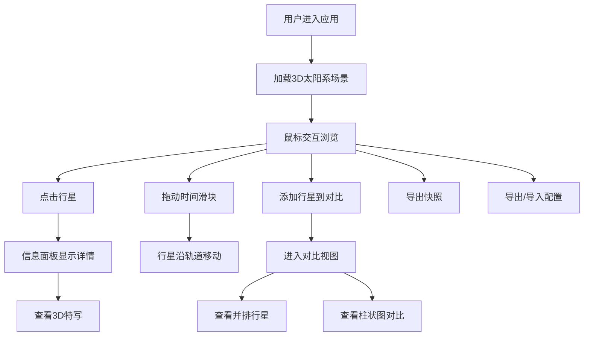

## 1. 产品概述

星途天文探索器 - 沉浸式3D太阳系交互应用，帮助天文爱好者直观了解行星比例、轨道关系和表面细节。

- 解决痛点：传统天文教学中行星比例、轨道关系难以直观感知，缺乏沉浸式交互体验
- 目标用户：天文爱好者、学生、科普教育工作者
- 核心价值：通过真实比例的3D模型和交互体验，让用户直观感受太阳系的宏伟与精妙

## 2. 核心功能

### 2.1 用户角色
| 角色 | 注册方式 | 核心权限 |
|------|----------|----------|
| 访客用户 | 无需注册 | 浏览太阳系、查看行星信息、使用对比功能、导出配置 |

### 2.2 功能模块
1. **3D太阳系主场景**：太阳+八大行星真实比例模型，轨道线，星空背景，视角交互
2. **行星信息面板**：行星详细数据展示，3D特写视图，自动旋转动画
3. **时间控制**：时间滑块控制日期，行星沿轨道实时移动
4. **对比模式**：最多3颗行星并排对比，比例切换，柱状图对比
5. **导出导入**：场景快照导出，配置JSON导出/导入

### 2.3 页面详情
| 页面名称 | 模块名称 | 功能描述 |
|----------|----------|----------|
| 主场景页 | 顶部导航栏 | Logo、对比模式入口、导出按钮、轨迹开关 |
| 主场景页 | 3D太阳系场景 | 太阳、八大行星、轨道线、星空背景、交互控制 |
| 主场景页 | 信息面板 | 行星详情、数据统计、3D特写视图 |
| 主场景页 | 时间滑块 | 0-365天时间控制、播放/暂停 |
| 对比视图页 | 并排行星对比 | 3D模型并排展示、比例切换、自动旋转 |
| 对比视图页 | 对比柱状图 | 直径、质量、引力三维对比 |
| 对比视图页 | 收藏列表管理 | 添加/移除行星、最多3颗限制 |

## 3. 核心流程

用户进入应用 → 浏览3D太阳系场景 → 点击行星查看详情 → 调节时间观察轨道运动 → 选择行星加入对比 → 进入对比视图查看数据对比 → 导出快照或配置

## 4. 用户界面设计

### 4.1 设计风格
- **主色调**：深空蓝黑渐变背景（#0a0e1a → #1a1f35）
- **强调色**：冰蓝色（#64b5f6）、金色点缀（#ffd54f）
- **按钮风格**：半透明圆角按钮，微光悬浮动画
- **字体**：JetBrains Mono 等宽字体展示数据，Inter 作为标题字体
- **布局风格**：卡片式布局，深灰半透明背景（rgba(30, 35, 50, 0.85)），毛玻璃效果
- **图标风格**：线性简洁图标，lucide-react 图标库

### 4.2 页面设计概述
| 页面名称 | 模块名称 | UI元素 |
|----------|----------|--------|
| 主场景页 | 顶部导航栏 | 半透明毛玻璃效果，Logo、功能按钮，悬浮微光动画 |
| 主场景页 | 3D场景 | 深空背景，星点粒子动效，行星发光材质，轨道半透明虚线 |
| 主场景页 | 信息面板 | 右侧滑入，深灰半透明卡片，环形轨道进度条，3D特写视图 |
| 主场景页 | 时间滑块 | 底部固定，渐变轨道，微光滑块，播放/暂停按钮 |
| 对比视图页 | 对比卡片 | 卡片翻转过渡效果，并排行星3D视图 |
| 对比视图页 | 柱状图 | 冰蓝色渐变柱体，等宽字体数值标注 |

### 4.3 响应式
- **桌面端（>1024px）**：信息面板右侧固定，3D场景全屏，时间滑块底部全宽
- **平板端（768-1024px）**：信息面板底部弹出，导航栏简化
- **移动端（<768px）**：信息面板全屏模态，触控优化交互，滑块放大
- **触控优化**：增大点击热区，支持双指缩放，滑动操作

### 4.4 3D场景指引
- **环境**：深空蓝黑渐变背景，数千颗星点粒子动效，微弱星云光雾
- **光照**：太阳作为点光源发光，行星接收光照，环境光补充暗部细节
- **相机**：透视相机，初始视角俯瞰太阳系，支持OrbitControls拖拽旋转和滚轮缩放
- **运动**：视角切换平滑插值过渡（800ms内），行星自转+公转，特写镜头缓慢推近
- **后处理**：Bloom发光效果（太阳、行星边缘），景深虚化（特写模式背景虚化）
- **性能**：实例化星点，LOD模型，>30fps帧率目标
