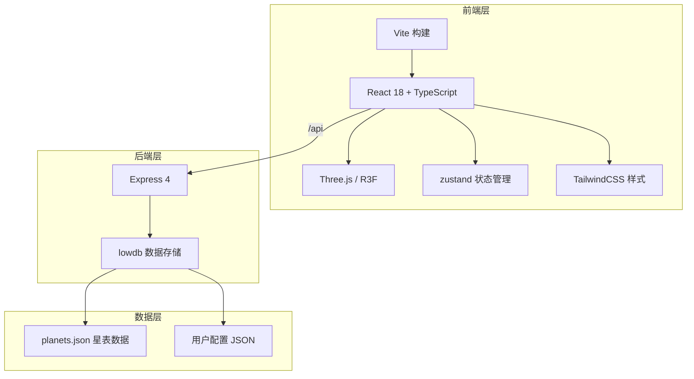
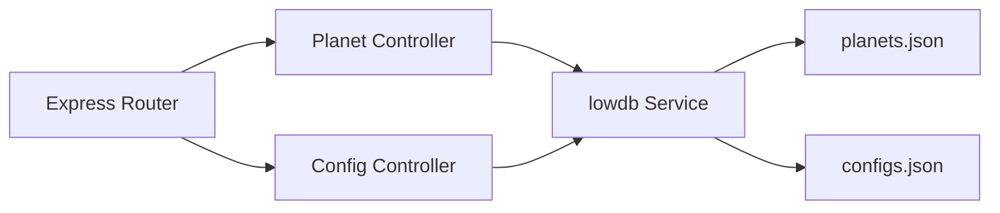
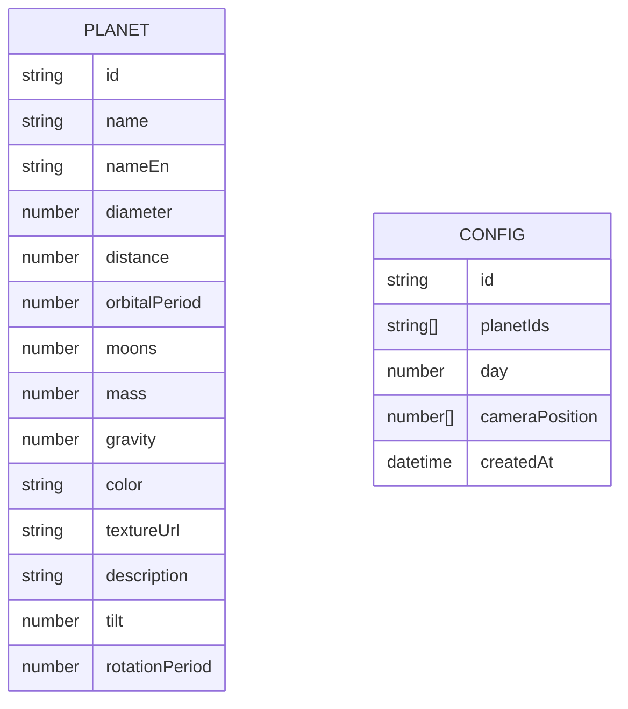

## 1. 架构设计



## 2. 技术描述

- **前端框架**: React 18 + TypeScript
- **3D 渲染**: Three.js + @react-three/fiber + @react-three/drei
- **构建工具**: Vite 5
- **状态管理**: zustand
- **样式方案**: TailwindCSS 3
- **路由**: react-router-dom 6
- **HTTP 客户端**: axios
- **后端**: Express 4
- **数据库**: lowdb (JSON 文件存储)
- **图标**: lucide-react

## 3. 路由定义

| 路由 | 用途 |
|------|------|
| / | 主场景页 - 3D太阳系浏览 |
| /compare | 对比视图页 - 行星对比分析 |

## 4. API 定义

### 4.1 获取行星列表
- **GET** `/api/planets`
- **响应**: `Planet[]`

```typescript
interface Planet {
  id: string;
  name: string;
  nameEn: string;
  diameter: number;       // km
  distance: number;       // 百万 km (距太阳)
  orbitalPeriod: number;  // 天
  moons: number;
  mass: number;           // 10^24 kg
  gravity: number;        // m/s²
  color: string;          // 十六进制颜色
  textureUrl: string;
  description: string;
  tilt: number;           // 轴倾斜角度
  rotationPeriod: number; // 小时
}
```

### 4.2 获取单颗行星
- **GET** `/api/planets/:id`
- **响应**: `Planet`

### 4.3 保存配置
- **POST** `/api/save-config`
- **请求体**: `{ planetIds: string[], day: number, cameraPosition?: number[] }`
- **响应**: `{ success: boolean, configId: string }`

### 4.4 加载配置
- **GET** `/api/configs/:id`
- **响应**: `{ planetIds: string[], day: number, cameraPosition?: number[] }`

## 5. 服务端架构



## 6. 数据模型

### 6.1 数据模型定义



### 6.2 数据结构

**planets.json**
```json
{
  "planets": [
    {
      "id": "mercury",
      "name": "水星",
      "nameEn": "Mercury",
      "diameter": 4879,
      "distance": 57.9,
      "orbitalPeriod": 88,
      "moons": 0,
      "mass": 0.33,
      "gravity": 3.7,
      "color": "#b5b5b5",
      "textureUrl": "/textures/mercury.jpg",
      "description": "太阳系中最小的行星...",
      "tilt": 0.03,
      "rotationPeriod": 1407.6
    }
  ]
}
```

**db.json (lowdb)**
```json
{
  "configs": [
    {
      "id": "uuid-string",
      "planetIds": ["earth", "mars", "jupiter"],
      "day": 125,
      "cameraPosition": [0, 0, 100],
      "createdAt": "2024-01-01T00:00:00Z"
    }
  ]
}
```

## 7. 项目文件结构

```
.
├── package.json
├── vite.config.ts
├── tsconfig.json
├── index.html
├── src/
│   ├── main.tsx          # React入口
│   ├── App.tsx           # 布局组件
│   ├── store/
│   │   └── useStore.ts   # zustand状态管理
│   ├── scene/
│   │   └── SolarSystem.tsx  # 核心3D场景
│   ├── components/
│   │   ├── Navbar.tsx        # 顶部导航
│   │   ├── InfoPanel.tsx     # 信息面板
│   │   ├── TimeSlider.tsx    # 时间滑块
│   │   ├── CompareView.tsx   # 对比视图
│   │   ├── ExportImport.tsx  # 导出导入
│   │   └── PlanetCard.tsx    # 行星卡片
│   ├── pages/
│   │   ├── HomePage.tsx      # 主页
│   │   └── ComparePage.tsx   # 对比页
│   ├── types/
│   │   └── planet.ts         # 类型定义
│   ├── utils/
│   │   └── orbital.ts        # 轨道计算工具
│   └── styles/
│       └── index.css         # 全局样式
└── server/
    ├── index.ts          # Express入口
    └── planets.json      # 行星数据
```
