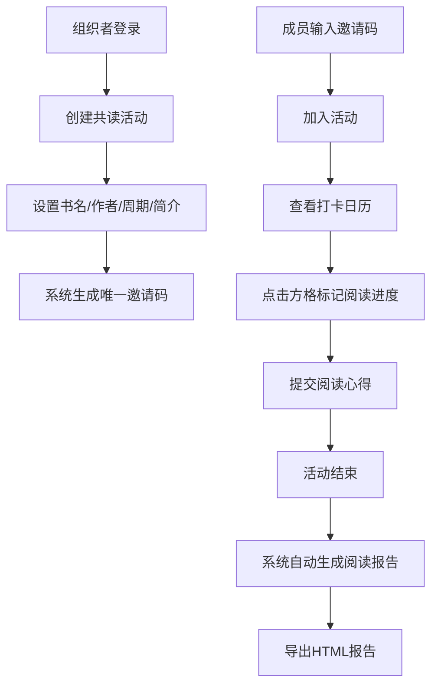

## 1. 产品概述

线上读书会活动管理平台，帮助读书会组织者便捷发布共读活动、管理成员阅读进度和收集读书心得，让阅读社交更高效、更有温度。

- 核心用户：读书会组织者和参与共读活动的成员
- 解决问题：传统读书会管理分散、进度追踪困难、互动性不足的痛点
- 产品价值：通过可视化打卡日历、智能报告生成和便捷的成员管理，提升共读活动的参与感和组织效率

## 2. 核心 Features

### 2.1 用户角色

| 角色 | 注册方式 | 核心权限 |
|------|----------|----------|
| 组织者 | 登录后自动识别 | 创建活动、设置活动参数、查看所有成员数据、生成阅读报告 |
| 成员 | 输入邀请码加入 | 打卡阅读、提交心得、查看活动详情和报告 |

### 2.2 功能模块

1. **首页仪表盘**：展示我参与的活动和进行中的活动列表，带进度条展示
2. **活动详情页**：打卡日历、成员打卡列表、心得体会提交
3. **报告页**：阅读数据汇总、横向柱状图展示、HTML导出
4. **活动管理**：组织者创建新活动、设置书籍信息和阅读周期

### 2.3 页面详情

| 页面名称 | 模块名称 | 功能描述 |
|---------|----------|----------|
| 首页仪表盘 | 活动列表卡片 | 展示活动缩略图、标题、进度条，点击进入详情 |
| 活动详情页 | 打卡日历Canvas | 绘制阅读打卡网格，支持点击标记进度（未读/在读/读完20页/读完50页），悬停放大变色 |
| 活动详情页 | 成员打卡列表 | 按日期倒序展示成员头像、昵称、阅读量，支持分页（响应<500ms） |
| 活动详情页 | 心得提交表单 | 100-500字心得输入，提交后淡入动画+震动反馈 |
| 活动详情页 | 书籍封面上传 | 支持JPG/PNG上传，前端裁剪200x300并压缩至1MB以内 |
| 报告页 | 数据汇总 | 总阅读天数、总页数、连续打卡最长天数 |
| 报告页 | 横向柱状图 | Canvas渐变色条展示每人完成率 |
| 报告页 | HTML导出 | 一键导出包含样式和数据的完整HTML报告 |

## 3. 核心流程

## 4. 用户界面设计

### 4.1 设计风格
- **主色调**：暖橙色 `#F97316`，柔和米白 `#FFFBEB`
- **辅助色**：深棕色 `#78350F`，浅灰 `#F5F5F4`
- **按钮风格**：圆角12px，细腻阴影，hover状态上移2px增强立体感
- **卡片风格**：圆角16px，多层阴影（box-shadow: 0 4px 6px -1px rgba(249, 115, 22, 0.1), 0 2px 4px -1px rgba(249, 115, 22, 0.06)）
- **字体**：标题使用"Noto Serif SC"衬线字体营造书卷气息，正文使用"Inter"无衬线字体保证可读性
- **图标**：使用lucide-react线性图标，与整体柔和风格统一

### 4.2 页面设计概览

| 页面名称 | 模块名称 | UI元素 |
|---------|----------|--------|
| 首页仪表盘 | 活动列表 | 网格布局2列（桌面）/1列（移动端），卡片悬停上浮，进度条渐变色填充 |
| 活动详情页 | 打卡日历 | 7列网格布局，日期方格默认浅米色，不同阅读状态显示不同颜色，悬停scale(1.1)放大+阴影加深 |
| 活动详情页 | 打卡列表 | 每条记录左侧圆形头像，中间昵称和日期，右侧阅读量标签，新记录fade-in动画（opacity 0→1，translateY 10px→0） |
| 活动详情页 | 心得表单 | 文本域柔和边框，聚焦时橙色光晕，提交按钮loading状态，成功后confetti庆祝动画 |
| 报告页 | 柱状图 | 每根柱子从左到右渐变填充（#FED7AA → #F97316），hover显示具体数值tooltip |

### 4.3 响应式设计
- **桌面端（>1024px）**：双列布局，日历+打卡列表并排展示，最大内容宽度1200px居中
- **平板端（768px-1024px）**：单列布局，日历和列表垂直堆叠
- **移动端（<768px）**：日历方格缩小，字体自适应，touch目标≥44x44px，按钮触控反馈
- **触摸优化**：所有交互元素添加:active状态微缩放，滑动时禁止水平滚动

### 4.4 动效规范
- 页面加载：staggered reveal动画，各模块延迟100ms依次淡入
- 日历交互：方格点击时添加ripple扩散效果
- 心得提交：提交成功后卡片轻微震动（transform: translateX(-2px) → translateX(2px) → 0）
- 报告导出：按钮点击时旋转图标180度，完成后show toast提示
