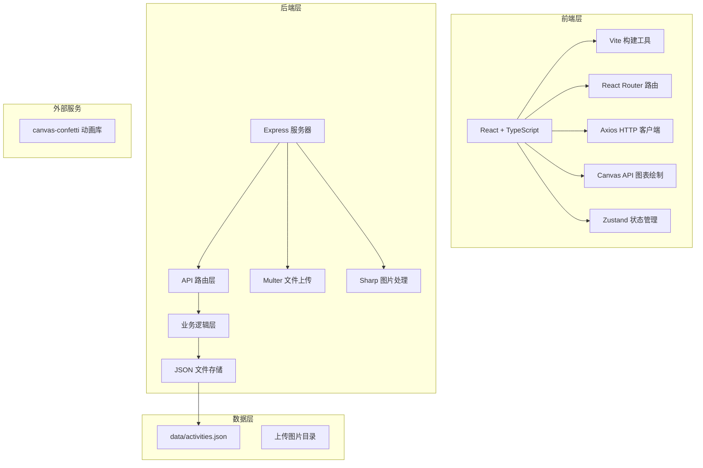
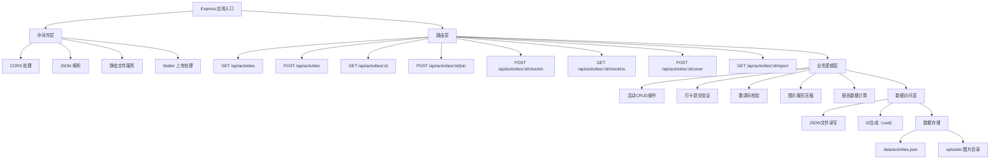
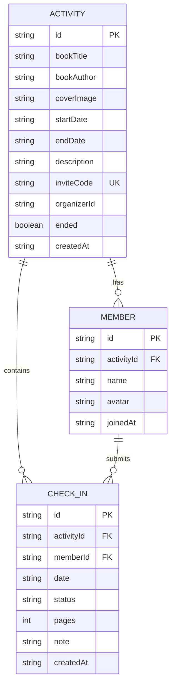

## 1. 架构设计



## 2. 技术描述

- **前端框架**：React@18 + TypeScript@5
- **构建工具**：Vite@5 + @vitejs/plugin-react
- **路由管理**：react-router-dom@6
- **HTTP客户端**：axios@1
- **状态管理**：zustand@4
- **后端服务**：Express@4
- **文件上传**：multer@1
- **图片处理**：sharp@0.33
- **ID生成**：uuid@9
- **动效库**：canvas-confetti@1
- **类型定义**：@types/react, @types/react-dom, @types/express, @types/multer
- **存储方案**：本地JSON文件（data/activities.json）

## 3. 路由定义

| 路由路径 | 页面组件 | 用途 |
|---------|----------|------|
| `/` | Dashboard | 首页仪表盘，展示活动列表 |
| `/activity/:id` | ActivityDetail | 活动详情页，打卡和心得提交 |
| `/report/:id` | Report | 活动结束报告页 |
| `/login` | Login | 登录页面（简单模拟） |
| `/create` | CreateActivity | 创建活动页面（组织者） |

## 4. API 定义

### TypeScript 类型定义
```typescript
// 阅读进度状态
type ReadingStatus = 'unread' | 'reading' | 'finished20' | 'finished50';

// 打卡记录
interface CheckIn {
  id: string;
  memberId: string;
  memberName: string;
  memberAvatar: string;
  date: string; // YYYY-MM-DD
  status: ReadingStatus;
  pages: number;
  note?: string;
  createdAt: string;
}

// 成员
interface Member {
  id: string;
  name: string;
  avatar: string;
  joinedAt: string;
}

// 活动
interface Activity {
  id: string;
  title: string;
  bookTitle: string;
  bookAuthor: string;
  coverImage?: string;
  startDate: string; // YYYY-MM-DD
  endDate: string; // YYYY-MM-DD
  description: string;
  inviteCode: string;
  organizerId: string;
  members: Member[];
  checkIns: CheckIn[];
  createdAt: string;
  ended: boolean;
}

// 报告数据
interface ReportData {
  activityId: string;
  totalDays: number;
  totalPages: number;
  longestStreak: number;
  memberCompletion: Array<{
    memberId: string;
    memberName: string;
    memberAvatar: string;
    completionRate: number;
    totalPages: number;
  }>;
}
```

### API 端点
| 方法 | 路径 | 说明 | 请求体 | 响应 |
|------|------|------|--------|------|
| GET | `/api/activities` | 获取活动列表（分页） | query: { page, limit, userId } | { data: Activity[], total: number } |
| POST | `/api/activities` | 创建活动 | { bookTitle, bookAuthor, startDate, endDate, description, organizerId } | Activity |
| GET | `/api/activities/:id` | 获取活动详情 | - | Activity |
| POST | `/api/activities/:id/join` | 加入活动 | { inviteCode, memberName, memberAvatar } | Member |
| POST | `/api/activities/:id/checkin` | 提交打卡 | { memberId, date, status, pages, note? } | CheckIn |
| GET | `/api/activities/:id/checkins` | 获取打卡列表（分页） | query: { page, limit } | { data: CheckIn[], total: number } |
| POST | `/api/activities/:id/cover` | 上传封面图 | FormData: { file } | { coverImage: string } |
| GET | `/api/activities/:id/report` | 获取活动报告 | - | ReportData |
| GET | `/api/activities/:id/report/export` | 导出HTML报告 | - | HTML文件 |

## 5. 服务器架构图



## 6. 数据模型

### 6.1 数据模型定义



### 6.2 初始化数据（data/activities.json）
```json
{
  "activities": [
    {
      "id": "a1b2c3d4",
      "title": "《百年孤独》共读",
      "bookTitle": "百年孤独",
      "bookAuthor": "加西亚·马尔克斯",
      "coverImage": "",
      "startDate": "2026-06-01",
      "endDate": "2026-06-30",
      "description": "一起走进魔幻现实主义的巅峰之作，感受布恩迪亚家族七代人的传奇故事。",
      "inviteCode": "READ2026",
      "organizerId": "org001",
      "ended": false,
      "members": [
        {
          "id": "m001",
          "name": "小明",
          "avatar": "https://api.dicebear.com/7.x/avataaars/svg?seed=xiaoming",
          "joinedAt": "2026-06-01T00:00:00.000Z"
        }
      ],
      "checkIns": [],
      "createdAt": "2026-05-28T00:00:00.000Z"
    }
  ]
}
```
