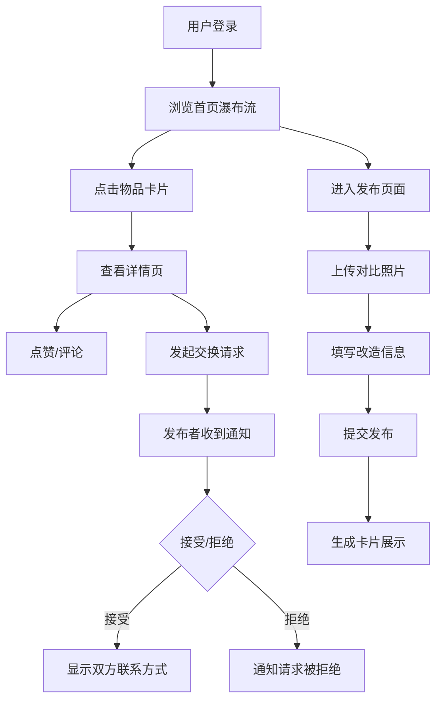

## 1. 产品概述

社区旧物改造创意集市是一个促进环保手工坊活动的平台，让用户可以记录、展示旧物改造的过程和成果，并促进社区成员之间的交流和物品交换。

- 主要目的：为社区环保手工活动提供数字化记录和展示平台，促进旧物再利用理念的传播
- 目标用户：参与环保手工坊的社区居民、手工爱好者、环保人士
- 核心价值：通过可视化的改造过程展示和互动功能，激发更多人参与旧物改造，践行环保生活方式

## 2. 核心功能

### 2.1 用户角色

| 角色 | 注册方式 | 核心权限 |
|------|----------|----------|
| 普通用户 | 用户名登录（模拟） | 浏览改造物品、发布改造作品、点赞、评论、发起交换请求 |

### 2.2 功能模块

1. **首页**：瀑布流展示改造物品列表、顶部导航栏、搜索筛选
2. **物品详情页**：对比大图展示、改造步骤、工具清单、评论区、点赞功能、交换请求
3. **发布页面**：图片上传（前后对比）、表单填写、Canvas图片压缩、提交发布

### 2.3 页面详情

| 页面名称 | 模块名称 | 功能描述 |
|-----------|-------------|---------------------|
| 首页 | 导航栏 | 半透明毛玻璃效果、Logo、导航链接、移动端汉堡菜单 |
| 首页 | 瀑布流卡片 | 按时间倒序展示、缩略图悬停切换前后对比、难度标签、点赞数 |
| 首页 | 懒加载 | IntersectionObserver实现图片懒加载、首屏1秒内渲染 |
| 详情页 | 图片展示 | Lightbox点击放大、淡入切换动画、帧率≥50fps |
| 详情页 | 改造步骤 | 步骤列表、工具清单、心得分享 |
| 详情页 | 互动区 | 点赞（单次限制）、评论（用户名+时间）、求交换按钮 |
| 详情页 | 交换系统 | 站内通知、接受/拒绝、联系方式展示 |
| 发布页 | 图片上传 | 前后各2张、Canvas压缩至1MB以下、预览 |
| 发布页 | 表单填写 | 物品名称、难度选择、工具清单、步骤描述、心得分享 |

## 3. 核心流程

### 3.1 发布改造物品流程

用户进入发布页 → 上传改造前后照片（自动压缩）→ 填写物品信息和改造步骤 → 提交表单 → 服务器存储数据 → 自动生成物品卡片 → 跳转首页展示

### 3.2 浏览与互动流程

用户浏览首页瀑布流 → 点击感兴趣的卡片 → 进入详情页查看完整内容 → 点击图片放大查看 → 点赞/取消点赞 → 发表评论 → 点击"求交换"发起请求 → 发布者收到通知 → 选择接受/拒绝 → 双方查看联系方式

### 3.3 Mermaid流程图

## 4. 用户界面设计

### 4.1 设计风格

- **主色调**：浅米色（#F5F0E6）为主背景，木色（#8B7355）为辅助色
- **点缀色**：环保绿（#4A7C59）突出主题，用于按钮、标签等交互元素
- **按钮样式**：圆角8px、轻微阴影、hover时上浮3px、过渡动画0.3s
- **字体**：标题使用"Noto Serif SC"（衬线字体），正文使用"Noto Sans SC"（无衬线字体）
- **布局风格**：卡片式布局、瀑布流排列、充足留白、层次分明
- **图标风格**：使用lucide-react线性图标，统一16px/20px/24px尺寸

### 4.2 页面设计概述

| 页面名称 | 模块名称 | UI元素 |
|-----------|-------------|-------------|
| 首页 | 导航栏 | 毛玻璃背景、Logo文字、导航链接、登录状态、移动端汉堡菜单 |
| 首页 | 瀑布流卡片 | 前后对比缩略图、物品名称、难度标签（绿/黄/红）、点赞数心形图标、hover阴影加深上浮 |
| 详情页 | 图片展示 | 双栏对比图、点击放大Lightbox、半透明遮罩、淡入淡出动画 |
| 详情页 | 步骤区域 | 有序列表、步骤描述、工具清单标签组 |
| 详情页 | 评论区 | 头像、用户名、时间戳、评论内容、字数统计、发送按钮加载动画 |
| 发布页 | 上传区域 | 拖拽上传框、图片预览网格、删除按钮、压缩进度提示 |
| 发布页 | 表单区域 | 分组标签、输入框、下拉选择、多行文本域、提交按钮 |

### 4.3 响应式设计

- **桌面端**（≥1024px）：瀑布流3-4列、完整导航栏、双栏详情布局
- **平板端**（768px-1023px）：瀑布流2列、简化导航
- **移动端**（<768px）：单列布局、汉堡菜单、单栏详情、触摸优化
- **触摸交互**：点击区域≥44px、触摸反馈、避免hover依赖

### 4.4 动效与性能

- 图片切换：opacity淡入动画300ms，帧率≥50fps
- 卡片悬浮：transform translateY(-3px) + box-shadow加深，过渡300ms
- 评论提交：按钮旋转加载动画，评论显示延迟≤500ms
- 懒加载：IntersectionObserver监听，图片进入视口前50px开始加载
- 骨架屏：首屏加载时显示卡片骨架，提升感知性能
