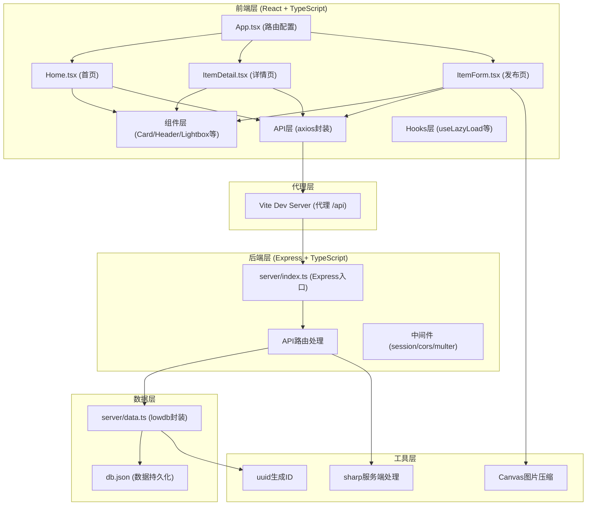
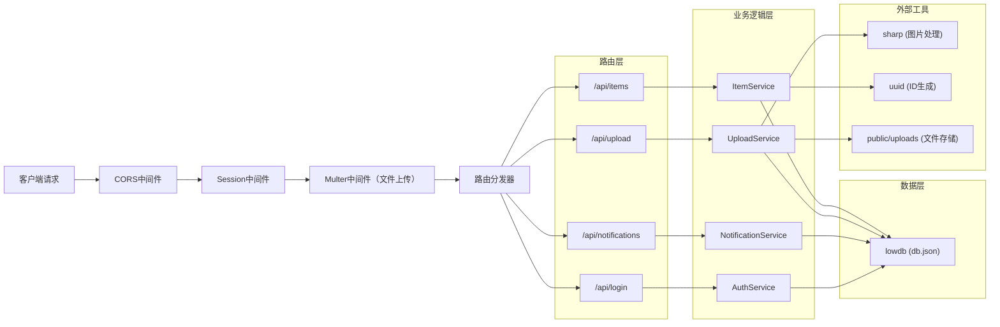
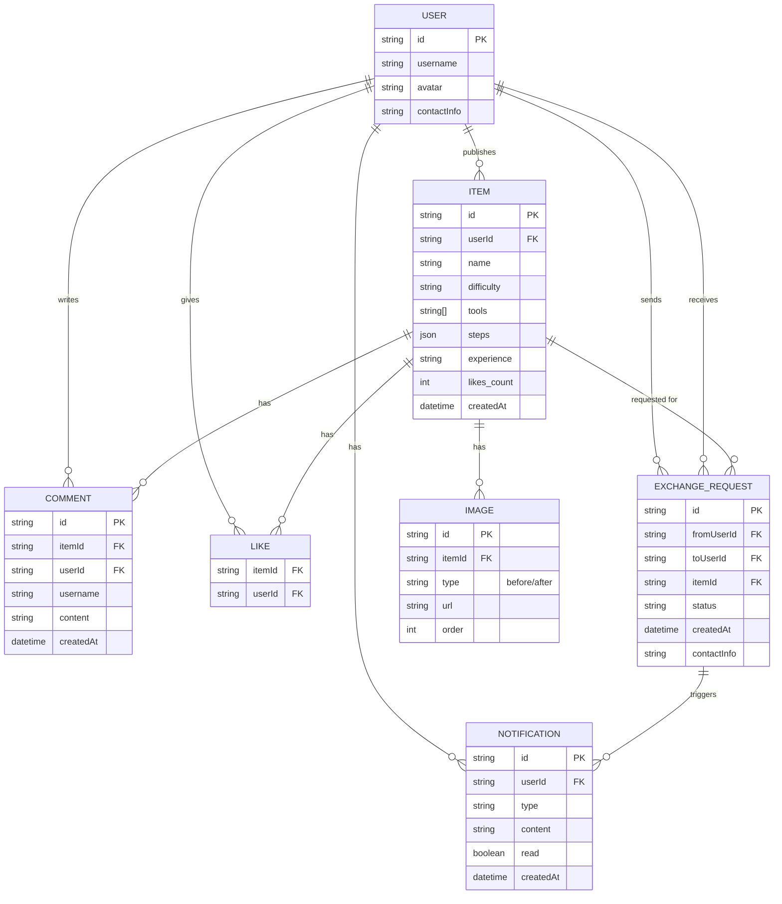

## 1. 架构设计



**数据流向说明：**
1. 前端组件 → API层(axios) → Vite代理 → Express路由 → 数据层(lowdb) → db.json
2. 返回数据原路返回，前端通过状态管理更新UI
3. 图片上传：前端Canvas压缩 → FormData提交 → multer接收 → sharp二次处理 → 存储到public/uploads

## 2. 技术描述

- **前端框架**：React@18 + TypeScript + Vite@5
- **状态管理**：React Hooks (useState/useEffect/useCallback)
- **路由**：react-router-dom@6
- **HTTP客户端**：axios@1
- **样式方案**：TailwindCSS@3 + CSS变量
- **图标库**：lucide-react
- **后端框架**：Express@4 + TypeScript
- **会话管理**：express-session
- **数据库**：lowdb@7（JSON文件存储）
- **文件上传**：multer@1 + sharp@0.32
- **跨域**：cors@2
- **ID生成**：uuid@9
- **构建工具**：ts-node + tsup（后端编译）

## 3. 路由定义

| 路由路径 | 页面/组件 | 用途 |
|----------|-----------|------|
| `/` | Home.tsx | 首页，瀑布流展示所有改造物品 |
| `/item/:id` | ItemDetail.tsx | 物品详情页，展示完整信息和互动区 |
| `/publish` | ItemForm.tsx | 发布改造物品页面 |
| `/api/items` | Express路由 | GET获取物品列表，POST创建新物品 |
| `/api/items/:id` | Express路由 | GET获取单个物品详情 |
| `/api/items/:id/like` | Express路由 | POST点赞/取消点赞 |
| `/api/items/:id/comments` | Express路由 | POST添加评论 |
| `/api/items/:id/exchange` | Express路由 | POST发起交换请求 |
| `/api/notifications` | Express路由 | GET获取通知列表 |
| `/api/notifications/:id/respond` | Express路由 | POST响应交换请求 |
| `/api/upload` | Express路由 | POST上传图片 |
| `/api/login` | Express路由 | POST用户登录（模拟） |

## 4. API 定义

### 4.1 类型定义

```typescript
// 共享类型定义 (shared/types.ts)

export type Difficulty = 'easy' | 'medium' | 'hard';

export interface ImageData {
  id: string;
  url: string;
  filename: string;
}

export interface Step {
  order: number;
  description: string;
}

export interface Comment {
  id: string;
  userId: string;
  username: string;
  content: string;
  createdAt: string;
}

export interface ExchangeRequest {
  id: string;
  fromUserId: string;
  fromUsername: string;
  toUserId: string;
  itemId: string;
  itemName: string;
  status: 'pending' | 'accepted' | 'rejected';
  createdAt: string;
  contactInfo?: string;
}

export interface Notification {
  id: string;
  userId: string;
  type: 'exchange_request' | 'exchange_accepted' | 'exchange_rejected';
  content: string;
  relatedItemId?: string;
  relatedRequestId?: string;
  read: boolean;
  createdAt: string;
}

export interface Item {
  id: string;
  userId: string;
  username: string;
  name: string;
  difficulty: Difficulty;
  tools: string[];
  steps: Step[];
  experience: string;
  beforeImages: ImageData[];
  afterImages: ImageData[];
  likes: string[]; // userIds who liked
  comments: Comment[];
  createdAt: string;
  updatedAt: string;
}

export interface User {
  id: string;
  username: string;
  avatar?: string;
  contactInfo?: string;
}

// 请求/响应类型
export interface CreateItemRequest {
  name: string;
  difficulty: Difficulty;
  tools: string[];
  steps: Step[];
  experience: string;
  beforeImageIds: string[];
  afterImageIds: string[];
}

export interface AddCommentRequest {
  content: string;
}

export interface ExchangeRequestPayload {
  message?: string;
}

export interface ExchangeResponsePayload {
  accepted: boolean;
  contactInfo?: string;
}

export interface LoginRequest {
  username: string;
}

export interface ApiResponse<T> {
  success: boolean;
  data?: T;
  error?: string;
}
```

## 5. 服务器架构图



**模块职责：**
- `server/index.ts`：Express应用初始化，中间件注册，路由挂载，服务器启动
- `server/data.ts`：lowdb数据库操作封装，提供CRUD方法
- 路由层：请求参数解析，响应格式化
- 业务逻辑层：核心业务处理，数据校验
- 数据层：持久化存储，事务处理

## 6. 数据模型

### 6.1 ER图



### 6.2 lowdb 数据结构

```json
{
  "users": [
    {
      "id": "uuid-string",
      "username": "string",
      "avatar": "string",
      "contactInfo": "string"
    }
  ],
  "items": [
    {
      "id": "uuid-string",
      "userId": "uuid-string",
      "username": "string",
      "name": "string",
      "difficulty": "easy|medium|hard",
      "tools": ["string"],
      "steps": [
        {
          "order": 1,
          "description": "string"
        }
      ],
      "experience": "string",
      "beforeImages": [
        {
          "id": "uuid",
          "url": "/uploads/xxx.jpg",
          "filename": "xxx.jpg"
        }
      ],
      "afterImages": [
        {
          "id": "uuid",
          "url": "/uploads/xxx.jpg",
          "filename": "xxx.jpg"
        }
      ],
      "likes": ["user-id-1", "user-id-2"],
      "comments": [
        {
          "id": "uuid",
          "userId": "uuid",
          "username": "string",
          "content": "string",
          "createdAt": "ISO-8601"
        }
      ],
      "createdAt": "ISO-8601",
      "updatedAt": "ISO-8601"
    }
  ],
  "exchangeRequests": [
    {
      "id": "uuid",
      "fromUserId": "uuid",
      "fromUsername": "string",
      "toUserId": "uuid",
      "itemId": "uuid",
      "itemName": "string",
      "message": "string",
      "status": "pending|accepted|rejected",
      "contactInfo": "string",
      "createdAt": "ISO-8601"
    }
  ],
  "notifications": [
    {
      "id": "uuid",
      "userId": "uuid",
      "type": "exchange_request|exchange_accepted|exchange_rejected",
      "content": "string",
      "relatedItemId": "uuid",
      "relatedRequestId": "uuid",
      "read": false,
      "createdAt": "ISO-8601"
    }
  ],
  "uploads": [
    {
      "id": "uuid",
      "userId": "uuid",
      "filename": "string",
      "originalName": "string",
      "url": "string",
      "size": 1024000,
      "createdAt": "ISO-8601"
    }
  ]
}
```

## 7. 项目文件结构

```
auto19/
├── .trae/documents/
│   ├── PRD.md
│   └── tech-architecture.md
├── public/
│   └── uploads/          # 图片上传目录
├── server/
│   ├── index.ts          # Express主入口
│   ├── data.ts           # lowdb操作封装
│   └── types.ts          # 后端类型定义
├── src/
│   ├── components/       # 可复用组件
│   │   ├── Header.tsx    # 顶部导航栏
│   │   ├── ItemCard.tsx  # 物品卡片
│   │   ├── Lightbox.tsx  # 图片放大查看
│   │   ├── Masonry.tsx   # 瀑布流布局
│   │   └── CommentSection.tsx  # 评论区
│   ├── hooks/
│   │   ├── useLazyLoad.ts    # 图片懒加载
│   │   └── useAuth.ts        # 认证状态
│   ├── api/
│   │   └── client.ts     # axios实例和API方法
│   ├── types/
│   │   └── index.ts      # 前端类型定义
│   ├── utils/
│   │   └── imageCompressor.ts  # Canvas图片压缩
│   ├── App.tsx           # 根组件，路由配置
│   ├── Home.tsx          # 首页
│   ├── ItemDetail.tsx    # 详情页
│   ├── ItemForm.tsx      # 发布页
│   └── main.tsx          # 入口文件
├── shared/
│   └── types.ts          # 前后端共享类型
├── package.json
├── vite.config.ts
├── tsconfig.json
├── tailwind.config.js
└── index.html
```

**调用关系说明：**
- `App.tsx` → `Header.tsx`, `Home.tsx`, `ItemDetail.tsx`, `ItemForm.tsx`
- `Home.tsx` → `Masonry.tsx`, `ItemCard.tsx`, `useLazyLoad.ts`, `api/client.ts`
- `ItemDetail.tsx` → `Lightbox.tsx`, `CommentSection.tsx`, `api/client.ts`
- `ItemForm.tsx` → `utils/imageCompressor.ts`, `api/client.ts`
- `server/index.ts` → `server/data.ts`, `shared/types.ts`
- `api/client.ts` → `shared/types.ts`
