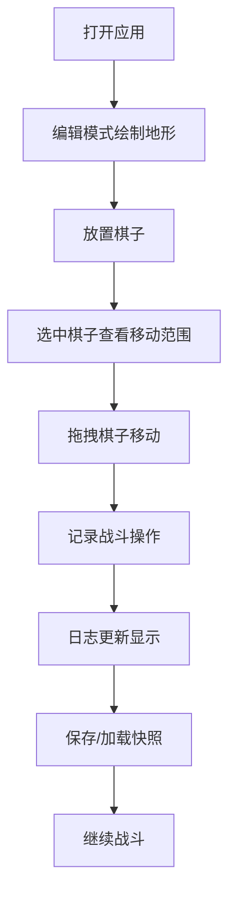

## 1. 产品概述
龙与地下城风格的RPG战斗管理工具，帮助游戏主持人实时管理战棋地图、棋子状态和战斗记录。
- 解决桌面跑团中角色位置混乱、状态跟踪繁琐、规则计算耗时长的痛点
- 面向TRPG游戏主持人，提供六边形网格地图、棋子管理、战斗日志等核心功能

## 2. 核心功能

### 2.1 用户角色
| 角色 | 注册方式 | 核心权限 |
|------|----------|----------|
| 游戏主持人(GM) | 无需注册，本地使用 | 地图编辑、棋子管理、战斗控制、数据保存/加载 |

### 2.2 功能模块
1. **战棋地图**：六边形网格渲染、地形绘制、棋子拖拽、移动范围显示
2. **棋子详情面板**：属性展示、HP条动画、状态变化处理
3. **战斗日志**：回合操作记录、渐入动画、数据持久化
4. **快照管理**：战斗状态保存、加载恢复、确认弹窗

### 2.3 页面详情
| 页面名称 | 模块名称 | 功能描述 |
|---------|----------|----------|
| 战斗主界面 | 战棋地图 | 六边形网格、地形笔刷、棋子拖拽放置、移动范围高亮光环 |
| 战斗主界面 | 棋子详情面板 | 单位完整属性展示、HP条减淡动画、死亡状态显示 |
| 战斗主界面 | 战斗日志 | 滚动日志区、按回合记录、最新记录渐入动画 |
| 战斗主界面 | 工具栏 | 地形笔刷选择、编辑模式切换、保存/加载按钮 |

## 3. 核心流程
GM打开应用后，首先在编辑模式下使用笔刷绘制地形（草地、石块、水域），然后拖拽放置玩家和敌方棋子。选中棋子后可查看详情和移动范围，拖拽棋子到高亮区域完成移动。战斗过程中记录攻击、治疗等操作，日志实时更新。可随时保存当前战斗状态为JSON快照，需要时重新加载恢复。

## 4. 用户界面设计

### 4.1 设计风格
- **主色调**：深褐色(#2D1F14)、暗金色(#C9A227)、羊皮纸米色(#E8DCC4)
- **按钮风格**：金色镶边、深褐色填充、悬停时金色发光效果
- **字体**：Cinzel Decorative（标题）、Crimson Text（正文）
- **布局风格**：PC端左右分栏（地图70% + 面板30%），移动端上下布局
- **图标**：使用lucide-react图标，风格统一为暗金色

### 4.2 页面设计概述
| 页面名称 | 模块名称 | UI元素 |
|---------|----------|--------|
| 战斗主界面 | 战棋地图 | 羊皮纸纹理背景、六边形网格、棋子带金色光环、移动范围半透明高亮、地形波纹动画 |
| 战斗主界面 | 棋子详情面板 | 金色边框、深褐色背景、HP条逐帧动画、死亡骷髅图标覆盖 |
| 战斗主界面 | 战斗日志 | 交替深浅褐色背景、最新记录渐入、滚动条暗金色 |
| 战斗主界面 | 工具栏 | 金色镶边按钮、笔刷指示器半透明圆形、加载动画旋转 |

### 4.3 响应性
- PC端：地图左侧70%，右侧30%面板（详情+日志上下排列）
- 移动端（<768px）：上下布局，地图占上半部分，面板占下半部分可折叠
- 触摸优化：棋子拖拽支持触摸操作，按钮最小尺寸44px

### 4.4 动画与特效
- 所有过渡动画时长≤300ms
- 棋子移动：平滑滑动动画
- HP变化：血条逐帧减淡动画
- 新日志条目：渐入动画（opacity 0→1）
- 棋子悬停：金色光环扩散
- 棋子点击：火焰特效动画
- 地形绘制：波纹扩散动画
- 保存/加载：旋转加载动画

## 5. 性能要求
- 拖拽棋子响应延迟<50ms
- 地形笔刷绘制时FPS≥25
- 使用requestAnimationFrame优化渲染
