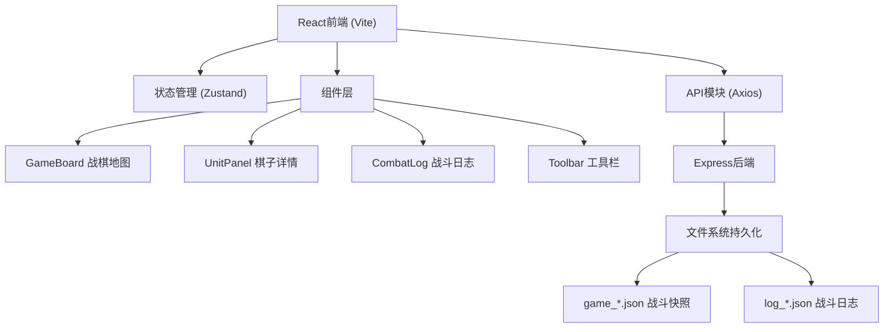
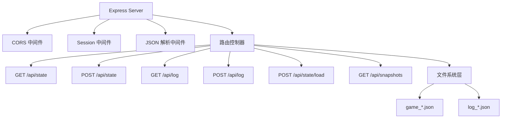
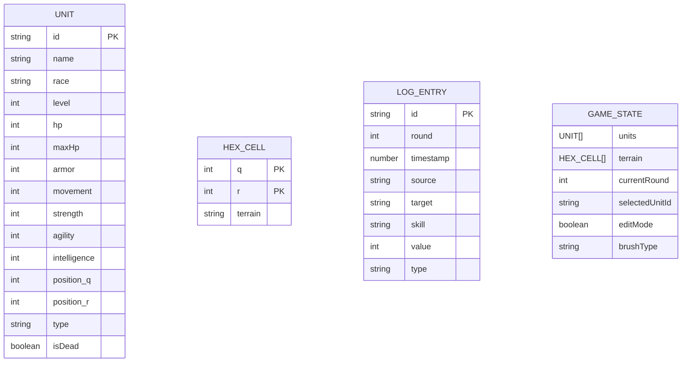

## 1. 架构设计



## 2. 技术描述
- **前端**：React 18 + TypeScript + Vite + TailwindCSS 3 + Zustand
- **后端**：Express 4 + TypeScript
- **数据存储**：文件系统（JSON文件）
- **初始化工具**：vite-init
- **HTTP客户端**：Axios
- **图标库**：lucide-react
- **唯一ID**：uuid

## 3. 路由定义
| 路由 | 用途 |
|------|------|
| / | 战斗主界面 |

## 4. API 定义

### 类型定义
```typescript
// 棋子类型
interface Unit {
  id: string;
  name: string;
  race: string;
  level: number;
  hp: number;
  maxHp: number;
  armor: number;
  movement: number;
  strength: number;
  agility: number;
  intelligence: number;
  position: { q: number; r: number };
  type: 'player' | 'enemy';
  isDead: boolean;
}

// 地形类型
type TerrainType = 'grass' | 'stone' | 'water';

interface HexCell {
  q: number;
  r: number;
  terrain: TerrainType;
}

// 战斗日志
interface LogEntry {
  id: string;
  round: number;
  timestamp: number;
  source: string;
  target: string;
  skill: string;
  value: number;
  type: 'attack' | 'heal' | 'buff' | 'debuff';
}

// 战斗状态
interface GameState {
  units: Unit[];
  terrain: HexCell[];
  currentRound: number;
  selectedUnitId: string | null;
  editMode: boolean;
  brushType: TerrainType;
}
```

### API接口
| 方法 | 路径 | 请求 | 响应 | 说明 |
|------|------|------|------|------|
| GET | /api/state | - | GameState | 获取当前战斗状态 |
| POST | /api/state | GameState | { success: boolean, filename: string } | 保存战斗快照 |
| GET | /api/log | - | LogEntry[] | 获取战斗日志 |
| POST | /api/log | LogEntry | { success: boolean } | 追加战斗日志 |
| POST | /api/state/load | { filename: string } | GameState | 加载指定快照 |
| GET | /api/snapshots | - | { filenames: string[] } | 获取快照列表 |

## 5. 服务器架构图



## 6. 数据模型

### 6.1 数据模型定义



### 6.2 文件结构
```
project/
├── package.json
├── vite.config.ts
├── tsconfig.json
├── index.html
├── src/
│   ├── main.tsx
│   ├── App.tsx
│   ├── config.ts
│   ├── api.ts
│   ├── store.ts
│   ├── gameBoard.tsx
│   ├── unitPanel.tsx
│   ├── combatLog.tsx
│   ├── toolbar.tsx
│   └── types.ts
└── server/
    ├── index.ts
    ├── game_*.json
    └── log_*.json
```
