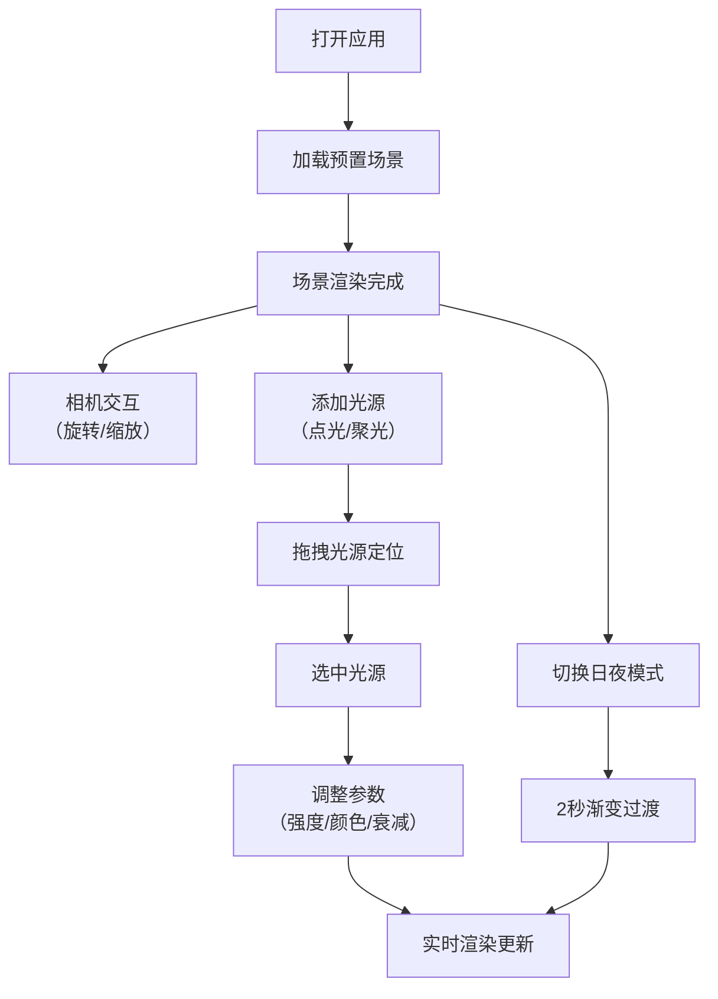

## 1. 产品概述

三维空间光照预览器是一款面向建筑师和室内设计师的专业工具，用于快速预览和调整室内三维空间的光照方案。通过实时渲染技术解决传统渲染器迭代慢、光照调整不直观的痛点，让设计师在数秒内即可完成光照方案的视觉验证。

- **核心目标**：提供直观、高性能的实时光照调整体验，显著提升设计效率
- **目标用户**：建筑师、室内设计师、灯光设计师
- **产品价值**：将传统需要数小时的光照渲染迭代缩短至秒级，降低设计试错成本

## 2. 核心功能

### 2.1 用户角色

| 角色 | 注册方式 | 核心权限 |
|------|----------|----------|
| 设计师用户 | 无需注册，直接使用 | 完整操作场景、管理光源、调整参数 |

### 2.2 功能模块

1. **主场景视图**：Three.js 渲染的三维室内场景，支持相机交互
2. **光源管理系统**：点光源/聚光灯的添加、选择、拖拽、删除
3. **参数配置面板**：光源强度、颜色、衰减半径等实时调节
4. **日夜模式切换**：全局光照预设的平滑渐变过渡
5. **指南针辅助**：半透明环形朝向指示器

### 2.3 页面详情

| 页面名称 | 模块名称 | 功能描述 |
|----------|----------|----------|
| 主应用页 | 顶部工具栏 | 添加光源按钮（点光源/聚光灯）、日夜模式切换开关 |
| 主应用页 | 三维场景画布 | 室内场景渲染、相机旋转缩放、光源拖拽交互 |
| 主应用页 | 环形指南针 | 场景外围朝向指示，半透明环绕显示 |
| 主应用页 | 光源列表 | 已添加光源的可滚动列表，窄屏折叠为侧滑菜单 |
| 主应用页 | 参数配置面板 | 选中光源后的详细参数调节（强度/颜色/衰减等） |

## 3. 核心流程

用户打开应用 → 加载预置室内场景（<3秒）→ 通过鼠标拖拽旋转视角 → 点击工具栏添加点光源或聚光灯 → 拖拽光源至目标位置 → 选中光源调整参数（实时预览）→ 切换日夜模式查看不同光照效果 → 完成方案验证

## 4. 用户界面设计

### 4.1 设计风格

- **主题色**：深灰（#1a1d24）到深蓝（#0f172a）的垂直线性渐变背景
- **主色调**：冷蓝灰系，搭配微弱发光反馈
- **按钮样式**：圆角矩形（12px 圆角），悬浮时 2px 高光边框 + 轻微放大
- **字体**：Geist Sans 标题 + JetBrains Mono 数值，营造专业工具感
- **布局**：顶部工具栏 + 中心画布 + 右侧配置面板的经典三栏布局
- **图标风格**：Lucide 线性图标，与主题色调一致

### 4.2 页面设计概览

| 页面名称 | 模块名称 | UI 元素 |
|----------|----------|---------|
| 主应用页 | 顶部工具栏 | 半透明深色条带，光源添加按钮组，模式切换开关（带过渡动画） |
| 主应用页 | 三维画布 | 全屏渲染区域，边缘有微妙 vignette 暗角，鼠标悬停时光标变化 |
| 主应用页 | 环形指南针 | 场景外围 60px 环形区域，N/S/E/W 标记，随相机旋转同步 |
| 主应用页 | 配置面板 | 玻璃拟态背景（backdrop-filter: blur(20px)，透明度 85%），渐变轨道滑块，数值发光 |
| 主应用页 | 光源列表 | 可滚动卡片列表，选中卡片高亮边框，窄屏折叠为汉堡菜单侧滑 |

### 4.3 响应式设计

- **桌面端（1920×1080）**：三栏完整展开，配置面板固定宽度 360px
- **iPad（768×1024）**：配置面板折叠为右侧抽屉，光源列表折叠为底部滑出面板，通过汉堡按钮触发
- **触摸优化**：支持双指旋转/缩放手势，滑块触控区域扩大至 44px

### 4.4 3D 场景指引

- **环境/HDRI**：室内场景使用渐进式环境贴图，日间模式偏暖白（#fff5e6），夜间模式偏冷蓝（#c4d4ff）
- **光照设置**：默认配备环境光（0.3 强度）+ 方向光模拟日光，支持最多 8 个动态阴影投射光源
- **相机设置**：PerspectiveCamera，FOV 50°，近裁 0.1，远裁 100，OrbitControls 带 0.08 阻尼系数
- **构图与焦点**：默认视角为 45° 俯视斜角，聚焦于场景中心会客区域
- **交互与动画**：光源选中时出现线框光环，拖拽时显示位置坐标，参数变化时材质高光实时更新
- **后期处理**：启用 ACES 色调映射 + 2.2 gamma 校正，轻微泛光增强发光感
- **资源与性能**：所有几何体使用 BufferGeometry，材质合并，目标帧率 ≥ 30fps，内存 ≤ 200MB
