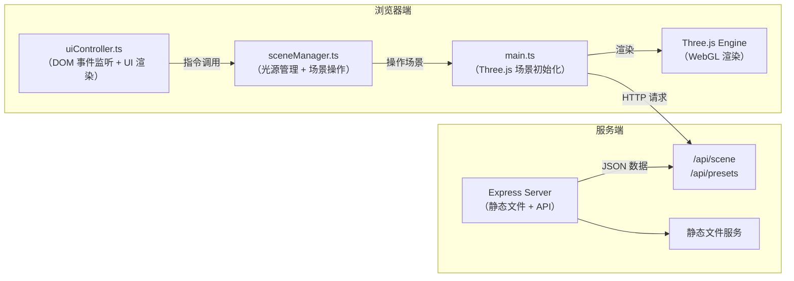
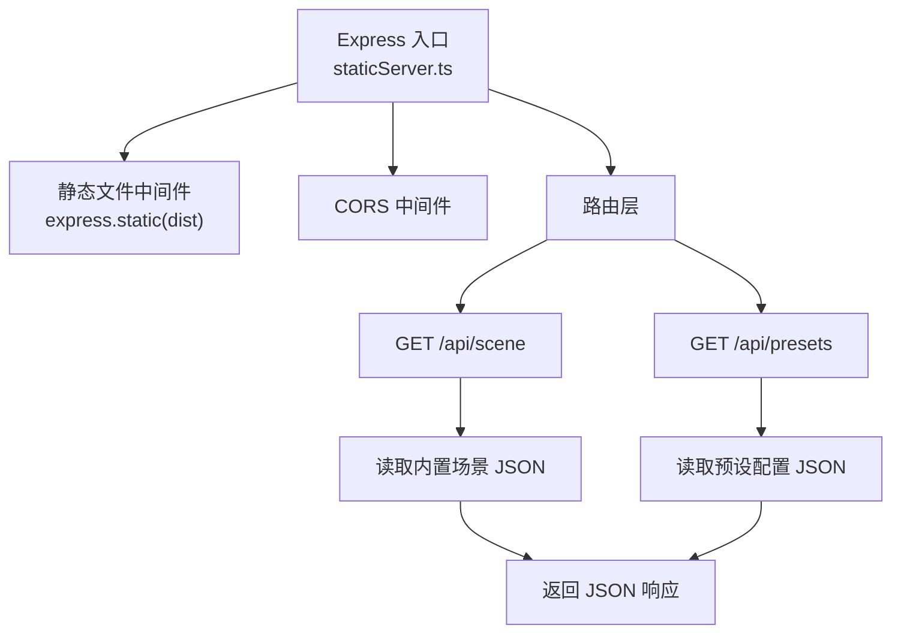

## 1. 架构设计



## 2. 技术选型说明

| 层级 | 技术栈 | 版本要求 | 用途 |
|------|--------|----------|------|
| 前端框架 | 原生 TypeScript | 5.x | 业务逻辑组织，无需额外 UI 框架 |
| 3D 渲染引擎 | Three.js + @types/three | 0.160.x | WebGL 场景渲染、光照、材质、阴影 |
| 构建工具 | Vite | 5.x | 模块热替换、TypeScript 编译、开发服务器 |
| 后端服务 | Express | 4.x | 静态资源托管、场景数据 API |
| 语言 | TypeScript | 5.x | 严格类型检查，路径别名 @/ 映射 |

**与通用模板差异说明**：用户明确指定使用原生 TypeScript + Three.js，不使用 React/Vue 等前端框架，因此不引入 zustand/tailwind/router 等依赖，所有 DOM 操作通过原生 API 完成。

## 3. 路由定义

| 路由路径 | 用途 |
|----------|------|
| / | 应用入口页面，加载 index.html |
| /api/scene | GET 请求，返回预置室内场景几何体数据 JSON |
| /api/presets | GET 请求，返回日夜模式光源预设配置 |

## 4. API 定义

### 4.1 GET /api/scene
返回室内场景的结构化几何体描述，包含墙面、地板、家具的位置、尺寸、材质信息。

```typescript
interface SceneData {
  room: {
    width: number;
    height: number;
    depth: number;
  };
  materials: {
    id: string;
    type: 'standard' | 'metal' | 'glass';
    color: string;
    roughness: number;
    metalness: number;
  }[];
  meshes: {
    id: string;
    geometry: 'box' | 'plane' | 'cylinder' | 'sphere';
    materialId: string;
    position: [number, number, number];
    rotation: [number, number, number];
    scale: [number, number, number];
    castShadow: boolean;
    receiveShadow: boolean;
  }[];
}
```

### 4.2 GET /api/presets
返回日夜模式的全局光照预设参数。

```typescript
interface LightingPresets {
  day: {
    ambient: { color: string; intensity: number };
    directional: {
      color: string;
      intensity: number;
      position: [number, number, number];
      shadowSoftness: number;
    };
    backgroundTint: string;
    artificialLightsActive: boolean;
  };
  night: {
    ambient: { color: string; intensity: number };
    directional: {
      color: string;
      intensity: number;
      position: [number, number, number];
      shadowSoftness: number;
    };
    backgroundTint: string;
    artificialLightsActive: boolean;
  };
}
```

## 5. 服务端架构



## 6. 模块职责与数据模型

### 6.1 核心模块划分

| 文件 | 职责 | 导出 |
|------|------|------|
| src/main.ts | 初始化 Three.js：场景、相机、渲染器、控制器、加载模型 | `sceneInstance: { scene, camera, renderer, controls, objects: Map<string, Object3D> }` |
| src/sceneManager.ts | 单例模式，管理光源生命周期与日夜模式，暴露命令式 API | `sceneManager: { addLight(type, pos), removeLight(id), updateLight(id, params), selectLight(id), setMode('day'/'night'), getLights() }` |
| src/uiController.ts | 监听工具栏/配置面板 DOM 事件，调用 sceneManager，同步 UI 状态 | 自执行初始化函数，无导出 |
| server/staticServer.ts | Express 服务器，静态服务 + 两个 API 端点 | `startServer(port): void` |

### 6.2 光源数据模型

```typescript
type LightType = 'point' | 'spot';

interface LightParams {
  id: string;
  type: LightType;
  position: [number, number, number];
  intensity: number;      // 0 - 100
  color: string;          // hex
  distance: number;       // 衰减半径
  decay: number;          // 衰减系数 (1-2)
  angle?: number;         // 聚光灯角度 (弧度)
  penumbra?: number;      // 聚光灯光晕 (0-1)
}
```

### 6.3 文件结构

```
auto23/
├── package.json
├── vite.config.ts
├── tsconfig.json
├── index.html
├── src/
│   ├── main.ts              # Three.js 场景初始化与渲染循环
│   ├── sceneManager.ts      # 光源与模式管理核心
│   └── uiController.ts      # DOM 交互与 UI 状态同步
└── server/
    └── staticServer.ts      # Express 服务与 API
```
