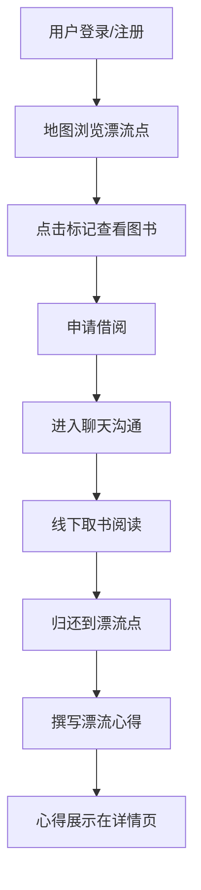

## 1. 产品概述
城市二手书店共享漂流平台，让书友将闲置纸质书标记为可漂流状态，通过地图发现附近书籍并申请借阅，读完后撰写漂流心得，促进知识共享和社区交流。

- 核心目标：解决闲置纸质书资源浪费问题，构建城市图书共享社区
- 目标用户：城市中的纸质书爱好者、阅读爱好者

## 2. 核心功能

### 2.1 用户角色
| 角色 | 注册方式 | 核心权限 |
|------|----------|----------|
| 普通用户 | 用户名注册 | 上传图书、浏览地图、申请借阅、发送消息、撰写心得 |

### 2.2 功能模块
1. **地图首页**：Leaflet地图展示漂流点标记、图书列表小窗、图书卡片悬浮预览
2. **图书上传**：表单填写图书信息、Canvas图片裁剪压缩、上传至漂流点
3. **聊天系统**：一对一消息沟通、本地存储、实时消息列表
4. **图书详情**：漂流日志、借阅统计、评分展示、心得提交

### 2.3 页面详情
| 页面名称 | 模块名称 | 功能描述 |
|----------|----------|----------|
| 地图页面 | 漂流点标记 | 蓝色（有书）/红色（无书）标记，呼吸脉动动画 |
| 地图页面 | 图书小窗 | 展示可借图书封面、书名、距离、申请借阅按钮 |
| 图书上传页面 | 图片处理 | Canvas等比缩放裁剪，自动压缩至800px宽 |
| 聊天页面 | 消息列表 | 一对一消息展示，输入框发送消息 |
| 图书详情页面 | 漂流日志 | 按时间倒序展示心得，统计借阅次数和评分 |

## 3. 核心流程
用户注册登录 → 在地图上查看附近漂流点 → 点击标记查看可借图书 → 申请借阅进入聊天 → 沟通取书 → 阅读后归还到漂流点 → 撰写漂流心得 → 心得展示在图书详情页

## 4. 用户界面设计

### 4.1 设计风格
- **主色调**：暖色调，米白（#FAF7F2）与深棕（#5C4033）搭配
- **辅助色**：漂流点蓝色（#4A7C9B）、红色（#C45C4B）
- **按钮样式**：圆角8px，背景色深棕，hover时轻微上浮
- **字体**：标题使用思源宋体，正文使用思源黑体
- **布局风格**：卡片式布局，磨砂玻璃质感
- **动画**：图书卡片hover上浮3px+柔和阴影，标记呼吸脉动

### 4.2 页面设计概述
| 页面名称 | 模块名称 | UI元素 |
|----------|----------|--------|
| 地图页面 | 地图容器 | Leaflet全屏地图、米白背景、自定义标记图标 |
| 地图页面 | 顶部导航 | 深棕背景、上传图书按钮、用户头像 |
| 图书卡片 | 封面区域 | 圆角图片、磨砂玻璃背景框 |
| 图书卡片 | 信息区域 | 深棕标题、米白背景、距离标签 |
| 聊天页面 | 消息气泡 | 左灰右棕、圆角气泡、时间戳 |
| 详情页面 | 统计卡片 | 豆瓣风格、借阅次数、平均评分 |

### 4.3 响应式设计
- 桌面端优先，适配移动端
- 移动端：地图全屏，底部固定导航栏
- 桌面端：左侧地图，右侧可选面板
- 触摸优化：按钮最小44x44px，手势友好
