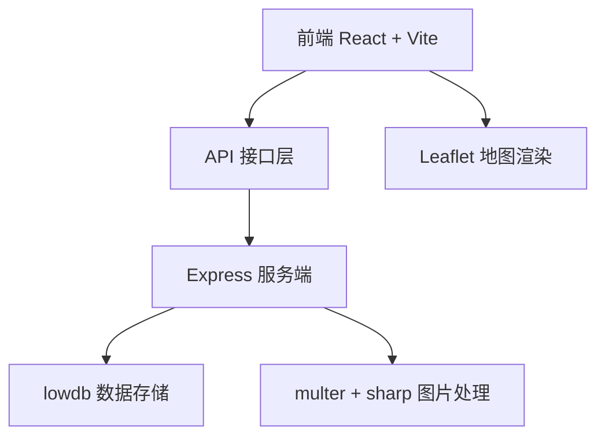
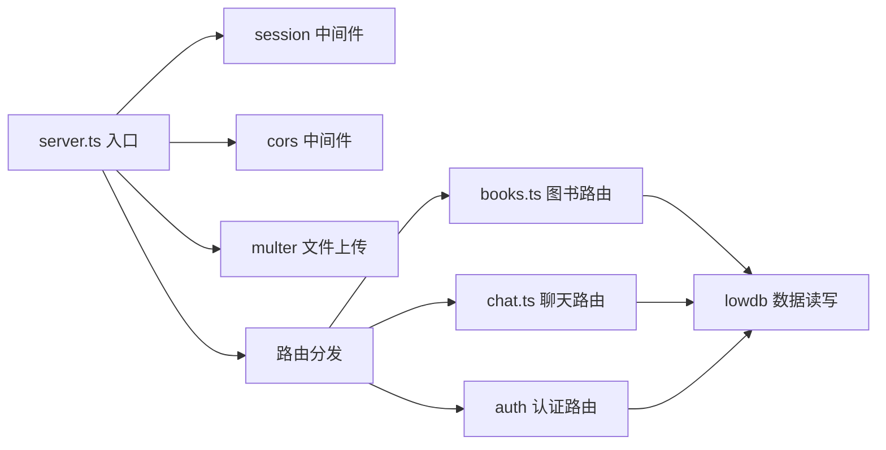
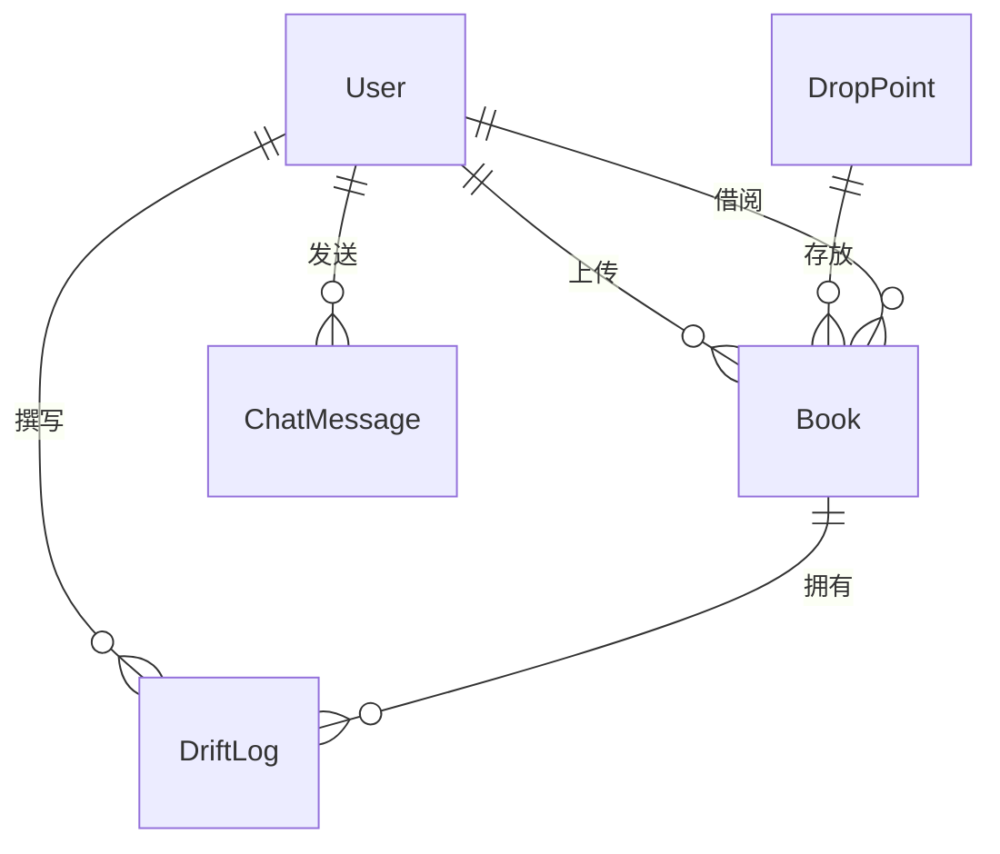

## 1. 架构设计



## 2. 技术栈说明
- **前端**：React 18 + TypeScript + Vite 5 + React Router 6 + Zustand
- **UI样式**：TailwindCSS 3 + 自定义CSS（磨砂玻璃、动画）
- **地图**：Leaflet 1.9 + react-leaflet 4
- **后端**：Express 4 + express-session + cors
- **数据库**：lowdb 7（JSON文件存储）
- **文件处理**：multer（上传）+ sharp（压缩）+ uuid（唯一标识）
- **HTTP客户端**：axios
- **状态管理**：zustand

## 3. 路由定义
| 路由路径 | 页面组件 | 用途 |
|----------|----------|------|
| / | MapPage | 地图首页，展示漂流点和图书 |
| /upload | UploadPage | 上传图书页面 |
| /book/:id | BookDetailPage | 图书详情页面 |
| /chat/:id | ChatPage | 一对一聊天页面 |
| /login | LoginPage | 登录/注册页面 |

## 4. API接口定义

### 4.1 用户认证
```typescript
// POST /api/auth/register
interface RegisterReq { username: string; password: string; }
interface RegisterRes { id: string; username: string; }

// POST /api/auth/login
interface LoginReq { username: string; password: string; }
interface LoginRes { id: string; username: string; }

// GET /api/auth/me
interface AuthMeRes { id: string; username: string; } | null
```

### 4.2 图书接口
```typescript
// POST /api/books (multipart/form-data)
interface BookCreateReq {
  title: string;
  author: string;
  isbn: string;
  publishYear: number;
  description: string;
  dropPointId: string;
  cover: File;
}
interface BookRes {
  id: string;
  title: string;
  author: string;
  isbn: string;
  publishYear: number;
  description: string;
  coverUrl: string;
  dropPointId: string;
  ownerId: string;
  status: 'available' | 'borrowed';
  borrowCount: number;
  avgRating: number;
}

// GET /api/books?dropPointId=xxx
interface BookListRes { books: BookRes[]; }

// GET /api/books/:id
interface BookDetailRes {
  book: BookRes;
  logs: DriftLog[];
}

// POST /api/books/:id/borrow
interface BorrowReq { borrowerId: string; }
interface BorrowRes { success: boolean; requestId: string; }
```

### 4.3 漂流点接口
```typescript
interface DropPoint {
  id: string;
  name: string;
  lat: number;
  lng: number;
  address: string;
}

// GET /api/drop-points
interface DropPointListRes { points: (DropPoint & { hasAvailableBooks: boolean; })[]; }
```

### 4.4 漂流日志
```typescript
interface DriftLog {
  id: string;
  bookId: string;
  userId: string;
  username: string;
  content: string;
  rating: number;
  createdAt: string;
}

// POST /api/books/:id/logs
interface DriftLogReq { content: string; rating: number; }
```

### 4.5 聊天接口
```typescript
interface ChatMessage {
  id: string;
  fromUserId: string;
  toUserId: string;
  content: string;
  createdAt: string;
  read: boolean;
}

// GET /api/chat/:peerId
interface ChatMessagesRes { messages: ChatMessage[]; }

// POST /api/chat/:peerId
interface ChatSendReq { content: string; }
```

## 5. 服务端架构



## 6. 数据模型

### 6.1 ER图


### 6.2 数据定义
```typescript
interface DB {
  users: User[];
  books: Book[];
  dropPoints: DropPoint[];
  driftLogs: DriftLog[];
  chatMessages: ChatMessage[];
}

interface User {
  id: string;
  username: string;
  password: string;
}

interface Book {
  id: string;
  title: string;
  author: string;
  isbn: string;
  publishYear: number;
  description: string;
  coverUrl: string;
  dropPointId: string;
  ownerId: string;
  status: 'available' | 'borrowed';
  currentBorrowerId: string | null;
  borrowCount: number;
  totalRating: number;
  ratingCount: number;
}

interface DropPoint {
  id: string;
  name: string;
  lat: number;
  lng: number;
  address: string;
}

interface DriftLog {
  id: string;
  bookId: string;
  userId: string;
  username: string;
  content: string;
  rating: number;
  createdAt: string;
}

interface ChatMessage {
  id: string;
  fromUserId: string;
  toUserId: string;
  content: string;
  createdAt: string;
  read: boolean;
}
```
