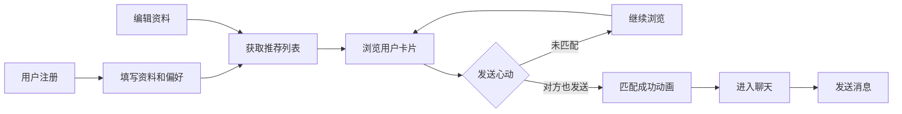

## 1. 产品概述
心动信号匹配应用是一个线上相亲角平台，帮助社区参与者展示个人信息、表达匹配意向，并通过"心动信号"机制促成双方初步沟通。
- 核心价值：为社区用户提供安全、便捷的线上相亲交友渠道，通过智能推荐和双向确认机制提升匹配效率
- 目标用户：社区内有交友需求的单身用户，注重用户体验和隐私保护

## 2. 核心功能

### 2.1 用户角色
| 角色 | 注册方式 | 核心权限 |
|------|----------|----------|
| 普通用户 | 填写资料注册 | 浏览推荐、发送心动、匹配聊天、编辑资料 |

### 2.2 功能模块
1. **注册页**：个人资料填写、择偶偏好设置
2. **推荐列表页**：用户卡片浏览、心动信号发送、滚动加载更多
3. **匹配通知模态框**：爱心粒子动画、匹配成功提示
4. **聊天页面**：联系人列表、消息气泡展示、消息发送
5. **侧边栏**：个人资料编辑、偏好设置修改

### 2.3 页面详情
| 页面名称 | 模块名称 | 功能描述 |
|----------|----------|----------|
| 注册页 | 个人资料表单 | 昵称、出生年份、性别、城市、简介、兴趣标签（≥3个） |
| 注册页 | 择偶偏好表单 | 年龄范围、目标城市、兴趣标签偏好 |
| 推荐列表页 | 用户卡片 | 头像色块、昵称、年龄、城市、兴趣标签、心动按钮 |
| 推荐列表页 | 无限滚动 | 滚动到底部自动加载更多用户 |
| 聊天页 | 联系人列表 | 头像色块、昵称、最后消息预览、匹配时间 |
| 聊天页 | 消息区域 | 气泡消息、发送时间、自动滚动到底部 |
| 聊天页 | 输入区域 | 文字输入、emoji选择器、发送按钮 |
| 侧边栏 | 资料编辑 | 修改个人资料和偏好，实时更新推荐 |

## 3. 核心流程
用户注册填写资料 → 系统按偏好筛选推荐用户 → 用户浏览并发送心动信号 → 双方互发则触发匹配动画 → 进入聊天界面开始私聊 → 可随时编辑资料更新推荐

## 4. 用户界面设计

### 4.1 设计风格
- **主色调**：珊瑚粉 `#FF6B6B`，搭配淡米白 `#FFF5E6`
- **按钮风格**：圆角渐变按钮（珊瑚粉 → 浅橙），hover时有轻微上浮效果
- **字体**：使用圆润友好的无衬线字体，标题字号较大，正文清晰易读
- **布局风格**：卡片式布局，毛玻璃效果（backdrop-filter: blur(10px)），柔和阴影
- **图标风格**：使用emoji和简约线性图标，整体温暖柔和

### 4.2 页面设计概述
| 页面名称 | 模块名称 | UI元素 |
|----------|----------|--------|
| 注册页 | 表单区域 | 柔和渐变背景，圆角输入框，标签多选，渐变色提交按钮 |
| 推荐列表页 | 用户卡片 | 毛玻璃效果，头像色块，悬停上浮（translateY(-4px)），心动按钮 |
| 聊天页 | 联系人列表 | 左侧边栏，头像色块，最后消息预览，匹配时间 |
| 聊天页 | 消息气泡 | 自己消息右对齐蓝色，对方消息左对齐灰色，时间戳精确到分钟 |
| 匹配模态框 | 爱心动画 | 半透明遮罩，爱心粒子从中心扩散消散，持续2秒 |

### 4.3 响应式设计
- **桌面端（≥768px）**：聊天页左右布局（左侧联系人列表，右侧聊天区域）
- **移动端（<768px）**：聊天页上下布局，联系人列表和聊天区域切换显示，高度自适应
- 所有按钮和交互元素确保触摸友好，最小点击区域44×44px

### 4.4 动画效果
- **卡片悬停**：translateY(-4px) + 阴影增强
- **匹配动画**：爱心粒子从中心向四周扩散消散，持续2秒
- **消息发送**：新消息滑入效果，列表自动滚动到底部
- **页面切换**：淡入淡出过渡效果
