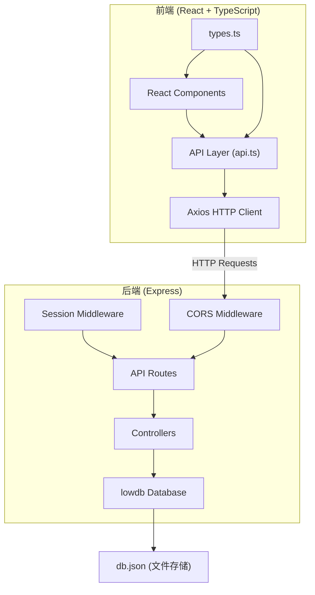
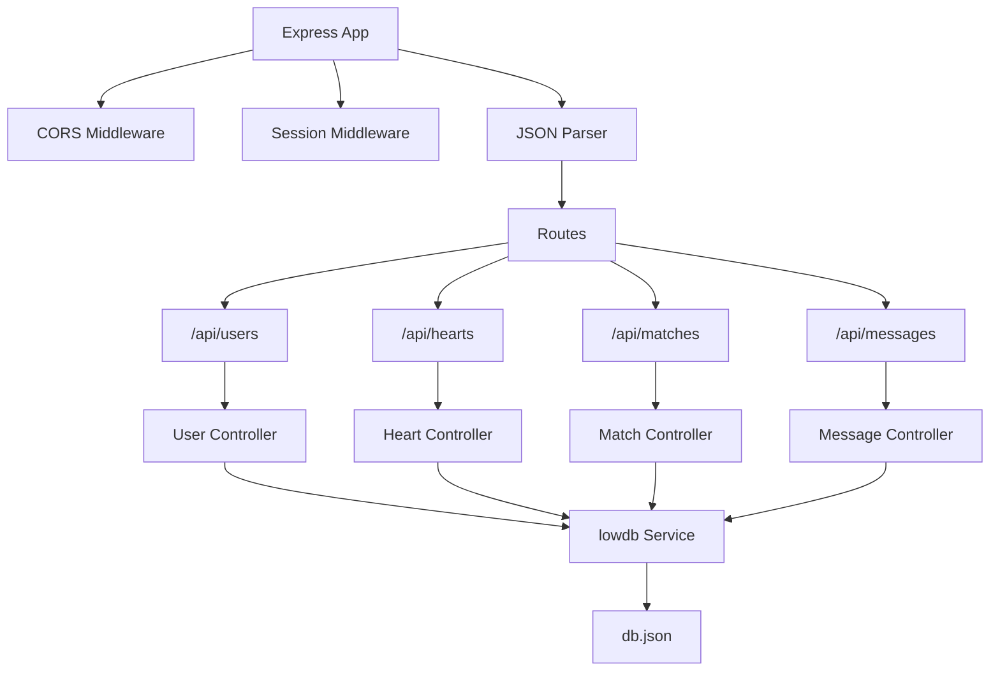
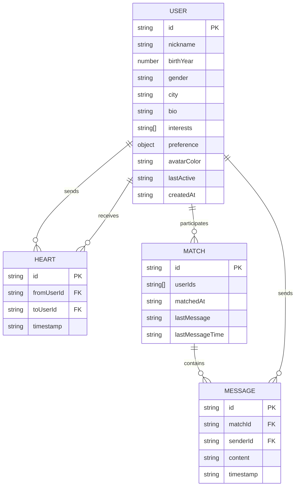

## 1. 架构设计



## 2. 技术栈说明
- **前端框架**：React 18 + TypeScript
- **构建工具**：Vite 5
- **路由管理**：react-router-dom 6
- **HTTP客户端**：Axios
- **后端框架**：Express 4
- **数据库**：lowdb (基于JSON文件)
- **唯一ID生成**：uuid
- **会话管理**：express-session
- **跨域处理**：cors

## 3. 路由定义
| 路由路径 | 页面/用途 |
|----------|----------|
| `/` | 注册页面，新用户填写资料 |
| `/discover` | 推荐列表页，浏览匹配用户 |
| `/chat` | 聊天列表页，查看所有匹配 |
| `/chat/:matchId` | 聊天详情页，与特定用户私聊 |

## 4. API 定义

### 4.1 类型定义
```typescript
interface User {
  id: string;
  nickname: string;
  birthYear: number;
  gender: 'male' | 'female';
  city: string;
  bio: string;
  interests: string[];
  preference: Preference;
  avatarColor: string;
  lastActive: string;
  createdAt: string;
}

interface Preference {
  minAge: number;
  maxAge: number;
  targetCity: string;
  targetInterests: string[];
}

interface Heart {
  id: string;
  fromUserId: string;
  toUserId: string;
  timestamp: string;
}

interface Match {
  id: string;
  userIds: [string, string];
  matchedAt: string;
  lastMessage?: string;
  lastMessageTime?: string;
}

interface Message {
  id: string;
  matchId: string;
  senderId: string;
  content: string;
  timestamp: string;
}
```

### 4.2 接口列表
| 方法 | 路径 | 描述 | 请求参数 | 响应 |
|------|------|------|----------|------|
| POST | `/api/users` | 用户注册 | `{ nickname, birthYear, gender, city, bio, interests, preference }` | `User` |
| GET | `/api/users/recommend` | 获取推荐列表 | `?page=1&limit=10` | `{ users: User[], hasMore: boolean }` |
| GET | `/api/users/:id` | 获取用户信息 | - | `User` |
| PUT | `/api/users/:id` | 更新用户资料 | `User` | `User` |
| POST | `/api/hearts` | 发送心动信号 | `{ fromUserId, toUserId }` | `{ success: boolean, isMatch: boolean, match?: Match }` |
| GET | `/api/hearts/check/:userId1/:userId2` | 检查是否匹配 | - | `{ isMatch: boolean }` |
| GET | `/api/matches/:userId` | 获取用户匹配列表 | - | `Match[]` |
| GET | `/api/messages/:matchId` | 获取聊天消息 | `?since=timestamp` | `Message[]` |
| POST | `/api/messages` | 发送消息 | `{ matchId, senderId, content }` | `Message` |

## 5. 服务端架构



## 6. 数据模型

### 6.1 ER图



### 6.2 lowdb 数据结构
```json
{
  "users": [],
  "hearts": [],
  "matches": [],
  "messages": []
}
```

## 7. 性能优化策略

### 7.1 推荐列表缓存
- 服务端缓存已拉取的用户ID，避免重复查询
- 第二次及后续请求响应时间 ≤ 500ms
- 每次返回10条数据，按活跃度（lastActive）排序

### 7.2 聊天轮询优化
- 轮询间隔：2秒
- 增量拉取：使用 `since` 参数只获取新消息
- 单次轮询数据量 ≤ 50KB
- 前端合并消息列表，避免重复渲染

### 7.3 前端优化
- 使用 React.memo 优化卡片组件渲染
- 虚拟滚动（可选，针对大量数据场景）
- 图片懒加载（头像色块无需此优化）
- 防抖/节流处理滚动和输入事件
