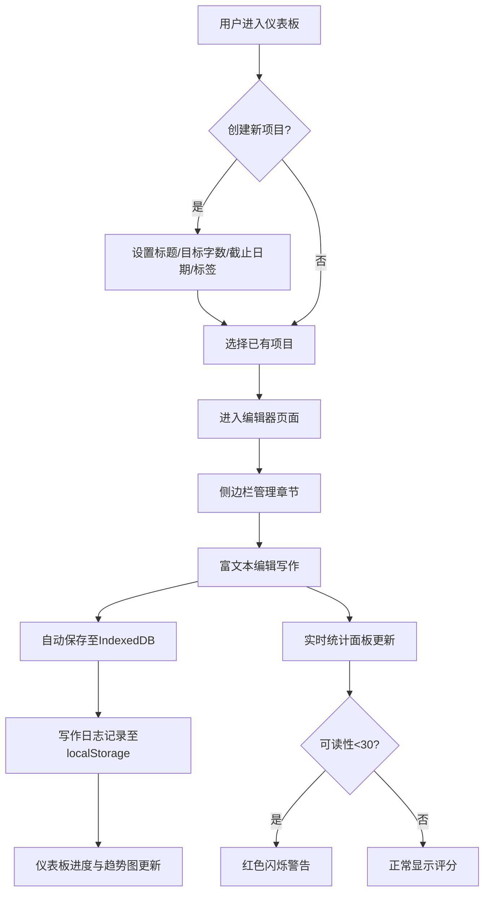

## 1. 产品概述

轻量写作辅助工具，帮助写作爱好者快速整理文章灵感、记录写作进度并生成可读性分析报告。解决写作过程中思路碎片化、进度难以追踪和文章可读性无法实时评估三大痛点。面向个人写作爱好者，提供从灵感到成稿的一站式辅助体验。

## 2. 核心功能

### 2.1 用户角色

| 角色 | 注册方式 | 核心权限 |
|------|----------|----------|
| 写作者 | 无需注册，本地使用 | 创建/管理项目、编辑章节、查看统计与进度 |

### 2.2 功能模块

1. **仪表板页面**：项目列表管理、写作目标追踪仪表板（环形进度条 + 折线图）
2. **编辑器页面**：富文本编辑器、章节管理、实时统计面板、自动草稿保存

### 2.3 页面详情

| 页面名称 | 模块名称 | 功能描述 |
|----------|----------|----------|
| 仪表板 | 项目卡片列表 | 展示所有项目，支持创建（标题/目标字数/截止日期/标签）、重命名、复制、删除；卡片可拖拽排序 |
| 仪表板 | 环形进度条 | 展示"已完成字数/目标字数"百分比，实时更新 |
| 仪表板 | 折线图 | 展示过去7天每日新增字数趋势（Canvas绘制），点击某天查看当天写作片段列表 |
| 编辑器 | 章节管理面板 | 侧边栏多层折叠面板，管理多个章节/片段，支持拖拽排序 |
| 编辑器 | 富文本编辑器 | Quill编辑器，支持加粗/斜体/标题/列表/引用块，插入本地图片（Canvas压缩至800px宽） |
| 编辑器 | 自动保存 | 每5秒自动保存草稿至IndexedDB，显示最后保存时间戳 |
| 编辑器 | 统计面板 | 侧边栏实时展示总字数/段落数/句数/预计阅读时长/可读性评分（Flesch-Kincaid 0-100），低于30红色警告 |

## 3. 核心流程

1. 用户在仪表板创建新文章项目，设置标题、目标字数、截止日期和标签
2. 进入项目编辑器，在侧边栏管理章节，点击章节开始写作
3. 编辑器自动保存草稿，侧边栏实时显示字数统计和可读性评分
4. 返回仪表板查看项目进度和7天写作趋势

## 4. 用户界面设计

### 4.1 设计风格

- **主色调**：淡蓝灰配色 — 深色 `#2C3E50` + 浅底 `#E8F0FE`
- **按钮风格**：圆角微阴影按钮，hover时轻微上浮效果
- **字体**：标题使用 Noto Serif SC（衬线中文字体，适合写作氛围），正文使用 Noto Sans SC
- **布局风格**：左侧深色侧边栏 + 右侧编辑区域，卡片式项目展示
- **图标风格**：Lucide线性图标，与淡蓝灰主色调协调

### 4.2 页面设计概述

| 页面名称 | 模块名称 | UI元素 |
|----------|----------|--------|
| 仪表板 | 项目卡片列表 | 网格布局卡片，白色底+轻微阴影，标签色块，截止日期倒计时；拖拽时弹性跟随动画 |
| 仪表板 | 环形进度条 | SVG/Canvas环形，渐变填充，中心数字滚动动画 |
| 仪表板 | 折线图 | Canvas原生绘制，渐变填充区域，悬浮显示数据点，点击某天弹出片段列表 |
| 编辑器 | 侧边栏 | 深色 `#2C3E50` 背景，多层折叠面板，章节项可拖拽；768px以下收起为汉堡菜单 |
| 编辑器 | 编辑区域 | 轻微纸纹纹理背景（CSS背景图案），Quill工具栏顶部固定，编辑区居中留白 |
| 编辑器 | 统计面板 | 侧边栏内嵌面板，数字变化时滚动动画，可读性<30时色块渐变闪烁 |

### 4.3 响应式设计

- 桌面优先设计，768px为断点
- 768px以下：侧边栏自动收起为汉堡菜单，编辑器全宽，统计面板折叠为底部抽屉
- 触摸优化：拖拽排序支持触摸事件，按钮点击区域不小于44px

### 4.4 动效设计

- 章节拖拽：弹性跟随动画（弹簧阻尼效果）
- 数字统计：数字变化时滚动计数动画（从旧值到新值平滑过渡）
- 可读性警告：评分低于30时色块渐变闪烁（红色脉冲动画）
- 页面切换：淡入淡出过渡
- 项目卡片：hover时轻微上浮+阴影加深
