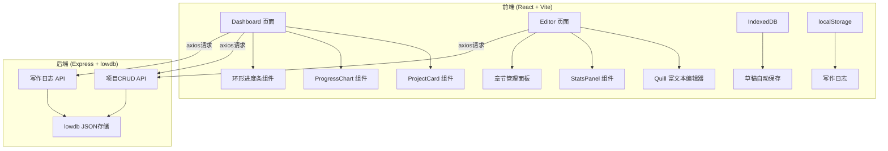
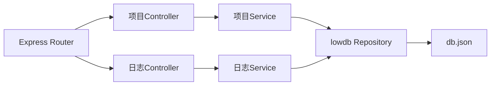
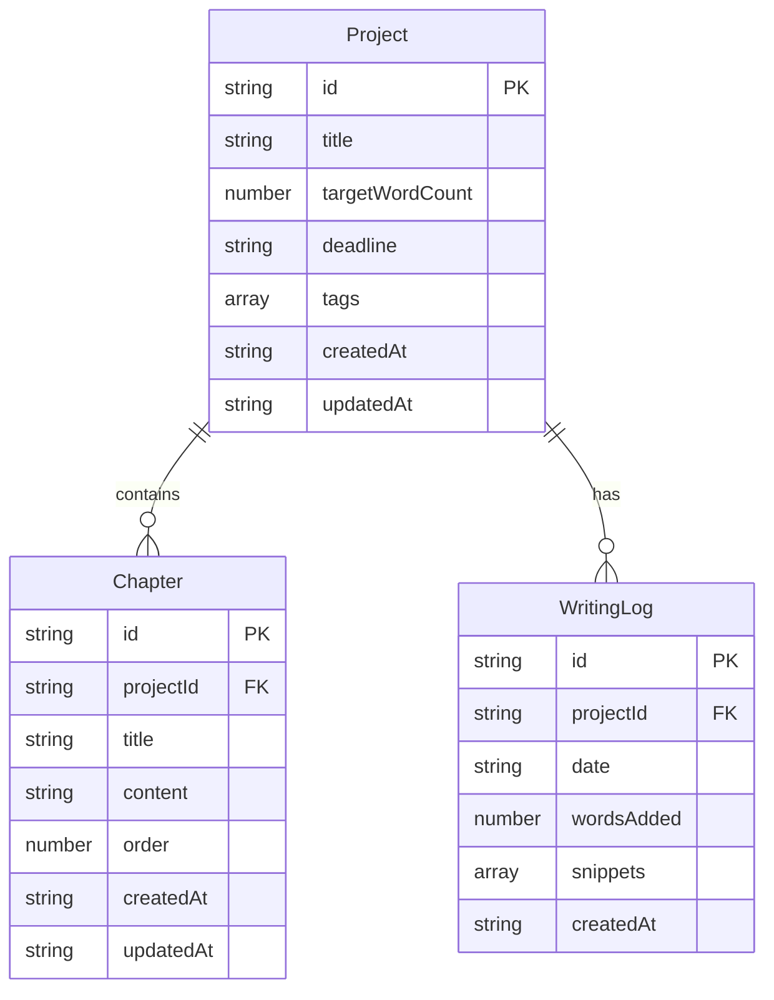

## 1. 架构设计



## 2. 技术说明

- **前端**：React@18 + TypeScript + TailwindCSS@3 + Vite
- **初始化工具**：vite-init (react-express-ts 模板)
- **状态管理**：Zustand
- **后端**：Express@4 + TypeScript (ESM)
- **数据库**：lowdb (JSON文件存储)
- **富文本编辑器**：Quill
- **路由**：react-router-dom
- **HTTP客户端**：axios

## 3. 路由定义

| 路由 | 用途 |
|------|------|
| `/` | 仪表板页面，展示项目列表和写作目标追踪 |
| `/project/:id` | 编辑器页面，包含富文本编辑器、章节管理和统计面板 |

## 4. API定义

### 4.1 项目管理API

```typescript
interface Project {
  id: string;
  title: string;
  targetWordCount: number;
  deadline: string;
  tags: string[];
  chapters: Chapter[];
  createdAt: string;
  updatedAt: string;
}

interface Chapter {
  id: string;
  projectId: string;
  title: string;
  content: string;
  order: number;
  createdAt: string;
  updatedAt: string;
}

// GET /api/projects - 获取所有项目
// Response: Project[]

// GET /api/projects/:id - 获取单个项目
// Response: Project

// POST /api/projects - 创建项目
// Body: { title, targetWordCount, deadline, tags }
// Response: Project

// PUT /api/projects/:id - 更新项目（重命名/修改信息）
// Body: { title?, targetWordCount?, deadline?, tags?, chapters? }
// Response: Project

// POST /api/projects/:id/duplicate - 复制项目
// Response: Project

// DELETE /api/projects/:id - 删除项目
// Response: { success: boolean }

// PUT /api/projects/:id/chapters/reorder - 章节排序
// Body: { chapterIds: string[] }
// Response: Project

// POST /api/projects/:id/chapters - 创建章节
// Body: { title }
// Response: Chapter

// PUT /api/chapters/:id - 更新章节内容
// Body: { title?, content? }
// Response: Chapter

// DELETE /api/chapters/:id - 删除章节
// Response: { success: boolean }
```

### 4.2 写作日志API

```typescript
interface WritingLog {
  id: string;
  projectId: string;
  date: string; // YYYY-MM-DD
  wordsAdded: number;
  snippets: string[];
  createdAt: string;
}

// POST /api/writing-logs - 记录写作日志
// Body: { projectId, date, wordsAdded, snippets }
// Response: WritingLog

// GET /api/writing-logs/:projectId/daily?days=7 - 获取近N天日志
// Response: WritingLog[]

// GET /api/writing-logs/:projectId/date/:date - 获取某天日志
// Response: WritingLog
```

## 5. 服务端架构图



## 6. 数据模型

### 6.1 数据模型定义



### 6.2 lowdb数据结构

```json
{
  "projects": [
    {
      "id": "uuid",
      "title": "我的小说",
      "targetWordCount": 50000,
      "deadline": "2026-12-31",
      "tags": ["小说"],
      "chapters": [
        {
          "id": "uuid",
          "projectId": "uuid",
          "title": "第一章",
          "content": "",
          "order": 1,
          "createdAt": "2026-06-14T00:00:00Z",
          "updatedAt": "2026-06-14T00:00:00Z"
        }
      ],
      "createdAt": "2026-06-14T00:00:00Z",
      "updatedAt": "2026-06-14T00:00:00Z"
    }
  ],
  "writingLogs": [
    {
      "id": "uuid",
      "projectId": "uuid",
      "date": "2026-06-14",
      "wordsAdded": 1200,
      "snippets": ["写完了第一章的开头..."],
      "createdAt": "2026-06-14T00:00:00Z"
    }
  ]
}
```
