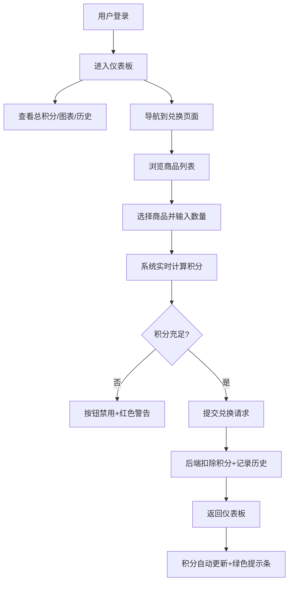

## 1. 产品概述
垃圾分类积分兑换平台，通过积分兑换机制激励社区居民参与垃圾分类和旧物回收环保行动。
- 目标用户：社区居民，通过环保行为获取积分并兑换生活商品
- 核心价值：用积分奖励机制建立长期环保行为习惯，促进社区绿色生活

## 2. 核心功能

### 2.1 用户角色
| 角色 | 注册方式 | 核心权限 |
|------|----------|----------|
| 社区居民 | 模拟登录 | 查看积分、浏览商品、兑换商品、查看兑换历史 |

### 2.2 功能模块
1. **仪表板页面**：总积分展示、本周积分柱状图、当月积分趋势折线图、兑换历史记录
2. **兑换页面**：商品列表浏览、商品选择、积分计算、兑换提交

### 2.3 页面详情
| 页面名称 | 模块名称 | 功能描述 |
|----------|----------|----------|
| 仪表板 | 总积分卡片 | 粗体大字显示当前总积分，毛玻璃卡片风格 |
| 仪表板 | 本周积分柱状图 | 7天每日积分累积，柱状图从底部向上逐根弹出动画，每根柱子显示具体数值 |
| 仪表板 | 当月积分趋势折线图 | 折线逐点出现动画，展示当月积分变化趋势 |
| 仪表板 | 兑换历史列表 | 日期、商品名、消耗积分，按日期降序排列，支持虚拟滚动 |
| 仪表板 | 用户信息卡片 | 毛玻璃风格，头像Canvas裁剪为圆形，支持上传 |
| 仪表板 | 顶部通知条 | 兑换成功绿色滑入提示，3秒后自动滑出消失 |
| 兑换 | 商品列表 | 名称、所需积分、库存、Canvas缩略图，卡片悬停上浮阴影效果，响应式布局，支持虚拟滚动 |
| 兑换 | 兑换表单 | 选择商品、输入数量、实时计算总积分（数字递增动画），积分不足显示红色警告并禁用按钮 |
| 兑换 | 涟漪按钮动效 | 所有按钮拥有从中间向两边扩散的涟漪点击动效 |
| 兑换 | 输入框聚焦动画 | 表单输入框聚焦时底部边框绿色渐变动画 |

## 3. 核心流程
用户登录后进入仪表板查看积分数据，通过导航切换到兑换页面，浏览商品后选择商品并输入数量，系统实时校验积分，确认兑换后提交请求，后端扣除积分并记录兑换历史，返回仪表板时积分自动更新并弹出成功提示。

## 4. 用户界面设计

### 4.1 设计风格
- 主色：深绿 #2E7D32，辅色：浅绿 #A5D6A7，背景：米白 #F5F0E8
- 卡片背景：磨砂玻璃效果 backdrop-filter: blur(10px) + 半透明白色背景
- 按钮：圆角设计，涟漪扩散动效
- 字体：系统无衬线字体，标题加粗，正文清晰可读
- 图标风格：Lucide 线性图标，绿色主题

### 4.2 页面设计概览
| 页面名称 | 模块名称 | UI 元素 |
|----------|----------|---------|
| 仪表板 | 布局 | 顶部导航栏 + 左侧用户卡片区 + 中间图表区 + 底部历史列表 |
| 仪表板 | 总积分 | 大号加粗数字，渐变背景毛玻璃卡片 |
| 仪表板 | 图表区 | 左侧折线图，右侧柱状图，Canvas绘制带入场动画 |
| 仪表板 | 历史列表 | 虚拟滚动列表，日期降序，每行分隔线 |
| 兑换 | 商品网格 | 桌面端4列/平板2列/移动1列，卡片悬停上浮阴影 |
| 兑换 | 表单 | 数量输入框 + 积分实时显示 + 兑换按钮 |

### 4.3 响应式设计
- 桌面端（≥1024px）：商品卡片每行4个，双栏图表布局
- 平板端（≥640px）：商品卡片每行2个，图表堆叠排列
- 移动端（<640px）：商品卡片每行1个，单栏布局，触控优化
