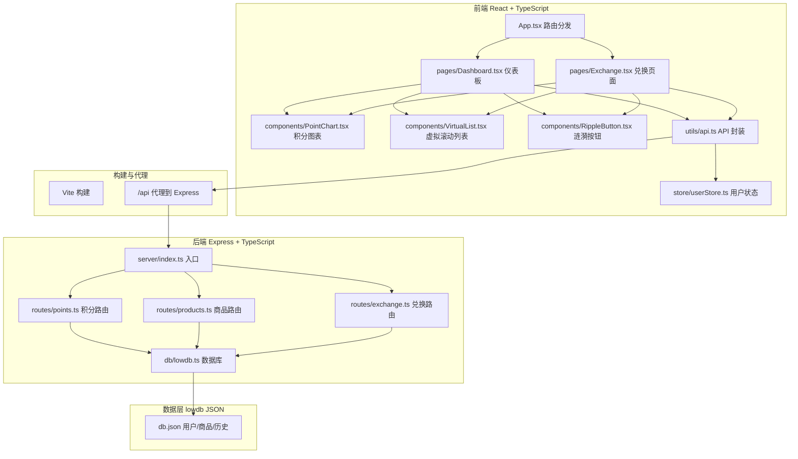
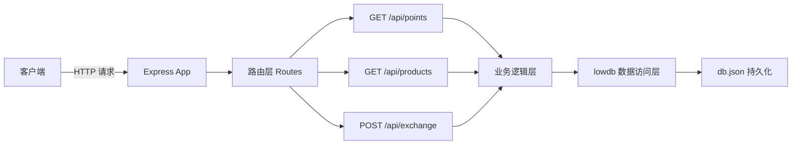
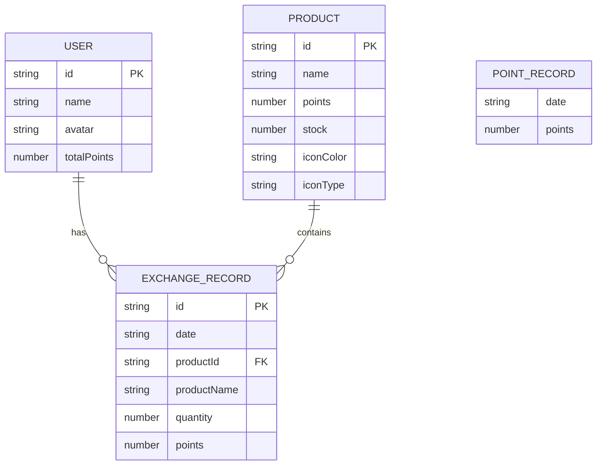

## 1. 架构设计



## 2. 技术说明
- 前端：React@18 + TypeScript@5 + Vite@5 + React Router@6 + Zustand + Axios + Lucide React
- 后端：Express@4 + TypeScript@5 + lowdb@3 + uuid + cors + express-session
- 数据库：lowdb（JSON文件持久化）
- 构建工具：Vite，代理 `/api` 到后端 Express 端口
- 包管理：npm
- 启动脚本：`npm run dev` 同时运行前后端（concurrently）

## 3. 路由定义
| 路由 | 用途 |
|------|------|
| / | 仪表板 Dashboard |
| /exchange | 商品兑换 Exchange |
| * | 404 重定向到 / |

## 4. API 定义

### 类型定义
```typescript
interface User {
  id: string;
  name: string;
  avatar?: string;
  totalPoints: number;
}

interface PointRecord {
  date: string;
  points: number;
}

interface Product {
  id: string;
  name: string;
  points: number;
  stock: number;
  iconColor: string;
  iconType: 'bottle' | 'bag' | 'box' | 'plant' | 'umbrella' | 'cup';
}

interface ExchangeRecord {
  id: string;
  date: string;
  productId: string;
  productName: string;
  quantity: number;
  points: number;
}

interface ExchangeRequest {
  productId: string;
  quantity: number;
}

interface ExchangeResponse {
  success: boolean;
  message: string;
  points?: number;
  record?: ExchangeRecord;
}
```

### API 列表
| 方法 | 路径 | 请求 | 响应 |
|------|------|------|------|
| GET | /api/points | - | `{ user: User, weekPoints: PointRecord[], monthPoints: PointRecord[], history: ExchangeRecord[] }` |
| GET | /api/products | - | `Product[]` |
| POST | /api/exchange | `ExchangeRequest` | `ExchangeResponse` |

## 5. 服务器架构图



## 6. 数据模型

### 6.1 数据模型定义



### 6.2 初始化数据
- **默认用户**：id="user_001", name="社区居民", totalPoints=1580
- **本周积分**：周一到周日模拟数据 [120, 85, 150, 90, 200, 180, 65]
- **当月积分**：30天模拟趋势数据
- **商品数据**：环保袋(50分/库存100)、再生水杯(80分/库存50)、绿植盆栽(120分/库存30)、旧物回收箱(200分/库存20)、折叠雨伞(150分/库存25)、饮料瓶兑换券(30分/库存200)、竹制餐具(90分/库存40)、节能灯泡(60分/库存80)、有机肥皂(70分/库存60)、纸质笔记本(45分/库存150)
- **兑换历史**：10条模拟记录，按日期倒序排列
