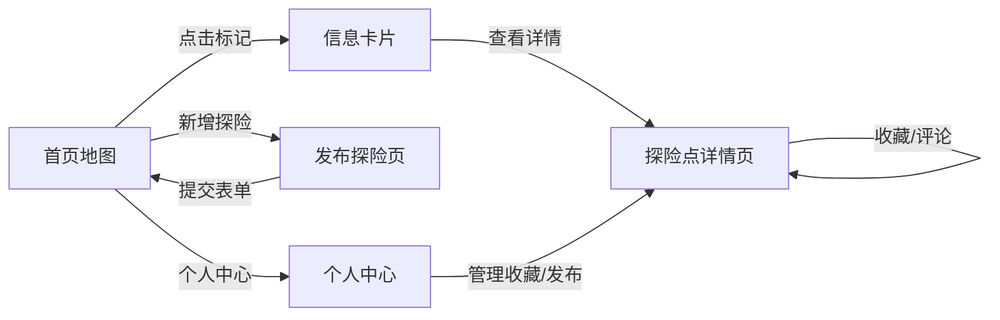

## 1. 产品概述

城迹探索是一款基于地理位置的城市探险日志应用，让用户发现、记录和分享城市中隐藏的有趣角落、特色小店与独特建筑。
- 解决城市探索爱好者发现小众地点、记录探索足迹、与同好交流的需求
- 打造城市文化地图，提升城市生活的趣味性和探索价值

## 2. 核心功能

### 2.1 用户角色
| 角色 | 注册方式 | 核心权限 |
|------|----------|----------|
| 普通用户 | 默认游客身份，无需注册 | 浏览地图、查看详情、发布探险点、收藏、评分、评论、编辑/删除自己发布的内容 |

### 2.2 功能模块
1. **首页地图视图**：全屏地图展示所有探险点标记，分类自定义图标，点击弹出信息卡片，底部浮动工具栏
2. **探险点详情页**：轮播大图、完整描述、评分仪表盘、评论列表、收藏操作
3. **发布新探险页**：表单输入、图片上传压缩、地图位置拾取、类型选择
4. **个人中心页**：收藏列表、自己发布的探险点列表、编辑/删除操作

### 2.3 页面详情
| 页面名称 | 模块名称 | 功能描述 |
|----------|----------|----------|
| 首页地图 | 地图图层 | Leaflet地图，滚轮缩放/拖拽保持30fps+，缩放层级控制 |
| 首页地图 | 标记系统 | 按类型（咖啡馆/书店/涂鸦墙等）自定义图标，点击标记飞行定位 |
| 首页地图 | 信息卡片 | 淡入动画，缩略图+名称+短描述，点击跳转详情 |
| 首页地图 | 浮动工具栏 | 半透明底部栏，新增按钮、个人中心入口、类型筛选 |
| 详情页 | 图片轮播 | 支持触控手势滑动，大图展示，模糊缩略图占位 |
| 详情页 | 评分仪表盘 | Canvas环形图展示各星级评分分布，综合评分与访问次数 |
| 详情页 | 评论系统 | 按时间倒序排列，支持文字+图片评论，1-5星评分 |
| 详情页 | 收藏操作 | 一键收藏/取消收藏，状态即时反馈 |
| 发布页 | 表单模块 | 名称、描述、类型选择输入校验 |
| 发布页 | 图片上传 | 最多3张，Canvas压缩至1MB内，预览与删除 |
| 发布页 | 位置拾取 | 地图拖拽标记+地址搜索，经纬度坐标实时显示 |
| 个人中心 | 收藏列表 | 卡片网格布局，悬停放大阴影效果，点击跳转详情 |
| 个人中心 | 我的发布 | 列表展示，支持编辑和删除操作，删除二次确认 |

## 3. 核心流程

用户打开应用 → 首页地图加载探险点标记 → 点击标记查看信息卡片 → 进入详情页浏览/收藏/评论 → 返回首页点击发布 → 填写表单上传图片拾取位置 → 提交后地图实时更新新标记 → 进入个人中心管理收藏与发布内容。

## 4. 用户界面设计

### 4.1 设计风格
- **主色调**：深蓝灰 (#1e293b) 作为背景与主基调，暖橙色 (#f97316) 作为强调色与交互元素
- **辅助色**：中性灰蓝 (#64748b) 用于边框与次要文字，浅灰白 (#f8fafc) 用于卡片背景
- **按钮风格**：圆角8px，暖橙色主按钮带悬浮抬升阴影，文字按钮无背景
- **字体**：标题使用 Playfair Display（优雅衬线体），正文使用 Noto Sans SC（简洁无衬线中文）
- **布局风格**：卡片式布局，圆角12px，柔和阴影，卡片悬浮时放大+加深阴影
- **图标风格**：Lucide 线性图标，暖橙色强调，大小统一20px

### 4.2 页面设计概述
| 页面名称 | 模块名称 | UI元素 |
|----------|----------|--------|
| 首页地图 | 全屏地图 | 深蓝灰地图滤镜，暖橙色标记图标，浮动缩放控件 |
| 首页地图 | 信息卡片 | 圆角12px，淡入0.3s，背景毛玻璃效果，悬浮抬升 |
| 首页地图 | 底部工具栏 | 半透明深蓝灰 (80%透明度)，模糊背景，水平排列按钮 |
| 详情页 | 轮播图 | 圆角底部切角，指示器小圆点，滑动切换过渡0.3s |
| 详情页 | 评分仪表盘 | 暖橙色渐变环形图，居中显示综合评分，四周标注星级分布 |
| 详情页 | 评论卡片 | 浅灰背景，头像圆角，时间戳灰色小字，收藏心形按钮 |
| 发布页 | 表单 | 卡片包裹，输入框圆角8px带边框，聚焦时橙色边框 |
| 发布页 | 图片上传区 | 虚线边框，拖拽区域，缩略图网格排列 |
| 个人中心 | 卡片网格 | 响应式栅格，卡片悬停缩放1.02+阴影加深，图片渐变遮罩 |

### 4.3 响应式设计
- **桌面端 (>1024px)**：地图全屏，浮动工具栏居中1200px宽，详情页两栏布局（左图右文），个人中心3列卡片网格
- **平板端 (768-1024px)**：地图全屏，工具栏宽度90%，详情页单栏滚动，卡片网格2列
- **移动端 (<768px)**：地图全屏，控制面板变窄且按钮缩小，卡片全宽单列排列，底部工具栏图标尺寸减小，轮播图支持多点触控滑动

### 4.4 性能优化
- 地图操作：Leaflet 硬件加速 CSS transform，节流缩放事件，确保30fps+
- 图片加载：使用 IntersectionObserver 懒加载，先显示低分辨率模糊缩略图占位，渐进加载高清图
- 图片压缩：Canvas 按比例缩放 + quality 0.8 压缩，确保单图 <1MB
- 动画：使用 CSS transform/opacity 实现 GPU 加速，避免布局重排
