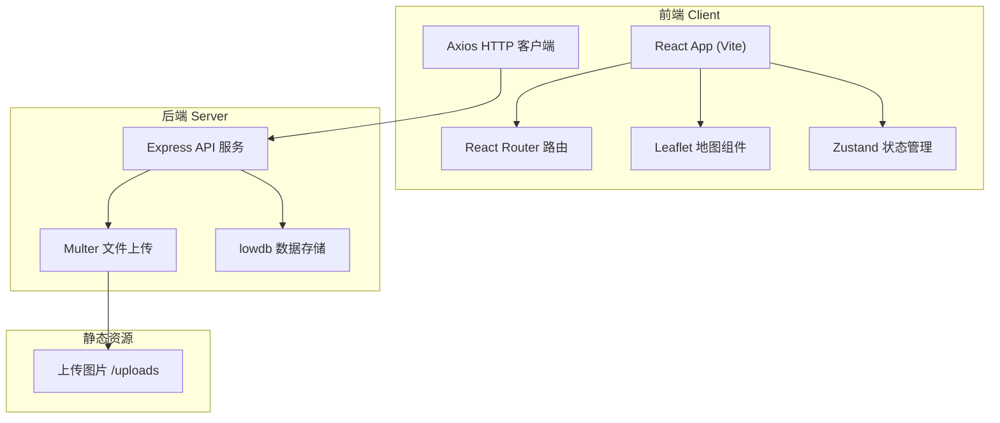
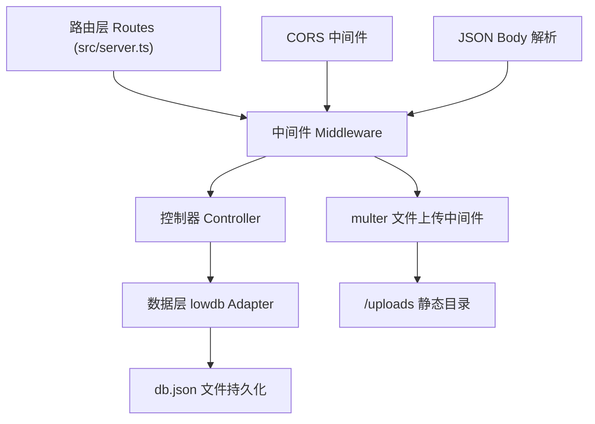
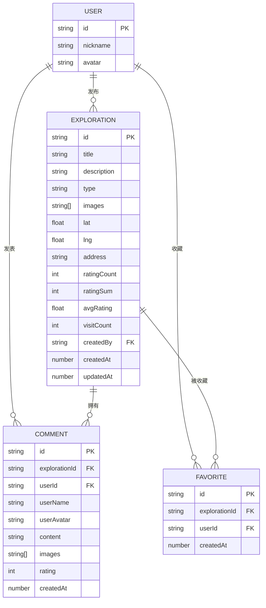

## 1. 架构设计



## 2. 技术说明

- **前端**：React 18 + TypeScript（严格模式）+ Vite 构建，React Router DOM 路由，Axios 网络请求，Zustand 全局状态，Leaflet + react-leaflet 地图
- **初始化工具**：Vite (vite-init react-ts 模板)
- **后端**：Express 4 提供 RESTful API，Multer 处理 multipart/form-data 图片上传，lowdb（JSON 文件数据库）持久化数据，uuid 生成唯一ID，CORS 跨域支持
- **数据库**：lowdb（db.json 文件存储），分 collections: explorations（探险点）、comments（评论）、users（用户）、favorites（收藏）

## 3. 路由定义

| 前端路由 | 页面组件 | 用途 |
|----------|----------|------|
| `/` | MapView | 首页地图视图，展示所有探险点标记 |
| `/exploration/:id` | DetailPage | 探险点详情页，大图+评分+评论 |
| `/publish` | ExplorationForm | 发布新探险点表单页 |
| `/profile` | ProfilePage | 个人中心，收藏与我的发布列表 |
| `/exploration/:id/edit` | ExplorationForm | 编辑已有探险点（复用发布页） |

| 后端 API 路由 | 方法 | 用途 |
|---------------|------|------|
| `/api/explorations` | GET | 获取所有探险点列表 |
| `/api/explorations/:id` | GET | 获取单个探险点详情（含评论） |
| `/api/explorations` | POST | 创建新探险点 |
| `/api/explorations/:id` | PUT | 更新探险点 |
| `/api/explorations/:id` | DELETE | 删除探险点及关联评论 |
| `/api/explorations/:id/visit` | POST | 探险点访问次数+1 |
| `/api/comments` | POST | 新增评论（含评分） |
| `/api/comments/:id` | DELETE | 删除评论 |
| `/api/favorites` | GET | 获取收藏列表 |
| `/api/favorites/:explorationId` | POST | 收藏探险点 |
| `/api/favorites/:explorationId` | DELETE | 取消收藏 |
| `/api/upload` | POST | 上传单张图片（返回URL） |
| `/uploads/*` | GET | 静态资源访问上传图片 |

## 4. API 定义（类型与请求响应）

```typescript
// ===== 数据类型 =====
interface User {
  id: string;
  nickname: string;
  avatar: string;
}

interface Exploration {
  id: string;
  title: string;
  description: string;
  type: 'cafe' | 'bookstore' | 'graffiti' | 'architecture' | 'hidden_shop' | 'other';
  images: string[];
  lat: number;
  lng: number;
  address?: string;
  ratingCount: number;
  ratingSum: number;
  avgRating: number;
  visitCount: number;
  createdBy: string;
  createdAt: number;
  updatedAt: number;
}

interface Comment {
  id: string;
  explorationId: string;
  userId: string;
  userName: string;
  userAvatar: string;
  content: string;
  images: string[];
  rating: number;
  createdAt: number;
}

interface Favorite {
  id: string;
  explorationId: string;
  userId: string;
  createdAt: number;
}

// ===== 请求响应 =====
// GET /api/explorations
// Response: Exploration[]

// GET /api/explorations/:id
// Response: { exploration: Exploration; comments: Comment[]; ratingDistribution: Record<number, number>; isFavorited: boolean }

// POST /api/explorations
// Request Body: { title, description, type, images, lat, lng, address }
// Response: Exploration

// POST /api/comments
// Request Body: { explorationId, userId, userName, userAvatar, content, images, rating }
// Response: Comment

// POST /api/upload
// Request: multipart/form-data (field: image)
// Response: { url: string }
```

## 5. 服务端架构图



服务端架构：单文件 server.ts 组织，Express 内置中间件处理 JSON/CORS，路由 → 处理函数直接读写 lowdb。Multer 配置 diskStorage 将图片保存至 public/uploads 目录，通过 express.static 暴露静态访问。

## 6. 数据模型

### 6.1 数据模型定义（ER 图）



### 6.2 初始数据（lowdb db.json 种子）

```json
{
  "users": [
    { "id": "user-demo", "nickname": "城市漫游者", "avatar": "https://api.dicebear.com/7.x/adventurer/svg?seed=explorer" }
  ],
  "explorations": [
    {
      "id": "exp-001",
      "title": "巷弄里的手冲咖啡馆",
      "description": "隐藏在老城区巷子深处，由老宅改造而成，木质装修搭配绿植，手冲豆子来自云南保山，口感回甘。",
      "type": "cafe",
      "images": [],
      "lat": 39.9087,
      "lng": 116.3975,
      "address": "北京市东城区某巷弄18号",
      "ratingCount": 12,
      "ratingSum": 56,
      "avgRating": 4.7,
      "visitCount": 156,
      "createdBy": "user-demo",
      "createdAt": 1710000000000,
      "updatedAt": 1710000000000
    }
  ],
  "comments": [],
  "favorites": []
}
```
