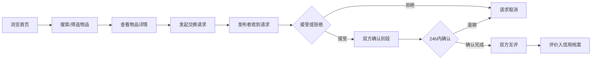

## 1. 产品概述

社区旧物交换与评价系统，为社区居民提供闲置物品的发布、浏览、交换和信用评价一体化平台。解决社区闲置物品流转低效、缺乏信任机制的问题，促进社区资源循环利用。

- 核心用户：社区居民，有闲置物品需要处理或需要寻找特定物品
- 市场价值：降低社区资源浪费，建立邻里信任，促进可持续生活方式

## 2. 核心功能

### 2.1 用户角色

| 角色 | 注册方式 | 核心权限 |
|------|---------|---------|
| 普通用户 | 系统默认登录 | 发布物品、浏览物品、发起交换、接受/拒绝交换、评价对方 |

### 2.2 功能模块

1. **首页**：搜索栏、分类筛选、物品列表（带骨架屏）
2. **物品详情页**：轮播图展示、物品信息、发布者信息、交换按钮、评论区
3. **物品发布页**：多图上传（Canvas预览压缩）、表单填写
4. **个人中心**：我的物品管理、收到的交换请求、发起的交换请求、信用评价档案
5. **信用档案页**：用户评分汇总、评价列表

### 2.3 页面详情

| 页面名称 | 模块名称 | 功能描述 |
|---------|---------|---------|
| 首页 | 搜索栏 | 关键词搜索（300ms防抖），支持标题/描述模糊匹配，带放大镜和重置按钮 |
| 首页 | 分类筛选 | 下拉框选择类别（电子、家具、书籍、衣物等），紧挨搜索框右侧 |
| 首页 | 物品列表 | 网格布局，按时间倒序，加载骨架屏，懒加载图片，空状态提示 |
| 物品详情页 | 轮播图 | 左右箭头+底部缩略图导航，0.5s渐变切换 |
| 物品详情页 | 物品信息 | 标题、类别、成色、描述、发布时间、状态徽章 |
| 物品详情页 | 发布者信息 | 头像、昵称、信用评分 |
| 物品详情页 | 交换按钮 | 弹窗输入附言，提交交换请求 |
| 物品详情页 | 评论区 | 时间倒序，从左向右滑入动画 |
| 物品发布页 | 图片上传 | 最多3张，Canvas等比缩放预览，自动压缩到800px宽 |
| 物品发布页 | 表单 | 标题、类别、成色、描述输入 |
| 个人中心 | 我的物品 | 列表展示，带编辑/删除功能 |
| 个人中心 | 收到的请求 | 待处理交换请求列表，可接受/拒绝 |
| 个人中心 | 发起的请求 | 状态展示（待确认/已完成/已取消） |
| 个人中心 | 信用档案入口 | 跳转至信用档案页 |
| 信用档案页 | 评分汇总 | 总评分、评价数量展示 |
| 信用档案页 | 评价列表 | 所有收到的评价详情 |

## 3. 核心流程

用户浏览首页 → 搜索或筛选物品 → 点击物品卡片进入详情页 → 点击交换按钮并填写附言 → 发布者在个人中心收到请求 → 发布者接受/拒绝 → 接受后双方24小时内确认完成 → 完成后双方互评（1-5星+评价文字）→ 评价展示在信用档案

## 4. 用户界面设计

### 4.1 设计风格

- **主色调**：#F5A623（暖橙色）
- **辅助色**：#FFFFFF（白色）
- **状态色**：蓝色（待交换）、绿色（已交换）、灰色（已下架）
- **卡片样式**：圆角+细微阴影，悬停时阴影加深+transform: translateY(-4px) 0.3s过渡
- **按钮风格**：圆角暖橙色按钮，悬停变亮
- **字体**：现代无衬线字体，清晰易读
- **布局**：卡片网格系统，桌面3列、平板2列、手机1列
- **图标**：Lucide React 图标库

### 4.2 页面设计概览

| 页面名称 | 模块名称 | UI 元素 |
|---------|---------|---------|
| 首页 | 搜索筛选区 | 圆角输入框带放大镜图标，重置按钮，分类下拉框，暖色调 |
| 首页 | 物品卡片 | 圆角图片、标题、类别标签、状态徽章、用户头像、悬停上浮动画 |
| 物品详情页 | 轮播图 | 渐变切换、左右箭头、底部缩略图圆点 |
| 物品详情页 | 评论区 | 头像+昵称+时间+内容，滑入动画 |
| 物品发布页 | 上传区 | 虚线框拖拽区域、Canvas预览、删除按钮 |
| 个人中心 | 标签页切换 | 我的物品/收到的请求/发起的请求 |
| 信用档案页 | 评分展示 | 大号数字评分、星级图标、评价数量 |

### 4.3 响应式设计

- **桌面端（≥1024px）**：3列网格，搜索框与筛选框横向排列
- **平板端（768-1023px）**：2列网格
- **手机端（<768px）**：1列网格，搜索框与筛选框上下排列
- 所有交互元素确保触摸友好（最小44px点击区域）
