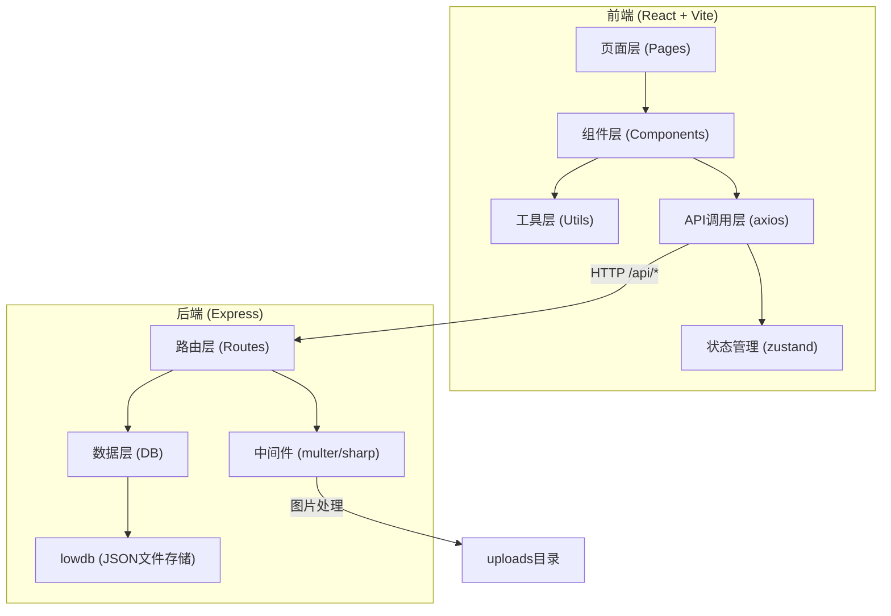
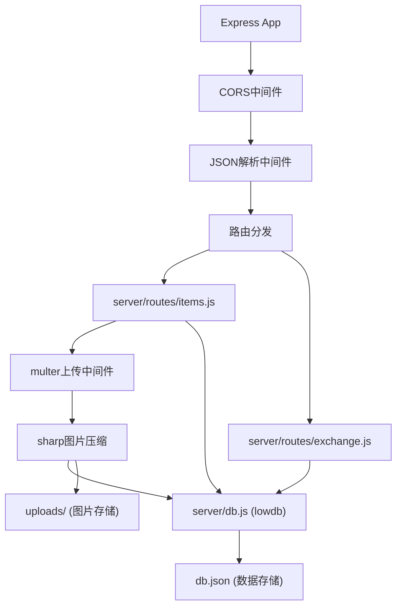
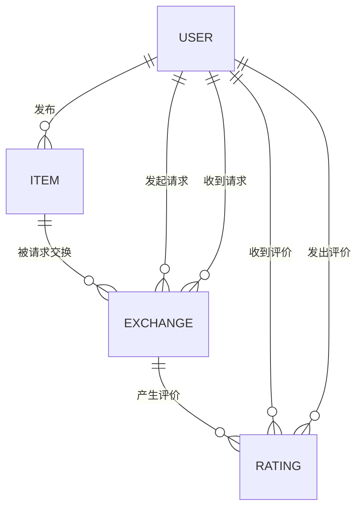

## 1. 架构设计



## 2. 技术说明

- **前端框架**：React@18 + TypeScript
- **构建工具**：Vite@5
- **路由**：react-router-dom@6
- **HTTP客户端**：axios
- **状态管理**：zustand
- **图标库**：lucide-react
- **样式**：Tailwind CSS@3
- **后端框架**：Express@4
- **数据库**：lowdb（JSON文件存储）
- **文件上传**：multer
- **图片处理**：sharp
- **唯一ID**：uuid
- **跨域**：cors

## 3. 路由定义

| 路由 | 用途 |
|------|------|
| / | 首页（物品列表、搜索、筛选） |
| /item/:id | 物品详情页 |
| /publish | 发布物品页 |
| /profile | 个人中心 |
| /profile/:userId | 用户信用档案页 |

## 4. API 定义

### 4.1 物品相关接口

```typescript
// 物品类型定义
interface Item {
  id: string;
  title: string;
  category: 'electronics' | 'furniture' | 'books' | 'clothing' | 'other';
  condition: 'new' | 'like-new' | 'good' | 'fair' | 'poor';
  description: string;
  images: string[];
  userId: string;
  userName: string;
  userAvatar: string;
  status: 'available' | 'exchanged' | 'offline';
  createdAt: number;
}

// GET /api/items?category=&keyword=
// 获取物品列表
// Response: { items: Item[] }

// GET /api/items/:id
// 获取单个物品详情
// Response: Item

// POST /api/items
// 发布物品（multipart/form-data）
// Request: { title, category, condition, description, images: File[] }
// Response: Item
```

### 4.2 交换相关接口

```typescript
// 交换请求类型定义
interface Exchange {
  id: string;
  itemId: string;
  itemTitle: string;
  itemImage: string;
  requesterId: string;
  requesterName: string;
  requesterAvatar: string;
  ownerId: string;
  ownerName: string;
  message: string;
  status: 'pending' | 'accepted' | 'rejected' | 'completed' | 'cancelled' | 'expired';
  createdAt: number;
  acceptedAt?: number;
  completedAt?: number;
  requesterRated: boolean;
  ownerRated: boolean;
}

// 评价类型定义
interface Rating {
  id: string;
  exchangeId: string;
  fromUserId: string;
  fromUserName: string;
  fromUserAvatar: string;
  toUserId: string;
  score: 1 | 2 | 3 | 4 | 5;
  comment: string;
  createdAt: number;
}

// POST /api/exchange
// 发起交换请求
// Request: { itemId, message }
// Response: Exchange

// GET /api/exchange/:userId
// 获取用户交换列表
// Response: { received: Exchange[], sent: Exchange[] }

// POST /api/exchange/:id/action
// 接受或拒绝交换
// Request: { action: 'accept' | 'reject' }
// Response: Exchange

// POST /api/exchange/:id/rate
// 提交评价
// Request: { score: number, comment: string, fromUserId: string, toUserId: string }
// Response: Rating

// GET /api/ratings/:userId
// 获取用户评价汇总
// Response: { averageScore: number, totalCount: number, ratings: Rating[] }
```

## 5. 后端架构图



## 6. 数据模型

### 6.1 数据模型关系图



### 6.2 数据存储结构

```json
// db.json
{
  "items": [
    {
      "id": "uuid",
      "title": "物品标题",
      "category": "electronics",
      "condition": "good",
      "description": "物品描述",
      "images": ["/uploads/xxx.jpg"],
      "userId": "user1",
      "userName": "张三",
      "userAvatar": "/avatars/default.png",
      "status": "available",
      "createdAt": 1718342400000
    }
  ],
  "exchanges": [
    {
      "id": "uuid",
      "itemId": "uuid",
      "itemTitle": "物品标题",
      "itemImage": "/uploads/xxx.jpg",
      "requesterId": "user2",
      "requesterName": "李四",
      "requesterAvatar": "/avatars/default.png",
      "ownerId": "user1",
      "ownerName": "张三",
      "message": "想交换这个物品",
      "status": "pending",
      "createdAt": 1718342400000,
      "requesterRated": false,
      "ownerRated": false
    }
  ],
  "ratings": [
    {
      "id": "uuid",
      "exchangeId": "uuid",
      "fromUserId": "user1",
      "fromUserName": "张三",
      "fromUserAvatar": "/avatars/default.png",
      "toUserId": "user2",
      "score": 5,
      "comment": "交换顺利，人很nice",
      "createdAt": 1718342400000
    }
  ]
}
```
