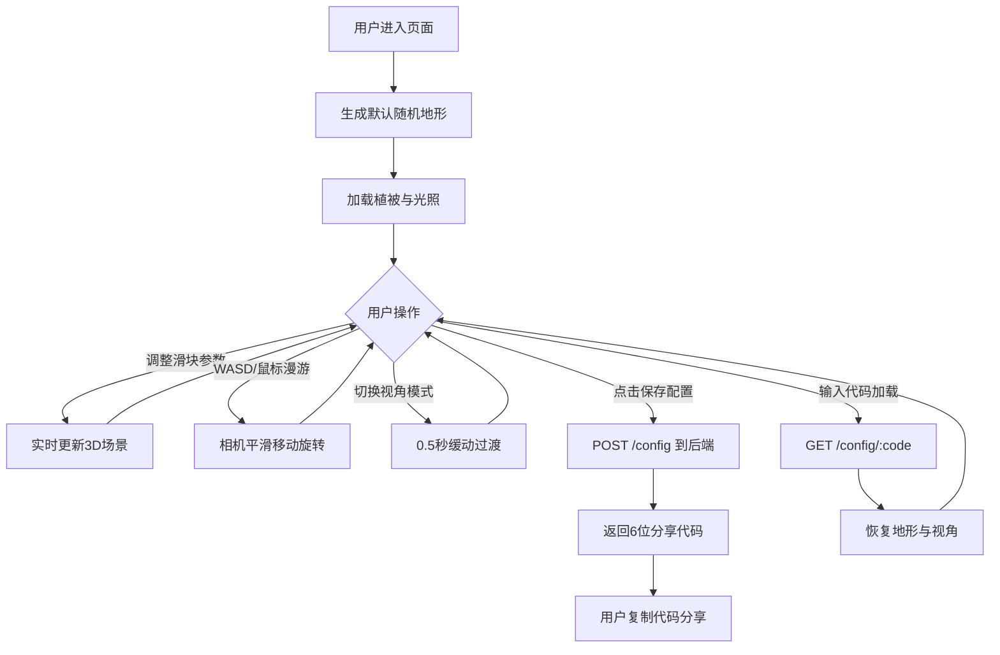

## 1. 产品概述

基于Three.js的3D地形生成与漫游Web应用，提供可交互的程序化地形创建、实时参数调整和沉浸式场景漫游体验。
- 核心目标：为用户提供一个直观的3D地形编辑器，支持参数化地形生成、植被系统、动态光照和自由漫游
- 目标用户：3D场景设计师、游戏开发者、地理数据可视化爱好者
- 产品价值：降低程序化地形创建门槛，实现所见即所得的实时调整，并通过分享代码实现成果共享

## 2. 核心功能

### 2.1 功能模块
1. **主场景页面**：3D地形渲染、植被分布、星空背景、雾效、动态阴影
2. **参数控制面板**：地形参数调整、植被密度控制、光照角度调节、视角模式切换
3. **相机漫游系统**：WASD键位移动、鼠标拖拽旋转、滚轮缩放、第一/第三人称平滑切换
4. **配置保存与分享**：保存当前地形配置为JSON、生成6位分享代码、通过代码加载配置

### 2.2 页面详情
| 页面名称 | 模块名称 | 功能描述 |
|---------|----------|---------|
| 主场景页面 | 3D地形渲染 | 基于Perlin噪声生成64x64以上精度的起伏地形，支持高度和频率参数实时调整 |
| 主场景页面 | 植被系统 | 随机分布的低多边形树木模型，密度可控，与地形表面贴合 |
| 主场景页面 | 光照与阴影 | 环境光+方向光组合，方向光产生实时阴影，支持角度调节 |
| 主场景页面 | 背景与氛围 | 星空背景、雾效营造深度感 |
| 主场景页面 | 相机控制 | WASD漫游、鼠标视角、阻尼平滑、视角模式切换 |
| 参数面板 | 地形控制滑块 | 高度倍率(0.1-5.0)、频率(1-10)实时调节 |
| 参数面板 | 植被控制滑块 | 植被密度(0-100%)实时调整 |
| 参数面板 | 光照控制滑块 | 光照角度(0-360°)沿Y轴旋转调节 |
| 参数面板 | 视角切换开关 | 第一人称/第三人称切换，带0.5秒缓动过渡 |
| 配置面板 | 保存按钮 | 提交配置到后端，获取6位分享代码 |
| 配置面板 | 加载输入框 | 输入6位代码，恢复对应的地形和视角 |

## 3. 核心流程

用户进入应用 → 自动生成默认随机绿色地形与植被 → 通过右侧面板调整参数实时预览效果 → 使用WASD和鼠标自由漫游场景 → 满意后点击保存配置获取分享代码 → 分享代码给他人 → 他人输入代码加载相同配置

## 4. 用户界面设计

### 4.1 设计风格
- **主色调**：深色科技风，背景深灰(#1a1a2e)，控件文字浅蓝(#e0e0ff)
- **滑块样式**：渐变轨道(#16213e→#0f3460)，选中态亮蓝紫(#533483)高亮
- **按钮风格**：圆角胶囊按钮，悬浮阴影+弹性动画反馈
- **导航栏**：半透明毛玻璃效果(backdrop-filter: blur)
- **字体**：现代无衬线字体，标题加粗，控件标签中等字重
- **布局**：全屏沉浸式，左侧3D场景无边界渲染，右侧320px固定宽度参数面板

### 4.2 页面设计概述
| 页面名称 | 模块名称 | UI元素 |
|---------|----------|--------|
| 主场景页面 | 顶部导航栏 | 毛玻璃半透明、应用标题、状态指示器、操作提示 |
| 主场景页面 | 3D视口 | 全屏Canvas渲染、无边框融入背景 |
| 参数面板 | 面板容器 | 深灰背景(#1a1a2e)、圆角、悬浮阴影、内边距24px |
| 参数面板 | 分组标题 | 浅蓝文字、大写字母间距、下部分隔线 |
| 参数面板 | 滑块控件 | 渐变轨道、圆形手柄、数值实时显示、弹性动画 |
| 参数面板 | 切换开关 | 胶囊形、带标签过渡动画 |
| 参数面板 | 保存/加载区 | 输入框圆角、按钮渐变、代码显示带复制按钮 |
| 主场景页面 | 角标提示 | 左下角键位说明、半透明背景、简洁图标 |

### 4.3 响应性
- 桌面端优先：参数面板固定320px宽度，3D场景自适应剩余空间
- 平板设备：参数面板最小化至抽屉式，通过按钮呼出
- 性能适配：低性能设备自动降低地形精度和植被数量

### 4.4 3D场景指导
- **环境氛围**：深邃星空背景(约2000颗随机星星) + 线性雾效(近0.01远500)营造纵深感
- **光照设置**：环境光强度0.4(柔和基础照明) + 方向光强度1.2(主光源带2048px阴影贴图)
- **相机设置**：第一人称高度1.7，第三人称后5上3，FOV 75度，近裁面0.1远裁面1000
- **运动控制**：移动速度8单位/秒，鼠标灵敏度0.002，阻尼系数0.08实现平滑跟随
- **交互细节**：地形顶点颜色根据高度渐变(低绿中绿黄高灰棕)、植被朝向随机微旋转
- **性能优化**：InstancedMesh渲染植被、阴影相机视口裁剪、参数节流更新(16ms)
