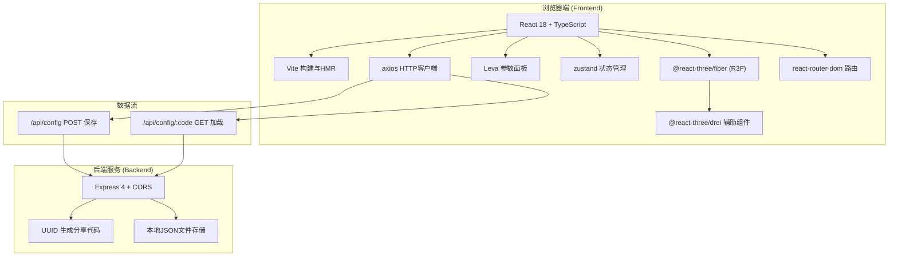
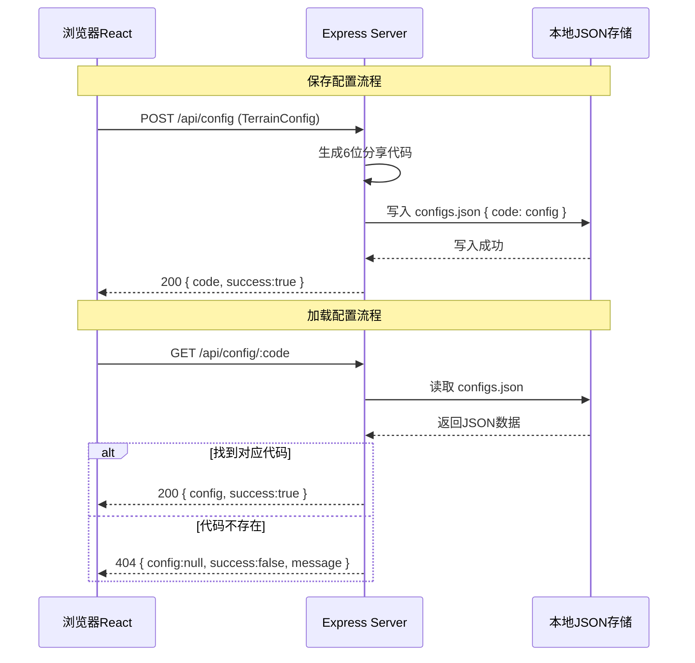
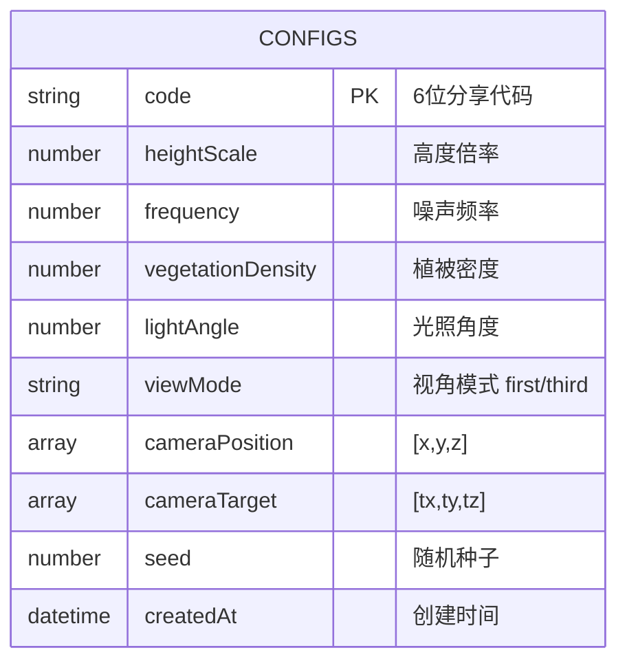

## 1. 架构设计



## 2. 技术描述
- **前端框架**：React@18 + TypeScript@5 + Vite@5
- **3D渲染层**：three@0.160 + @react-three/fiber@8 + @react-three/drei@9
- **参数控制UI**：leva@0.9
- **HTTP客户端**：axios@1.6
- **路由管理**：react-router-dom@6
- **后端服务**：Express@4 + cors + uuid
- **数据持久化**：server/data/configs.json 本地JSON文件存储
- **代码生成**：UUID取前6位大写字母数字组合作为分享代码

## 3. 路由定义
| 路由 | 用途 |
|-----|------|
| / | 主应用页面，包含3D场景和参数面板 |
| /api/config [POST] | 后端接口：保存地形配置，返回分享代码 |
| /api/config/:code [GET] | 后端接口：根据代码加载地形配置 |

## 4. API定义

### 4.1 类型定义
```typescript
interface TerrainConfig {
  heightScale: number;      // 地形高度倍率 0.1-5.0
  frequency: number;        // 地形噪声频率 1-10
  vegetationDensity: number;// 植被密度 0-100
  lightAngle: number;       // 光照角度(度) 0-360
  viewMode: 'first' | 'third'; // 视角模式
  cameraPosition: [number, number, number]; // 相机位置
  cameraTarget: [number, number, number];   // 相机朝向
  seed: number;             // 地形随机种子
}

interface SaveResponse {
  code: string;             // 6位分享代码
  success: boolean;
}

interface LoadResponse {
  config: TerrainConfig | null;
  success: boolean;
  message?: string;
}
```

### 4.2 POST /api/config
- 请求体：`TerrainConfig` JSON
- 响应：`SaveResponse { code: "A1B2C3", success: true }`
- 错误处理：参数校验失败返回 400 + message

### 4.3 GET /api/config/:code
- URL参数：`code` 6位字符
- 响应：`LoadResponse { config: {...}, success: true }`
- 错误处理：代码不存在返回 404 + message

## 5. 服务器架构图



## 6. 数据模型

### 6.1 数据模型定义


### 6.2 存储文件结构
`server/data/configs.json`:
```json
{
  "A1B2C3": {
    "heightScale": 2.0,
    "frequency": 3.5,
    "vegetationDensity": 60,
    "lightAngle": 135,
    "viewMode": "first",
    "cameraPosition": [0, 1.7, 10],
    "cameraTarget": [0, 1.7, 0],
    "seed": 42,
    "createdAt": "2025-01-01T00:00:00.000Z"
  }
}
```
