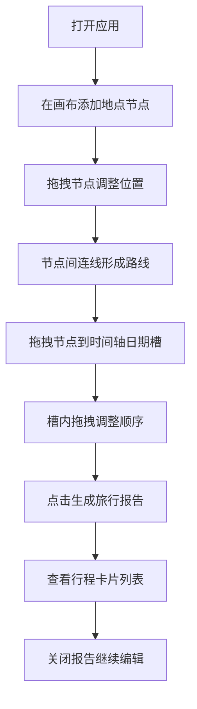

## 1. 产品概述

「旅行路线规划师」是一款面向旅行爱好者的互动式路线规划工具，解决旅行规划中路线杂乱、景点信息分散、无法直观预览每日行程的核心痛点。用户可在可视化画布上拖拽地点节点、绘制旅行路线，并通过时间轴面板按天组织行程，最终生成精美旅行报告。

目标市场价值：填补传统旅行笔记与地图导航之间的空白，为用户提供兼具创意性与实用性的行程规划体验，让旅行规划本身成为一种乐趣。

## 2. 核心功能

### 2.1 用户角色

| 角色 | 注册方式 | 核心权限 |
|------|----------|----------|
| 普通用户 | 无需注册，直接使用 | 完整使用画布规划、时间轴编排、报告生成功能 |

### 2.2 功能模块

1. **画布规划区**：地点节点添加、节点拖拽、连线绘制、缩放平移、网格参考
2. **时间轴面板**：每日行程槽位、节点拖入关联、槽内重排序、日期切换动画
3. **旅行报告**：一键生成、卡片式展示、虚拟滚动、滑动过渡动画

### 2.3 页面详情

| 页面名称 | 模块名称 | 功能描述 |
|---------|----------|----------|
| 主应用页 | 顶部工具栏 | 添加地点、生成报告、重置画布按钮 |
| 主应用页 | 画布规划区 | Canvas渲染节点与连线，支持拖拽、缩放、平移，Leaflet网格底图 |
| 主应用页 | 时间轴面板 | 7天行程槽位，拖拽节点关联日期，每日不同颜色标识 |
| 报告弹窗 | 报告展示区 | 卡片列表展示每日行程，虚拟滚动，滑动过渡动画 |

## 3. 核心流程

用户打开应用 → 在画布上点击添加多个地点节点 → 拖拽节点调整位置 → 从节点拉出连线形成路线 → 将画布节点拖拽到右侧时间轴的日期槽位中 → 在槽位内拖拽调整景点顺序 → 点击「生成旅行报告」按钮 → 查看每日行程卡片列表 → 可关闭报告返回继续编辑。

## 4. 用户界面设计

### 4.1 设计风格

- **主色调**：大地色系 - 沙色 (#E8DCC4)、橄榄绿 (#6B7F5E)、深棕 (#4A3728)、柔和白 (#FAF7F2)
- **辅助色**：每日行程渐变色系 - 暖橙渐变、青蓝渐变、琥珀渐变、翠绿渐变等7种
- **节点样式**：圆角矩形 (12px) + 微投影 (0 4px 12px rgba(74, 55, 40, 0.15))
- **按钮样式**：圆角 (8px) + 悬停上浮动效 + 橄榄绿主色调
- **字体**：展示字体使用 'Playfair Display' 或 'Noto Serif SC'，正文字体使用 'Inter' 或 'Noto Sans SC'
- **布局风格**：左侧70%画布区 + 右侧30%时间轴面板，中间可拖拽分隔条
- **图标风格**：线性简约图标，使用 lucide-react 图标库

### 4.2 页面设计概览

| 页面名称 | 模块名称 | UI 元素 |
|---------|----------|---------|
| 主应用页 | 顶部工具栏 | 大地色背景、图标按钮、添加地点表单、生成报告按钮 |
| 主应用页 | 画布规划区 | 米白色画布背景、Leaflet网格参考、圆角矩形节点、带箭头连线、缩放控件 |
| 主应用页 | 时间轴面板 | 垂直时间轴、7个日期卡片槽位、半透明拖拽占位提示、每日颜色标识 |
| 报告弹窗 | 报告展示区 | 模态弹窗、卡片列表、每日行程概览、滑动过渡动画、关闭按钮 |

### 4.3 响应式设计

- **桌面端 (>768px)**：画布区70% + 时间轴30%横向布局，中间可拖拽分隔条
- **移动端 (≤768px)**：画布区与时间轴面板垂直堆叠，画布在上，时间轴在下
- **触控优化**：节点触控区域扩大至48x48px，支持双指缩放和平移

### 4.4 动画与交互

- **节点选中**：脉冲动画效果 (box-shadow 循环扩散)
- **连线悬停**：线条加粗并显示距离标签
- **拖拽占位**：半透明虚线框提示放置位置
- **日期切换**：时间轴卡片上下滑入动画 (translateY + opacity)
- **报告卡片**：左右滑动过渡动画，卡片进入时 staggered 延迟
- **画布操作**：缩放平移使用 requestAnimationFrame 驱动，保持30fps+
