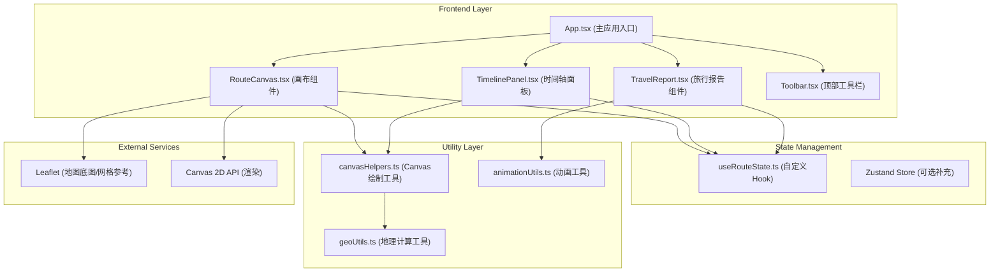
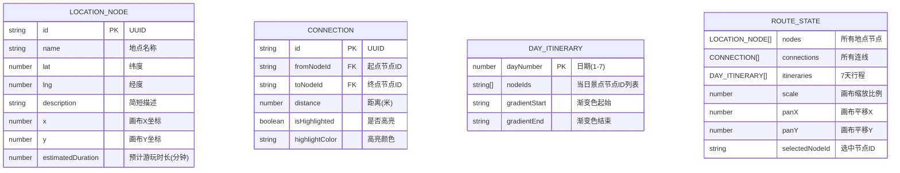

## 1. 架构设计



## 2. 技术描述

- **前端框架**：React 18 + TypeScript + Vite
- **样式方案**：Tailwind CSS 3 (CSS变量实现主题色系统)
- **状态管理**：自定义 Hook (useRouteState) + Zustand 作为补充
- **渲染引擎**：HTML5 Canvas 2D API + requestAnimationFrame 渲染循环
- **地图参考**：Leaflet (仅用于网格底图参考，不使用完整地图瓦片)
- **图标库**：lucide-react
- **路由**：react-router-dom (单页面应用)
- **工具库**：uuid (节点ID生成)
- **后端**：无，纯前端应用，数据存储于 localStorage

## 3. 路由定义

| 路由 | 用途 |
|------|------|
| / | 主应用页面，包含画布、时间轴和工具栏 |
| /report | 旅行报告页面（可选，或使用模态弹窗展示） |

## 4. 数据模型

### 4.1 数据模型定义



### 4.2 TypeScript 类型定义

```typescript
export interface LocationNode {
  id: string;
  name: string;
  lat: number;
  lng: number;
  description: string;
  x: number;
  y: number;
  estimatedDuration: number; // 分钟
}

export interface Connection {
  id: string;
  fromNodeId: string;
  toNodeId: string;
  distance: number; // 米
  isHighlighted: boolean;
  highlightColor: string;
}

export interface DayItinerary {
  dayNumber: number;
  nodeIds: string[];
  gradientStart: string;
  gradientEnd: string;
}

export interface RouteState {
  nodes: LocationNode[];
  connections: Connection[];
  itineraries: DayItinerary[];
  scale: number;
  panX: number;
  panY: number;
  selectedNodeId: string | null;
}

export interface CanvasViewport {
  scale: number;
  panX: number;
  panY: number;
}
```

## 5. 核心组件职责

### 5.1 RouteCanvas.tsx (画布组件)
- 使用 `<canvas>` 元素，基于 Canvas 2D API 渲染
- requestAnimationFrame 驱动渲染循环，保证 30fps+
- 处理节点拖拽、连线绘制、缩放平移交互
- Leaflet 仅用于提供经纬度网格参考线
- 缩放时节点标签自适应大小

### 5.2 TimelinePanel.tsx (时间轴面板)
- 7个日期槽位，支持 HTML5 Drag and Drop API
- 处理从画布拖入节点的逻辑
- 槽位内节点拖拽重排序
- 联动画布更新高亮路径颜色

### 5.3 useRouteState.ts (自定义 Hook)
- 集中管理所有状态：nodes, connections, itineraries
- 暴露纯数据接口和操作方法
- 提供派生数据计算：每日步行距离、总距离等
- 状态变更时通知相关组件重渲染

### 5.4 canvasHelpers.ts (工具函数)
- drawNode(): 绘制圆角矩形节点、标签、经纬度
- drawArrow(): 绘制带箭头连线
- calculateDistance(): Haversine公式计算两点距离
- hitTestNode(): 点击碰撞检测
- transformCoordinates(): 视口坐标与画布坐标转换

## 6. 性能优化策略

1. **Canvas 渲染优化**：
   - 使用 requestAnimationFrame 统一渲染循环
   - 仅在状态变更时标记脏渲染
   - 离屏 Canvas 缓存静态元素（网格线）

2. **虚拟滚动**：
   - 旅行报告长列表使用虚拟滚动
   - 仅渲染可视区域内的卡片
   - 计算动态高度，保证滚动平滑

3. **React 优化**：
   - 使用 React.memo 包装纯展示组件
   - useCallback 缓存事件处理函数
   - useMemo 缓存派生数据计算结果

4. **字体加载优化**：
   - font-display: swap 避免 FOIT
   - 预加载关键字体资源

## 7. 性能指标

- 画布操作帧率：≥ 30fps
- 初次加载时间：≤ 2秒
- 节点渲染数量：支持 100+ 节点流畅交互
- 报告虚拟滚动：1000+ 卡片流畅滚动
