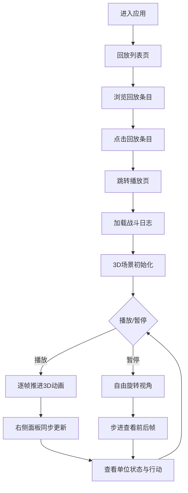

## 1. 产品概述

地牢战斗回放分析系统是一款面向策略类Roguelike地牢探索游戏的复盘工具，让玩家以等距3D视角回顾每一场战斗的详细过程，逐帧分析每个单位的移动、攻击、施法、道具使用等行动，帮助玩家理解决策得失、优化战术策略。

- 目标用户：策略Roguelike游戏的玩家群体，追求深度战术分析与自我提升的硬核玩家
- 核心价值：将抽象的战斗日志数据转化为直观可交互的3D可视化回放，让复盘从"读数字"变为"看战斗"

## 2. 核心功能

### 2.1 用户角色

| 角色 | 注册方式 | 核心权限 |
|------|----------|----------|
| 玩家 | 无需注册 | 浏览回放列表、播放回放、交互控制、查看状态面板 |

### 2.2 功能模块

1. **回放列表页**：展示所有可用战斗回放条目，显示战斗名称、日期、阵营总等级，点击进入回放播放页
2. **回放播放页**：等距3D场景还原战斗过程，配备交互式播放控制与单位状态信息面板

### 2.3 页面详情

| 页面名称 | 模块名称 | 功能描述 |
|----------|----------|----------|
| 回放列表页 | 回放卡片列表 | 从服务器获取所有回放元数据，以卡片形式展示每场战斗的名称、日期、己方阵容总等级，点击跳转到播放页 |
| 回放播放页 | 3D场景区域 | 等距45度视角的9x9网格地面，低多边形角色模型（蓝色玩家/红色敌人），单位移动平滑动画（250ms），攻击前冲+粒子特效，施法彩色球体爆炸特效 |
| 回放播放页 | 播放控制栏 | 播放/暂停按钮、进度条（当前帧/总帧数）、2x/4x/8x倍速切换、上一步/下一步步进控制 |
| 回放播放页 | 单位状态面板 | 当前帧时间戳、所有单位名称与血条/盾条/行动点数、本帧行动描述列表 |
| 回放播放页 | 视角控制 | 暂停时可通过OrbitControls自由旋转/缩放查看场景细节 |

## 3. 核心流程

用户进入应用后，首先看到回放列表页，浏览所有可用战斗回放。点击感兴趣的回放条目后，跳转到回放播放页，3D场景自动加载并聚焦到初始帧。用户可以播放/暂停回放、调整播放速度、步进逐帧查看，同时右侧面板实时同步显示当前帧的单位状态与行动记录。暂停时可自由旋转视角观察场景。

## 4. 用户界面设计

### 4.1 设计风格

- 主色调：暗色赛博朋克风格 —— 背景主色 #1a1a2e，面板底色 #16213e，高亮点缀色 #e94560
- 按钮样式：圆角设计，柔和阴影，0.2秒缩放与色彩过渡动画
- 字体：无衬线字体 Inter，全局统一
- 布局：左右分栏（左70% 3D场景 / 右30% 信息面板），毛玻璃半透明边框
- 卡片风格：单位条目卡片式展示，悬浮时轻微上浮并加深阴影
- 血条样式：渐变红色填充，HP减少时数值跳动0.3秒动画

### 4.2 页面设计概览

| 页面名称 | 模块名称 | UI元素 |
|----------|----------|--------|
| 回放列表页 | 回放卡片 | 深色卡片背景，#16213e底色，#e94560点缀边框，战斗名称/日期/等级信息，悬浮上浮动画 |
| 回放播放页 | 3D场景区域 | 毛玻璃半透明边框，等距视角9x9网格地面，蓝色/红色低多边形角色，粒子特效 |
| 回放播放页 | 播放控制栏 | 场景上方居中，Play/Pause圆形按钮，下方进度条，倍速切换按钮组，步进箭头按钮 |
| 回放播放页 | 单位状态面板 | 右侧30%宽，卡片式单位条目，渐变红色血条+蓝色盾条，行动描述列表滚动区域 |
| 回放播放页 | 视角控制 | OrbitControls覆盖，暂停时激活旋转/缩放 |

### 4.3 响应式适配

- 桌面端（≥768px）：左右分栏布局，左侧3D场景70%，右侧面板30%
- 移动端（<768px）：右侧面板折叠为底部抽屉式，点击按钮展开；3D场景占满宽度

### 4.4 3D场景指引

- 环境/HDRI：暗色氛围，深紫蓝色调，微弱环境光营造地牢感
- 光照：主方向光（偏暖色调模拟火把）+ 微弱环境光 + 点光源跟随角色
- 相机：等距正交相机，45度俯视角，固定距离
- 构图：9x9网格居中，角色在格子中移动，特效突出显示行动焦点
- 交互：暂停时OrbitControls允许旋转/缩放
- 后处理：轻微辉光效果增强赛博朋克感
- 性能预算：粒子总数≤200，主循环≥30fps，连续3帧<24fps自动降至75%分辨率
