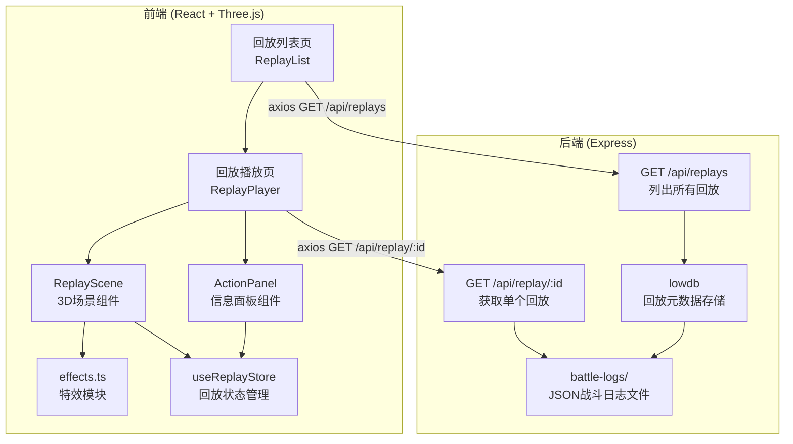
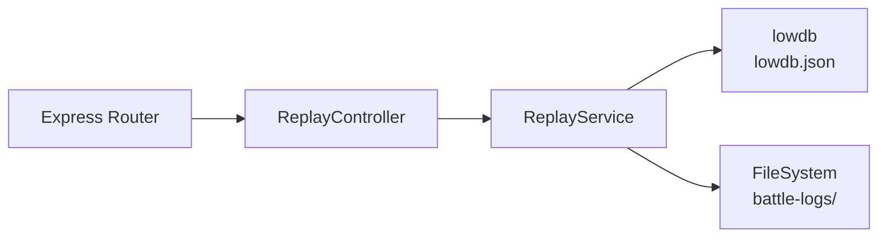
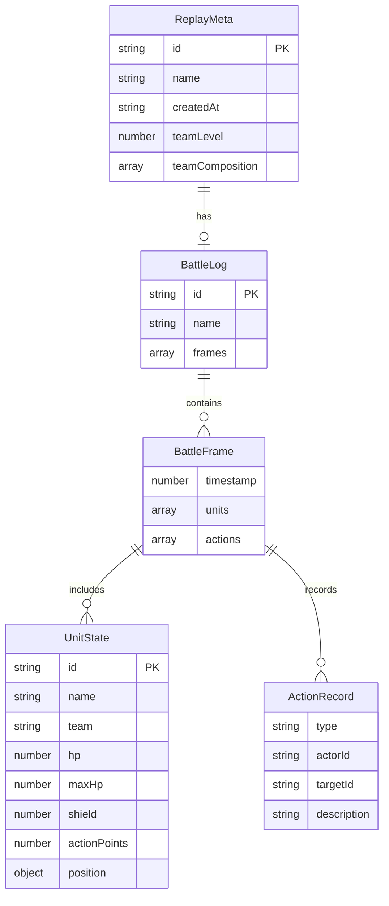

## 1. 架构设计



## 2. 技术说明

- 前端：React@18 + TypeScript + Three.js + @react-three/fiber + @react-three/drei + Tailwind CSS + Zustand
- 初始化工具：vite-init（react-express-ts 模板）
- 后端：Express@4 + TypeScript + lowdb + cors + uuid
- 数据存储：lowdb（JSON文件存储回放元数据 + battle-logs目录存放战斗日志文件）

## 3. 路由定义

| 路由 | 用途 |
|------|------|
| `/` | 回放列表页，展示所有可用战斗回放 |
| `/replay/:id` | 回放播放页，加载并播放指定ID的战斗回放 |

## 4. API定义

### 4.1 TypeScript 类型定义

```typescript
interface ReplayMeta {
  id: string;
  name: string;
  createdAt: string;
  teamLevel: number;
  teamComposition: string[];
}

interface BattleFrame {
  timestamp: number;
  units: UnitState[];
  actions: ActionRecord[];
}

interface UnitState {
  id: string;
  name: string;
  team: 'player' | 'enemy';
  hp: number;
  maxHp: number;
  shield: number;
  maxShield: number;
  actionPoints: number;
  position: { x: number; y: number; z: number };
}

interface ActionRecord {
  type: 'move' | 'attack' | 'spell' | 'item';
  actorId: string;
  actorName: string;
  targetId?: string;
  targetName?: string;
  description: string;
  from?: { x: number; y: number; z: number };
  to?: { x: number; y: number; z: number };
  damage?: number;
  healAmount?: number;
  spellName?: string;
  itemName?: string;
}

interface BattleLog {
  id: string;
  name: string;
  frames: BattleFrame[];
}
```

### 4.2 API端点

| 端点 | 方法 | 请求参数 | 响应 |
|------|------|----------|------|
| `/api/replays` | GET | 无 | `ReplayMeta[]` - 所有回放元数据列表 |
| `/api/replay/:id` | GET | `id: string` | `BattleLog` - 完整战斗日志数据 |

## 5. 服务端架构图



## 6. 数据模型

### 6.1 数据模型定义



### 6.2 数据文件

**lowdb.json** - 存储回放元数据索引：
```json
{
  "replays": [
    {
      "id": "battle-001",
      "name": "暗影地牢-第3层Boss战",
      "createdAt": "2026-06-14T10:30:00Z",
      "teamLevel": 15,
      "teamComposition": ["战士A", "弓箭手A", "法师A", "牧师A"]
    }
  ]
}
```

**battle-logs/battle-001.json** - 完整战斗日志：
```json
{
  "id": "battle-001",
  "name": "暗影地牢-第3层Boss战",
  "frames": [...]
}
```
