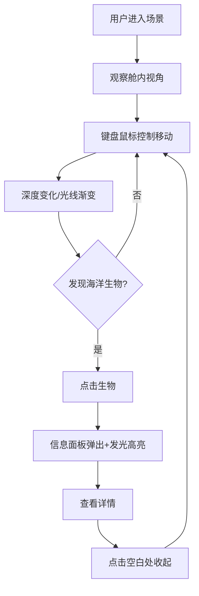

## 1. 产品概述

沉浸式水下生态观察站——让用户像潜水员一样在3D海底世界中自由探索，观察不同深度层的海洋生物与珊瑚礁结构，获取科学信息，体验科幻级海洋科研界面。

- 目标用户：海洋爱好者、科普教育用户、3D交互体验爱好者
- 核心价值：沉浸式3D海底探索 + 科普信息交互 + 科幻视觉体验

## 2. 核心功能

### 2.1 用户角色
无角色区分，所有用户享有完整功能。

### 2.2 功能模块
1. **3D海底场景**：半透明球形观察舱、程序化海底地形、海草摇曳、珊瑚群、5种以上鱼类、海龟巡航
2. **自由移动控制**：WASD平移、QE升降、鼠标拖拽旋转、阻尼惯性、深度光线变化
3. **生物信息交互**：点击生物/珊瑚弹出信息面板、发光高亮、学名与习性展示
4. **科幻UI界面**：磨砂毛玻璃控件、深度显示、圆形进度条、涟漪气泡特效

### 2.3 页面详情
| 页面名称 | 模块名称 | 功能描述 |
|----------|----------|----------|
| 主场景页 | 3D海底场景 | 渲染海底地形、海草、珊瑚、鱼类、海龟，半透明观察舱 |
| 主场景页 | 移动控制 | WASD/QE/鼠标控制观察舱移动，阻尼惯性，深度光线 |
| 主场景页 | 深度指示器 | 屏幕左上角实时显示当前深度值 |
| 主场景页 | 生物信息面板 | 右侧弹出毛玻璃面板，展示生物详情 |
| 主场景页 | 交互特效 | 点击涟漪/气泡扩散特效，生物发光高亮 |
| 主场景页 | HUD界面 | 科幻风格HUD，圆形进度条，弹性按钮 |

## 3. 核心流程

用户进入场景 → 观察舱内视角 → 键盘鼠标控制移动 → 深度变化/光线渐变 → 发现海洋生物 → 点击生物 → 信息面板弹出+发光高亮 → 查看详情 → 点击空白处收起 → 继续探索

## 4. 用户界面设计

### 4.1 设计风格
- 主色：深蓝（#0A1628）配浅青（#4DD0E1）和珊瑚粉（#FF6B6B）
- 按钮：轻微弹性形变动画，圆角，毛玻璃背景
- 字体：Orbitron（标题/数据）、Noto Sans SC（正文）
- 布局：全屏3D场景 + 浮动HUD控件
- 图标/特效：涟漪扩散、气泡上升、发光光圈

### 4.2 页面设计概览
| 页面名称 | 模块名称 | UI元素 |
|----------|----------|--------|
| 主场景页 | 3D场景 | Three.js渲染，全屏Canvas |
| 主场景页 | 深度指示器 | 左上角，毛玻璃背景，数字+单位，圆形深度计 |
| 主场景页 | 信息面板 | 右侧弹出，磨砂玻璃，学名/习性/深度/保护状态 |
| 主场景页 | 控制提示 | 底部中央，WASD/QE/鼠标提示，半透明 |
| 主场景页 | 交互反馈 | 涟漪扩散动画，气泡粒子效果 |

### 4.3 响应式
桌面优先设计，全屏3D场景自适应窗口大小。

### 4.4 3D场景指引
- 环境：水下HDRI氛围，体积光散射，粒子悬浮
- 灯光：方向光模拟阳光穿透，随深度衰减；环境光随深度变色（浅蓝→深蓝→墨绿）
- 相机：透视相机，位于观察舱中心，跟随舱体移动
- 构图：观察舱居中，四周海底场景环绕
- 交互：鼠标点击射线检测选中生物，WASD控制舱体移动
- 后期处理：水下色彩校正，景深模糊，光晕效果
- 性能预算：30fps+，初始化<5秒，交互响应<100ms
