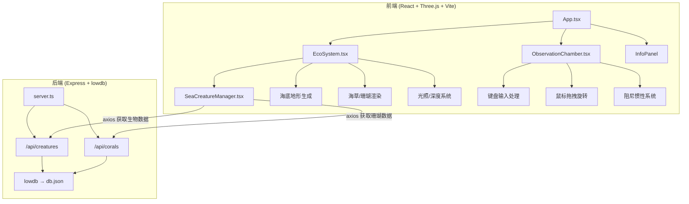
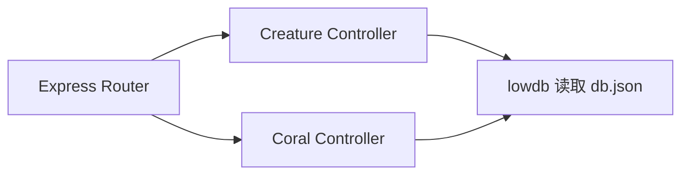
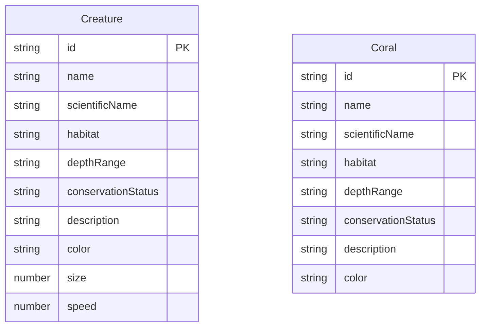

## 1. 架构设计



## 2. 技术说明
- 前端：React@18 + TypeScript + Three.js + @react-three/fiber + @react-three/drei + Vite
- 初始化工具：vite-init (react-express-ts 模板)
- 后端：Express@4 + TypeScript + lowdb + cors
- 数据库：lowdb (JSON文件存储，db.json)
- 状态管理：zustand
- 样式：CSS (毛玻璃效果) + Tailwind辅助

## 3. 路由定义
| 路由 | 用途 |
|------|------|
| / | 主场景页面，包含3D海底观察站 |

## 4. API定义
```typescript
interface Creature {
  id: string;
  name: string;
  scientificName: string;
  habitat: string;
  depthRange: string;
  conservationStatus: string;
  description: string;
  color: string;
  size: number;
  speed: number;
}

interface Coral {
  id: string;
  name: string;
  scientificName: string;
  habitat: string;
  depthRange: string;
  conservationStatus: string;
  description: string;
  color: string;
}

// GET /api/creatures → Creature[]
// GET /api/corals → Coral[]
```

## 5. 服务端架构图


## 6. 数据模型

### 6.1 数据模型定义


### 6.2 数据定义
db.json 初始化包含5种鱼类 + 1种海龟 + 5种珊瑚数据，每个条目包含完整的学名、生活习性、分布深度、保护状态字段。
