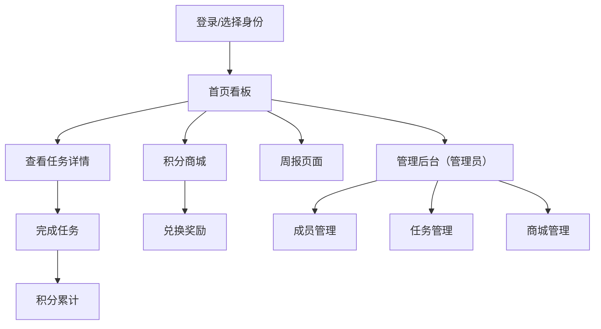

## 1. 产品概述

家庭家务管理应用，帮助家庭成员共同管理家务分配和任务完成情况，解决家务分配不公、进度追踪困难以及劳动成果激励不足的问题。

- **核心问题**：家务分配不公、进度追踪困难、劳动成果激励不足
- **目标用户**：家庭成员（管理员 + 普通成员）
- **产品价值**：通过游戏化积分机制和可视化数据展示，提升家庭家务参与度和公平感

## 2. 核心功能

### 2.1 用户角色

| 角色 | 登录方式 | 核心权限 |
|------|----------|----------|
| 家庭管理员（创建者） | 成员身份登录 | 添加/管理家庭成员、创建家务类别、设置任务、管理积分商城、查看周报 |
| 家庭成员 | 选择身份登录 | 查看任务、完成任务、查看积分、兑换奖励、查看周报 |

### 2.2 功能模块

1. **首页看板**：任务卡片瀑布流展示、按类别分组、拖拽重分配、成员切换
2. **任务详情**：任务描述、截止倒计时、负责人信息、完成操作
3. **积分商城**：奖励列表、积分兑换、库存展示
4. **周报页面**：每周统计、柱状图对比、雷达图偏好分析
5. **管理后台**：成员管理、任务管理、商城管理

### 2.3 页面详情

| 页面名称 | 模块名称 | 功能描述 |
|----------|----------|----------|
| 首页看板 | 任务卡片列表 | 瀑布流布局、按类别分组、拖拽分配、完成状态展示 |
| 首页看板 | 成员选择器 | 切换查看不同成员的任务、显示当前积分 |
| 任务详情 | 任务信息 | 任务描述、截止倒计时、负责人、积分值 |
| 任务详情 | 完成操作 | 点击完成、对勾动画、花瓣飘落特效 |
| 积分商城 | 奖励列表 | 奖励卡片、所需积分、库存数量 |
| 积分商城 | 兑换操作 | 积分扣除、成功提示、彩带特效 |
| 周报页面 | 统计概览 | 任务数、总积分、完成率 |
| 周报页面 | 柱状图 | 各成员任务数对比、入场动画 |
| 周报页面 | 雷达图 | 任务类型偏好分析、入场动画 |
| 管理后台 | 成员管理 | 添加成员、设置头像（emoji）、编辑昵称 |
| 管理后台 | 任务管理 | 创建任务、设置周期/积分/截止时间 |
| 管理后台 | 商城管理 | 上架奖励、设置积分价格、库存管理 |

## 3. 核心流程

### 3.1 任务管理流程
管理员创建家务类别 → 管理员创建任务（设置周期、积分、截止时间）→ 任务展示在看板上 → 成员查看自己的任务 → 成员完成任务 → 积分自动累计

### 3.2 积分兑换流程
成员浏览积分商城 → 选择奖励 → 检查积分是否足够 → 扣除积分/提示差额 → 兑换成功（彩带特效）

### 3.3 周报生成流程
每周日晚上12点自动生成 → 统计各成员本周数据 → 生成柱状图和雷达图 → 展示周报页面

## 4. 用户界面设计

### 4.1 设计风格

- **主色调**：琥珀橙（#FF8C42）
- **辅助色**：柔白（#FFF5E6）
- **背景**：渐变暖色纹理
- **卡片风格**：圆角矩形、轻微阴影、悬停上浮
- **按钮风格**：圆角、涟漪波纹反馈
- **字体**：温暖友好的无衬线字体
- **图标风格**：emoji 角色头像（至少8种）

### 4.2 页面设计概览

| 页面名称 | 模块名称 | UI 元素 |
|----------|----------|---------|
| 首页看板 | 顶部导航 | Logo、成员头像、积分显示、页面切换 |
| 首页看板 | 任务卡片 | 圆角卡片、类别标签、积分徽章、截止时间、负责人头像 |
| 首页看板 | 类别分组 | 分组标题、折叠/展开 |
| 任务详情 | 页面布局 | 从左到右滑动切换、全屏展示 |
| 任务详情 | 完成动画 | 对勾打勾动画、花瓣飘落特效 |
| 积分商城 | 奖励卡片 | 图片、名称、所需积分、库存、兑换按钮 |
| 积分商城 | 兑换成功 | 弹出提示框、庆祝彩带特效 |
| 周报页面 | 图表区域 | 柱状图、雷达图、从底部向上生长动画 |
| 周报页面 | 数据卡片 | 任务数、总积分、完成率 |

### 4.3 响应式设计

- **桌面端**：多列瀑布流布局
- **平板端**：两列布局
- **手机端**：单列布局，卡片宽度自适应
- **触摸优化**：拖拽操作、点击热区增大

### 4.4 动效设计

- **卡片悬停**：阴影加深、向上浮动 3px
- **按钮点击**：涟漪波纹反馈
- **任务完成**：对勾打勾动画 + 花瓣飘落
- **兑换成功**：庆祝彩带特效
- **图表入场**：从底部向上生长
- **页面切换**：从左到右滑动
- **拖拽变形**：弹性变形动画
