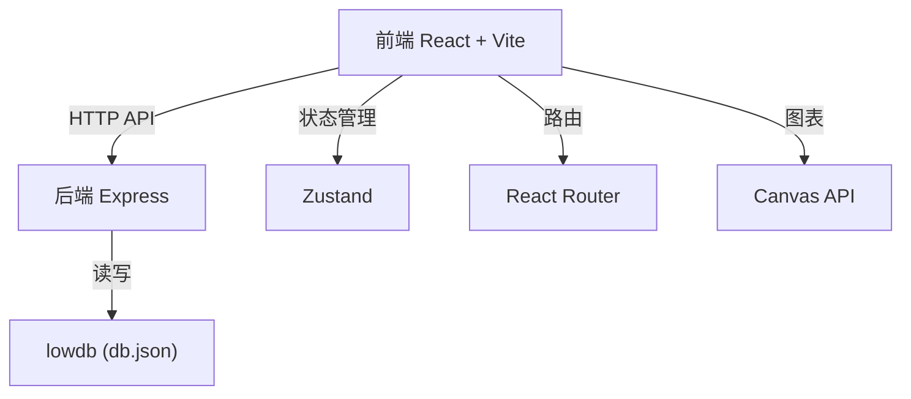
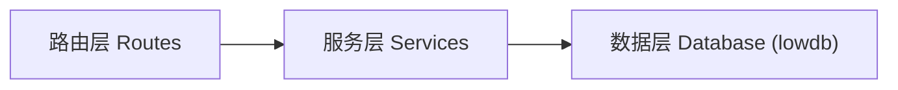
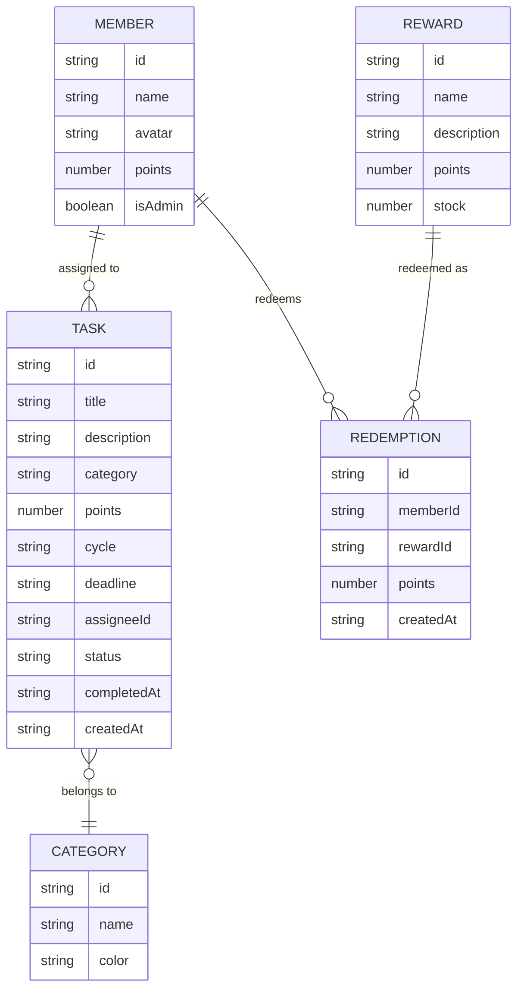

## 1. 架构设计



## 2. 技术描述

- **前端**：React 18 + TypeScript + Vite
- **状态管理**：Zustand
- **路由**：React Router DOM
- **HTTP 客户端**：Axios
- **图表**：Canvas API 原生绘制
- **后端**：Express 4
- **数据库**：lowdb（基于 JSON 文件）
- **构建工具**：Vite
- **开发模式**：前后端同时启动（concurrently）

## 3. 路由定义

| 路由 | 用途 |
|------|------|
| / | 首页看板（任务列表） |
| /task/:id | 任务详情页 |
| /shop | 积分商城 |
| /report | 周报页面 |
| /admin | 管理后台 |
| /login | 登录/选择身份 |

## 4. API 定义

### 4.1 成员管理

```typescript
interface Member {
  id: string;
  name: string;
  avatar: string; // emoji
  points: number;
  isAdmin: boolean;
}
```

- `GET /api/members` - 获取所有成员
- `POST /api/members` - 添加成员
- `PUT /api/members/:id` - 更新成员
- `DELETE /api/members/:id` - 删除成员

### 4.2 任务管理

```typescript
interface Task {
  id: string;
  title: string;
  description: string;
  category: string;
  points: number;
  cycle: 'daily' | 'weekly';
  deadline: string; // ISO date
  assigneeId: string | null;
  status: 'pending' | 'completed' | 'expired';
  completedAt?: string;
  createdAt: string;
}
```

- `GET /api/tasks` - 获取任务列表
- `POST /api/tasks` - 创建任务
- `PUT /api/tasks/:id` - 更新任务
- `DELETE /api/tasks/:id` - 删除任务
- `POST /api/tasks/:id/complete` - 完成任务
- `PUT /api/tasks/:id/assign` - 分配任务

### 4.3 积分商城

```typescript
interface Reward {
  id: string;
  name: string;
  description: string;
  points: number;
  stock: number;
  image?: string;
}
```

- `GET /api/rewards` - 获取奖励列表
- `POST /api/rewards` - 添加奖励（管理员）
- `PUT /api/rewards/:id` - 更新奖励（管理员）
- `DELETE /api/rewards/:id` - 删除奖励（管理员）
- `POST /api/rewards/:id/redeem` - 兑换奖励

### 4.4 周报

```typescript
interface WeeklyReport {
  weekStart: string;
  weekEnd: string;
  members: {
    memberId: string;
    completedTasks: number;
    totalPoints: number;
    completionRate: number;
    categoryStats: Record<string, number>;
  }[];
}
```

- `GET /api/report/weekly` - 获取本周周报
- `POST /api/report/generate` - 生成周报

## 5. 服务器架构图



## 6. 数据模型

### 6.1 数据模型定义



### 6.2 数据初始化

- 预设 8 种 emoji 头像：👨👩👧👦🧓👴🐱🐶
- 预设 4 种家务类别：清洁、烹饪、洗衣、购物
- 初始化示例任务数据
- 初始化示例奖励数据

## 7. 项目文件结构

```
.
├── package.json
├── vite.config.ts
├── tsconfig.json
├── index.html
├── db.json
├── src/
│   ├── App.tsx
│   ├── main.tsx
│   ├── components/
│   │   ├── TaskCard.tsx
│   │   ├── WeeklyReport.tsx
│   │   ├── MemberAvatar.tsx
│   │   ├── RewardCard.tsx
│   │   └── Navbar.tsx
│   ├── pages/
│   │   ├── KanbanPage.tsx
│   │   ├── TaskDetailPage.tsx
│   │   ├── ShopPage.tsx
│   │   ├── ReportPage.tsx
│   │   ├── AdminPage.tsx
│   │   └── LoginPage.tsx
│   ├── store/
│   │   └── useStore.ts
│   ├── utils/
│   │   ├── api.ts
│   │   ├── canvas.ts
│   │   └── date.ts
│   └── types/
│       └── index.ts
└── src/server/
    └── index.ts
```
