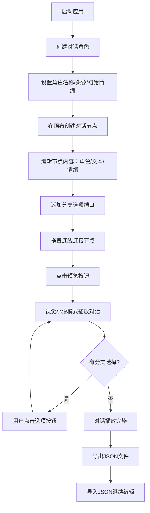

## 1. 产品概述

角色对话脚本生成器是一款面向独立游戏开发者的可视化对话树编辑工具，旨在解决手动编写分支对话重复劳动多、难以维护且缺乏可视化预览的痛点问题。

- 核心价值：通过可视化树状编辑器、实时预览和JSON导入导出功能，大幅提升对话脚本的创作效率和可维护性
- 目标用户：独立游戏开发者、视觉小说作者、互动叙事内容创作者

## 2. 核心特性

### 2.1 功能模块

1. **对话树编辑器**：角色管理、节点创建、拖拽布局、贝塞尔曲线连线、情绪切换
2. **实时预览面板**：视觉小说播放模式、打字机效果、分支选择、播放控制条
3. **数据管理**：JSON格式导入导出、节点自动布局适配

### 2.2 页面详情

| 页面名称 | 模块名称 | 功能描述 |
|-----------|-------------|---------------------|
| 主工作台 | 角色管理面板 | 创建/编辑角色（名称、头像、初始情绪），3种预设情绪切换 |
| 主工作台 | 节点画布 | 树状对话节点创建、拖拽、连线、编辑，自动布局避免重叠 |
| 主工作台 | 节点卡片 | 角色选择、对话文本、情绪指令、最多3个分支端口 |
| 主工作台 | 分隔条 | 可拖拽调整编辑区与预览区比例，0.2秒平滑过渡 |
| 主工作台 | 预览面板 | 视觉小说式逐句播放、打字机效果、分支选择按钮 |
| 主工作台 | 播放控制条 | 播放/暂停/上一步/下一步、1x/2x倍速、进度条动画 |
| 主工作台 | 工具栏 | 新建节点、导出JSON、导入JSON功能按钮 |

## 3. 核心流程

用户从创建角色开始，在画布上构建对话节点树，通过拖拽连线定义分支关系，随时切换到预览模式验证对话流程，最终导出JSON供游戏引擎使用。

## 4. 用户界面设计

### 4.1 设计风格

- **主色调**：深色主题，主背景#1a1a2e，卡片#16213e，强调色#e94560
- **情绪标识色**：灰色(#888)=中性、红色(#ef4444)=愤怒、绿色(#22c55e)=高兴
- **按钮风格**：圆角矩形，0.2秒悬停过渡，点击缩放0.95反馈
- **字体方案**：JetBrains Mono（代码/节点）搭配 Noto Sans SC（正文/UI）
- **布局风格**：左右分栏卡片式布局，左侧编辑区60%，右侧预览区40%，中间可拖拽分隔条
- **视觉特效**：节点卡片微弱投影+悬停抬升、贝塞尔曲线连线+箭头动画、情绪边框0.3秒渐变、打字机逐字打印

### 4.2 页面设计概览

| 页面名称 | 模块名称 | UI元素 |
|-----------|-------------|-------------|
| 主工作台 | 角色管理面板 | 头像卡片列表、情绪边框颜色标识、新增角色按钮 |
| 主工作台 | 节点画布 | 无限滚动画布、网格背景、节点8px圆角卡片 |
| 主工作台 | 节点卡片 | 角色头像(带情绪色边框)、角色名标签、多行文本框、分支端口圆点 |
| 主工作台 | 贝塞尔连线 | 曲线颜色随源节点情绪、箭头动画、拖拽时连线弹性弯曲(30fps+) |
| 主工作台 | 预览面板 | 对话气泡左对齐(圆角+细边线)、姓名标签、头像、打字机文本 |
| 主工作台 | 控制条 | 播放按钮组、倍速切换、平滑进度条、时间显示 |
| 主工作台 | 分支选项按钮 | 悬停放大高亮效果、点击反馈动画 |

### 4.3 响应式

桌面优先设计，最小支持宽度1280px；在小屏幕下可折叠预览面板为全屏编辑模式。触摸设备支持节点双指平移和长按选择。

### 4.4 动效规范

- 节点拖拽：连线实时跟随弯曲弹动，30fps+
- 情绪切换：头像边框颜色0.3秒渐变过渡
- 分隔条拖拽：两侧区域0.2秒平滑缩放
- 打字机效果：每字间隔可调，流畅无卡顿
- 进度条：平滑滑动动画
- 分支按钮：悬停放大(scale 1.05)+背景色高亮
