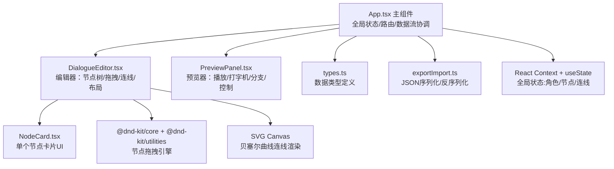
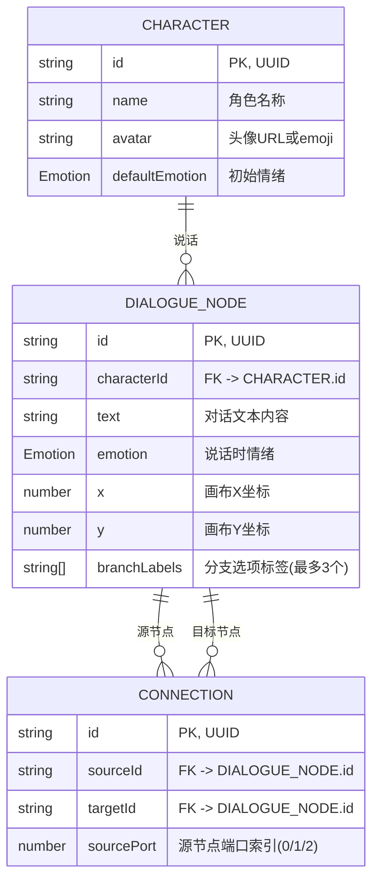

## 1. 架构设计



## 2. 技术说明

- **前端框架**：React 18 + TypeScript 5（严格模式）
- **构建工具**：Vite 5（ESNext模块）
- **路由管理**：react-router-dom 6（单页工作台）
- **拖拽引擎**：@dnd-kit/core + @dnd-kit/utilities（高性能节点拖拽与排序）
- **样式方案**：CSS Modules + CSS Variables（深色主题变量系统）
- **动画实现**：
  - CSS Transitions/Keyframes（悬停/情绪渐变/按钮反馈）
  - requestAnimationFrame（打字机/连线弹性动画，60fps目标）
- **连线渲染**：原生SVG `<path>` + 三次贝塞尔曲线(Cubic Bezier)
- **数据持久化**：JSON文件导入导出（Blob + FileReader API）

## 3. 路由定义

| 路由 | 用途 |
|-------|---------|
| / | 主工作台（编辑器+预览器双栏布局） |

## 4. 数据模型

### 4.1 核心类型定义



### 4.2 枚举与接口结构

- **Emotion 枚举**：`neutral | angry | happy` → 映射边框颜色
- **DialogueTree 根对象**：`{ characters: Character[], nodes: DialogueNode[], connections: Connection[], rootNodeId: string }`

## 5. 性能优化策略

| 优化点 | 策略 |
|-------|------|
| 100节点拖拽流畅度 | @dnd-kit硬件加速 + transform定位 + React.memo节点卡片 |
| 连线渲染性能 | SVG path局部更新（仅变更被拖拽节点相关连线）+ rAF节流 |
| 自动布局算法 | 力导向布局的简化版：层级网格布局，O(n)复杂度 |
| 打字机动画 | rAF逐帧更新 + 文本分片渲染 + 避免reflow |
| 分隔条拖拽 | CSS transform + will-change + 节流resize事件 |
| 情绪切换动画 | CSS transition border-color 0.3s ease |

## 6. 文件组织结构

```
auto41/
├── package.json          # 依赖+脚本配置
├── vite.config.ts        # Vite构建+代理配置
├── tsconfig.json         # TS严格模式+ESNext
├── index.html            # 入口页面(含深色主题背景)
└── src/
    ├── App.tsx                      # 主组件:全局状态/布局/数据流
    ├── types.ts                     # 类型定义(Character/Node/Connection/Emotion)
    ├── utils/exportImport.ts        # JSON序列化/反序列化/自动布局适配
    ├── components/
    │   ├── DialogueEditor.tsx       # 左侧编辑器:画布/节点/连线/角色管理
    │   ├── PreviewPanel.tsx         # 右侧预览:播放/打字机/分支/控制条
    │   └── NodeCard.tsx             # 节点卡片UI组件(可拖拽)
    └── styles/
        ├── globals.css              # CSS变量+深色主题+重置样式
        └── animations.css           # 关键帧动画定义
```
