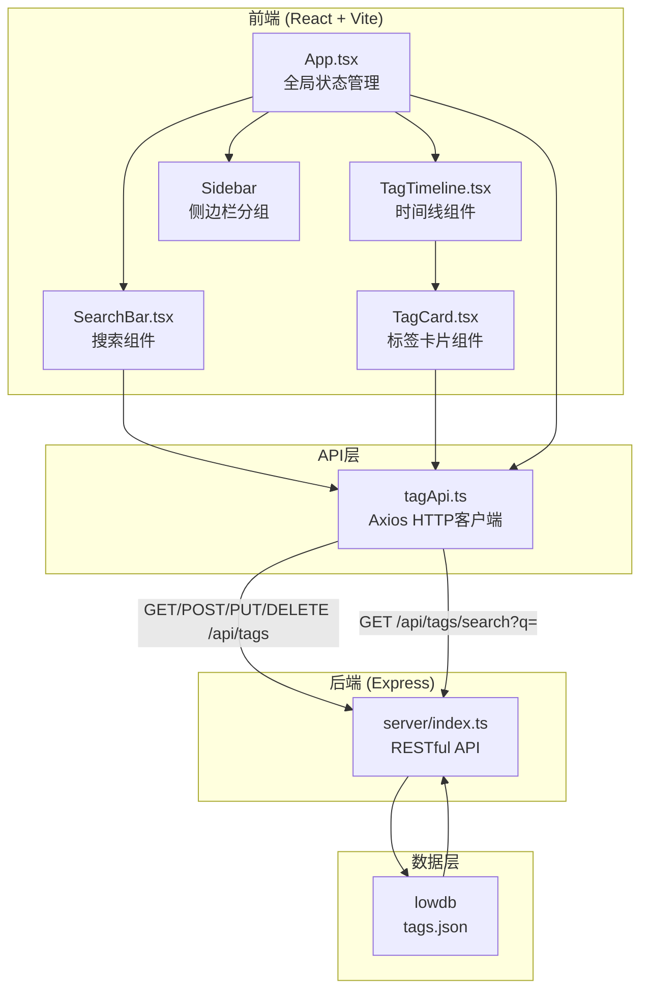
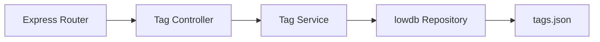
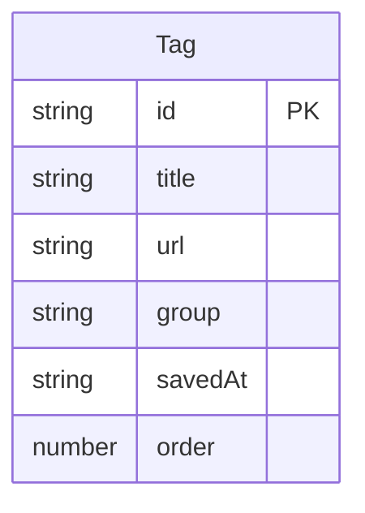

## 1. 架构设计



## 2. 技术说明
- 前端：React@18 + TypeScript + Vite + Tailwind CSS
- 初始化工具：vite-init（react-express-ts模板）
- 后端：Express@4 + TypeScript + lowdb + cors + uuid
- 数据库：lowdb（JSON文件持久化 tags.json）
- 状态管理：zustand
- 拖拽库：react-beautiful-dnd
- HTTP客户端：axios
- 日期处理：moment

## 3. 路由定义
| 路由 | 用途 |
|------|------|
| / | 首页 - 时间线视图，包含搜索栏、侧边栏、标签卡片列表 |

## 4. API定义

### 4.1 数据类型
```typescript
interface Tag {
  id: string;
  title: string;
  url: string;
  group: "work" | "study" | "life" | "other";
  savedAt: string;
  order: number;
}

interface TagCreateRequest {
  title: string;
  url: string;
  group?: string;
}

interface TagUpdateRequest {
  title?: string;
  url?: string;
  group?: string;
  order?: number;
}
```

### 4.2 API端点
| 方法 | 路径 | 请求体 | 响应 | 说明 |
|------|------|--------|------|------|
| GET | /api/tags | - | Tag[] | 获取所有标签 |
| POST | /api/tags | TagCreateRequest | Tag | 添加新标签 |
| PUT | /api/tags/:id | TagUpdateRequest | Tag | 更新标签 |
| DELETE | /api/tags/:id | - | { success: boolean } | 删除标签 |
| GET | /api/tags/search?q=keyword | - | Tag[] | 按标题和URL模糊搜索 |

## 5. 服务器架构图



## 6. 数据模型

### 6.1 数据模型定义


### 6.2 数据定义
```json
{
  "tags": [
    {
      "id": "uuid-string",
      "title": "示例网页标题",
      "url": "https://example.com",
      "group": "work",
      "savedAt": "2026-06-14T10:00:00.000Z",
      "order": 0
    }
  ]
}
```

## 7. 文件调用关系与数据流向

```
App.tsx (全局状态: tags, searchResults, activeGroup)
  ├── 调用 tagApi.fetchTags() 加载所有标签
  ├── 调用 tagApi.addTag() 收藏当前标签页
  ├── 渲染 SearchBar.tsx
  │     └── 调用 tagApi.searchTags(q) 搜索标签
  ├── 渲染 Sidebar (分组筛选)
  └── 渲染 TagTimeline.tsx
        └── 渲染 TagCard.tsx[] (每个标签)
              ├── 调用 window.open(url) 跳转链接
              ├── 调用 tagApi.updateTag(id, data) 编辑标签
              └── 调用 tagApi.deleteTag(id) 删除标签

tagApi.ts (Axios HTTP客户端)
  ├── GET    /api/tags           → server/index.ts
  ├── POST   /api/tags           → server/index.ts
  ├── PUT    /api/tags/:id       → server/index.ts
  ├── DELETE /api/tags/:id       → server/index.ts
  └── GET    /api/tags/search?q= → server/index.ts

server/index.ts (Express服务器)
  └── lowdb → 读写 tags.json
```
